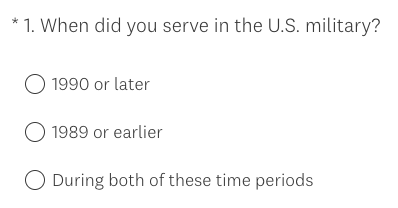
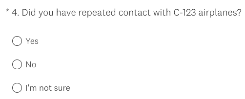
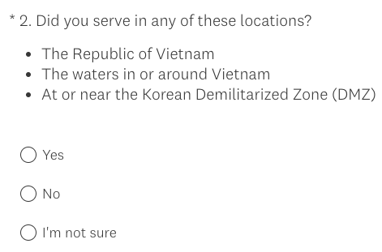
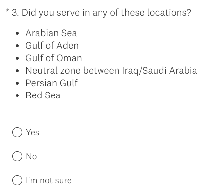

# PACT Act Wizard Usability Testing -- Research Findings 

**Office of the CTO - Digital Experience (OCTO-DE), PACT Act Wizard, Sitewide Public Websites**

Date: 10/20/2023

**Cindy Merrill** [cindy.merrill@adhocteam.us]

[Research readout TBD]()

 

**Jump to:**

[Hypotheses and conclusions](#hypotheses-and-conclusions)

[Key findings](#key-findings)

[Recommendations](#recommendations)

[Appendix (including screenshots of prototype)](#appendix)

[Who we talked to](#who-we-talked-to)

 

## Research Goals
The PACT Act Wizard is an i**nteractive question-and-answer flow to help Veterans understand how the PACT Act may apply to them**. 

There are many potential touchpoints between the Veteran and this application throughout the [Veteran journey](https://github.com/department-of-veterans-affairs/va.gov-team/blob/master/platform/design/va-product-journey-maps/Veteran%20Journey%20Map.pdf):
- Getting out (Engaging VA to access benefits and services)
- Starting up (Attending to health needs)
- Taking care of myself (Recognizing and addressing mental health needs, Managing primary care and chronic health issues, Seeking support for an acute health event, Maintaining my health)
- Retiring (Taking care of my health)
- Aging (Managing my declining health)

The purpose of this research is to **get feedback on the content** in the PACT Act Wizard and find out whether we’ve met these goals: 

- The **questions drafted for the PACT Act Wizard are clear and easy** enough for Veterans (or family members seeking information on behalf of a Veteran) to understand and confidently answer. 

- Veterans (or family members seeking information on behalf of a Veteran) can **understand from the results if they might be eligible** for disability or health care based on the PACT Act. 

- Veterans (or family members seeking information on behalf of a Veteran) can **understand from the results how to apply for benefits** related to the PACT Act based on their situation. 

Learnings will help refine questions and the presentation of results in the wizard.

## Research Questions
1. What feedback do Veterans (and others) have on **individual questions**?

     1.
1. What feedback do Veterans (and others) have on the **entire set of questions**?

     1. 

1. Do Veterans (and others) **know enough about their military service to answer the questions**? If not, what do they need to answer them?
    
     1.

1. What feedback do Veterans (and others) have on the **results**?
    
     1.
     

1. If the tool says that they're eligible, what do they say they would **do next**?

## Methodology 
We conducted **remote usability testing** over Zoom on October 2-6, 2023 to get feedback from research participants using a prototype that presents the questions and results screens in the PACT Act Wizard. The prototype was not a high-fidelity design prototype but instead an **online survey (in Survey Monkey) that presented questions** and branches appropriately to subsequent questions and relevant results screens. In this way, we **tested the *content* of the PACT Act Wizard**—the text and flow of the questions and the logical branching—but *not* the UI design. 

Perigean recruited the participants.

**We talked to 9 Veterans**, one of whom was also a Veteran's family member (spouse).
-  *Most (8 of 9) had NOT applied for VA benefits under the PACT Act*. The one who did had applied just the week before through the American Legion.
- 4 served in *1989 or earlier*, 2 served in *1990 or later*, and 3 served *during both* periods of time.
- *Most (8 of 9) used a computer* during the session; only 1 used a smartphone.

For more details, see [Who we talked to](#who-we-talked-to).

In the wizard, participants were first **asked when they served, and their answer determined which questions were presented** next. Then based on their answers to the questions, a results screen was shown. Below is a high-level summary of the interaction flow (more details can be found in the Wizard branching logic flow in the [Appendix](#appendix)).
- Ask service years question
  - If served *1990 or later*, ask Burn pit questions
  - If served *1989 or earlier*, ask Agent Orange, Radiation, and Camp Lejeune questions
  - If served *during both time periods*, ask ALL of the above questions
- Based on responses to the above questions, show one of the following results screens:
  - *VA benefit eligibility* (can't tell if you're eligible)
  - *Camp Lejeune* (may be eligible but not under PACT Act)
  - *You may be eligible* (may be eligible under PACT Act)

Any participants who didn't see the *You may be eligible* results screen were then shown it, even though it didn't apply to their situation (which was explained by the moderator).

## Hypotheses and Conclusions
1. Veterans (and others) will find the questions to be clear and easy to understand and answer.
     1. LIKELY TRUE: Participants...
     
2. Veterans (and others) will find the number and content of the questions to be relevant to their understanding of the PACT Act and how it applies to them (or the Veteran). 
     1. MAYBE TRUE: Participants...
1. Veterans (and others) won't find the number and content of the questions to be overly burdensome. 

1. The results are simple enough for Veterans (and others) to understand and are not misleading. 

1. Veterans (and others) will understand what "presumptive conditions" mean after reading the plain language description in the results flow. 

    

## Key Findings

1. All...

## Details of Findings 

### 1. All 9 participants had an overall positive experience using the PACT Act Wizard

Participants called out the following specific features as working well:
- **Questions**, which were simple, straightforward, and flowed well (5 participants)
- **Information provided** concisely that's easy to understand with links for more on intro page and results (5)
- **Accordions on results page** so don't have to go to another page or site (1)
- **Links to apply** for benefits (1)
- **Continue and Back buttons** (1)

> *"I really like the way that they broke down the PACT Act to #1 time and #2 the places" (p4).*

> *"It's pretty concise. There's not a lot of words. It's got a lot of hot links." (p11).*

> *"It follows a logical pattern--if/then. There's a clear button to take me to the next question...There's not a lot of choices. It flows smartly. And if I need to go back a page, that page is available. It doesn't take me someplace else." (p9)*

Participants' positivity towards the PACT Act Wizard wasn't affected by the number of questions that they saw. The **prototype showed between 2 and 10 questions to each participant, based on their responses**. If you answered "yes" to one of the burn pit or Agent Orange questions, you would skip the other questions in that section and might get a followup question. Below is a table showing the range and average number of questions seen by all participants and by service year category. 

Service year group | # of Participants | Range of # Q's seen | Avg # Q's seen | Maximum # of Q's 
------------------|---------------|----|----------- | -----
All groups | 9 | 2-10 | 6 | 10
1990 or later | 2 | 2 | 2 | 4
1989 or earlier | 4 | 5-7 | 6 | 7
Both time periods | 3 | 8-10 | 8.7 | 10

Participants who served in both time periods saw the greatest number of questions, followed by people who served in 1989 or earlier, and then those who served in 1990 or later.

### 2. Some of the questions were confusing to a few participants
#### 3 participants had difficulty with the service years question

One participant **thought that none of the options applied** to him. He said, *"This is one of those frustrating times when there's not an appropriate answer for me" (p10)/* When prompted to try again, he blamed it on his tendency *"to read through stuff quicker than I should."* He thought that rewording the radio button options to "1990 to present" and "Prior to 1989" might be clearer.

A different participant was thinking about the campaigns she served in and not the years, and was **wondering whether toxic exposures for 1990 were similar to those that she might have experienced 12 years later** in the 2000's. She suggested instead having checkbox options with the different options and thought this might be easier for answering questions on behalf of family members, too. She suggested the following list of options: Operation Iraqi Freedom, Operation Enduring Freedom, Desert Storm, Vietnam, Gulf War, Cold War. (Seems like this list could get really long and require updating.)

A third participant didn't select "both time periods" until his second time through the survey. He seemed to think that the word **"serve" meant instead "started" or "joined" because he asked whether it includes his training**. The reason is that he joined in Aug 1989 and did basic training and tech training but didn't actually start serving until 1990. And *"you're really not in the military until after training" (p4).*

#### RECOMMENDATIONS: 
1. **Consider instead asking what year the Veteran joined the service and what year they left** (as in Perigean's recruitment survey). This might be more straightforward than the cognitive load of A/B/both radio button options, and also would eliminate questions about whether one's service is close enough to 1989 or 1990 and the implications. 
1. Alternatively, consider making the options into 2 checkboxes instead of 3 radio buttons.
1. Alternatively, if we want to stick with radio buttons, consider rewording the options so that the first two don't both start with numbers that look similar (i.e., 1990, 1989). For example, "1990 to present" and "Prior to 1989".
1. Consider adding a "Not sure" option that would result in all questions being asked (like the current "Both time periods" option).

#### 2 participants didn't know what C-123 planes were in the Agent Orange question

When they saw the above question, 2 participants said (unprompted) that they **didn't know what "C-123 airplanes" are**. Both of them answered "I'm not sure" to the question. 

Two other participants mentioned that they're familiar with C-123's but others may not be. One of them said, *"If it applied to you, you would know...service members know their equipment" (p9).* The other said something similar and also that an explanation might be helpful.

#### RECOMMENDATION: 
1. Consider adding a brief description or link to information about C-123 planes.

#### 1 participant had questions about another Agent Orange question 

One participant had questions about the Agent Orange question they saw. The first one was about **what the word "serve" means**: "in country" on the ground, or does it also include on a ship nearby or in the airspace above? 

> *"The military is precise. We don't like a lot of gray area" (p1).*

The same participant was also unsure about **what is considered to be "near" the DMZ**. He served in Korea at Osan but not at the DMZ, so he answered "no".

This participant also asked **if there is a minimum duration for the time that you must have served there**, and if it must be continuous service for a period of time. 

#### RECOMMENDATIONS:
1. If applicable, consider adding content about whether on a ship nearby or in the airspace above counts as having served in the location.
1. If possible, consider revising the content to disambiguate the word "near" in the DMZ option.

#### 1 participant was unclear about "neutral zone"

One participant asked whether "neutral zone" in the question refers to what was called "the green zone" when she served in Iraq. She said that she wanted to see a map that shows the locations with the FOB (Forward Operating Base) names on it for the places she lived, transported supplies to, had a day pass to, etc. Without this information, she answered "not sure" to the question.

> *"I know I was in Iraq, but I don't know where in Iraq [they are referring to]...I know some of the FOBs where I was. I didn't know the cities I was close to...I really didn't pay attention to knowing exactly where I was, besides the fact that I was in Iraq...I know they said one time I was in the green zone" (p8).*

Another participant also wanted to see a map that showed the geographical areas of the locations listed in the question.

#### RECOMMENDATIONS: 
1. In the questions, try to mirror the language that Veterans heard during their service (e.g., FOB names, "green zone" and not "neutral zone"?).
1. Consider showing a map for questions that may have confusing or ambiguous locations, such as "neutral zone".

### 3. Some participants had beliefs about whether they were eligible for benefits under the PACT Act before trying the wizard--some of which were *incorrect* and not addressed by anything in the wizard.

Below is a list of reasons why **some participants said that they were NOT eligible** for benefits under the PACT Act:
1. **Wasn't in one of the locations at the right time** (3 participants) for one of the reasons listed below.
     1. Navy ship didn't go to Vietnam, even though it did later after he was off.
     1. Arrived in Korea only *after* Agent Orange was used.
     1. Has a disability that falls under PACT Act but doesn't qualify for that condition because didn't serve in a covered location. Might be because he was exposed to toxic chemicals while serving in Turkey, or possibly because his father was exposed to Agent Orange during Vietnam.
1. **100% disabled and assume can't get anything more** (2 participants)
1. **Hasn't heard anything from VA since signed up for the burn pit registry**, so assumed that the PACT Act doesn't apply to her (1 participant)

> *"I know I'm not eligible so I don't want to waste anybody's time, including my own" (p10).*

A different participant who's 100% disabled said that they **planned to file for PACT Act benefits in order to add more service-related disabilities to their record**. They knew that they couldn't get any more disability money, but they wanted the potential for extra DIC (Dependency and Indemnity Compensation) death benefits to their next of kin if they died of a service-related disability.

Another participant heard that they **could be eligible for PACT Act benefits by serving in a specific region--even if you don't have any medical conditions--because of presumed exposure.** One of the pilot participants also thought this might be the case because of the "presumption of exposure" content on the *You may be eligible* results page. This is actually incorrect becuase you must have a disability to get compensation. Just being in a specific location and getting exposed to toxic substances isn't enough.

> *"Having simply gone into Vietnam, you don't have to have conditions. But a condition is different, of course, from just presence and exposure. You could have been sprayed with Agent Orange and yet not have conditions" (p10).*

#### RECOMMENDATIONS: 
1. The Content team could evaluate and consider adding more information to the PACT Act page and/or the wizard:
     
     1. Whether/how PACT Act benefits are relevant if you're already 100% disabled *[Danielle Thierry is working with OPIA to add this to the PACT page]*

     1. You must have a disability in order to get compensation, but not necessarily a presumptive condition. Just being in a specific location and getting exposed to toxic substances isn't enough. 
       
     1. Burn pit registry is not connected to PACT Act eligibility, and so you should apply for PACT Act benefits.
1. Consider reaching out to people who are on the burn pit registry to encourage them to apply for PACT Act benefits.

### 4. Participants shared feedback and questions about how and when to apply for PACT Act benefits  
The following is feedback that we received from individual participants about applying for PACT Act benefits. 

One participant said that there **shouldn't be a deadline to apply**, which he heard about in a radio ad (Sept 30). He didn't understand that this deadline was for a special enrollment period for certain combat Veterans.

> *"I can understand that it's about trying to get people to apply, but you should be able to apply anytime" (p9).*

One participant was concerned about applying for PACT Act benefits because of a **presumptive condition that she was diagnosed for but that she doesn't remember seeing in her current problem list**. 

> *"I have been told by one of my primary care doctors...diagnosed with fibromyalgia, but I don't see it in my problem list...So it might be somewhere in my medical records that he said I had it...If they didn't actually comb through the records and look for it...you can't just search by typing a word, I may get denied saying that there's no medical record that this is something you have" (p8).*

A participant said that they would **encourage others to apply even if your condition isn't on the list** because it might be added in the future. The VA does look at trends of medical conditions reported by Veterans and periodically revises the rules and/or presumptive conditions.

> *"We look at this right now and we compare it to our uncles who were in Vietnam who did not get the benefits until after they died. 20-30 years later, now the families did [get benefits]" (p1).*

One participant **wondered if the PACT Act benefits are any different from regular VA disability compensation**. The answer is "no"; the PACT Act just expands eligibility for existing benefits.

One participant was **concerned about filing a supplemental claim because they might lose their current disability rating and compensation** because the VA looks at everything again. 

> *"Fears if you submit a supplemental claim, they look at everything and potentially lose benefits...have to...fight again for some of the things you have...That's always a fear for veterans. You file a supplemental claim, and all of a sudden they take away. And you feel like you're starting all over again. That's really what you're doing when you file a claim. I know there are better plenty of veterans that are afraid to file a supplemental claim" (p2).*

A different participant who's had a 100% disability rating for almost 10 years said that a Regional Office advised her to **wait to apply until it's been 10 years so VA can't change their disability rating** because after 10 years, your rating is permanent and VA can't decrease the rating.

Another participant is **waiting to apply until they hear about how to manage that with Combat-Related Special Compensation** (CRSC) because they don't want to file one claim and then have to submit another. He said that he realizes the impact of not applying right away, but that doesn't impact him a lot.

> *"I'm just waiting. I'm not in a hurry...I've just got everything ready. I'm just waiting for for them to get guidance from Congress" (p2).*

One participant **would have tried to convince his dad to apply** for benefits under the PACT Act, but unfortunately he died 3 years ago.

> *"If Dad were still alive today, I would have tried to convince him to have gone through this...We all know that when those guys came back [from Vietnam], they were treated like dirt...and he didn't want anything to do with the military...The VA today and the way the PACT Act is worded, I think if he was alive today, he would have been convinced after a lot of talking to apply...Thank goodness that today we are recognizing what those guys went through" (p4).*

#### RECOMMENDATIONS:
1. Danielle plans to share participant feedback about the Sept 30 deadline to OPIA for their continued outreach work.
1. The Content team could evaluate and consider adding more information to the PACT Act page and/or the wizard:
     1. The significance of having your disability rating for at least 10 years before applying for additional disability compensation (if that's accurate information and reasonable advice).
     1. Any guidance on how to handle CRSC and PACT benefits together
     1. PACT Act expands eligibility for existing disability compensation benefits
     1. This is the current list of presumptive conditions and others might be added in the future. (Does the VA ever reach out to Veterans who have reported service-connected conditions who may be affected by changes in eligibility or presumptive conditions?)

### 5. Participants shared feedback about the VA disability claims process in general
One participant (and also one pilot participant) described negative experiences in the past with **VA not believing that medical conditions are linked to their service**. 

> *"Initially, the first 2 exams I had back in 2011 and 2012. They were telling me no, you're fine, you don't fall under this. As the years went by I realized...I knew I did. But I had to go back multiple times. I think that was the more frustrating part...They were saying no no no, and then I had to go back just for them to say okay yeah we were wrong: You do fall under that...It was over a decade of symptoms and finally they said, oops, yeah, we found [a] correlation" (p2).*

This same participant advised against telling the doctor that you're "fine" when a doctor asks how you're doing.
> *"You walk in the doctor's office, how you doing? 'Fine.' That doesn't mean you're fine. You just, you say those words. They're documenting it, and sometimes those same words are being used against you. So it's a shame that we...have to walk in there and list off all everything and not say fine" (p2).*

A different participant said that he was advised to **go to the American Legion, VFW, or a Veteran advocates group that would understand how to fill out the disability application forms**, rather than trying to do it on your own. He went to the American Legion to apply, and they helped request his medical records. To get his military records, he had to apply 3 times--online, calling, and then writing a letter--and wait 18 months. By that time, the American Legion had already submitted his disability application, so they did a Supplemental Claim to add his military records.

### TBD findings re results...
Based on their responses to the questions, 6 of 9 participants were taken to the "You may be eligible" results page. This page in the prototype contained burn pit content and so wasn't applicable to all of the participants (the real wizard will show content on this page that corresponds to the specific questions to which the user answered "yes"). The other 3 participants saw this same "You may be eligible" page after first looking at the results page more relevant to their responses to the questions. Below is a table showing how many participants landed on each of the results screens based on their answers to the questions about their service.

Results screen | # of Participants
------------------|---------------
*You may be eligible* (under PACT Act) | 6 
*VA benefit eligibility* (can't tell if you're eligible)| 2
*Camp Lejeune* (may be eligible but not under PACT Act) | 1

### Usability Successes
1. **Most participants were able to answer most of the wizard questions easily.**
1. **No comments about too many questions**. Participants were presented with anywhere from 2-10 questions, which varied based on their responses and the branching logic.
1. All participants **understood *presumptive conditions***, but not from the PACT Act Wizard. Most said that they already knew from talking to other Veterans or looking into the PACT Act already.
1. Participants generally **understood the results screens** and figured out what  they should do next.

### Usability Issues

1. Three participants were **confused by the jump links** at the top of the results page on Staging because they interpreted them as CTA's (i.e., *file a disability claim* or *apply for health care* right now).

## Additional Insights

### Topic

### Topic

## Recommendations
Recommendations are listed below, with team decisions noted in *ITALIC CAPS*.
### For the app design and functionality
1.

### For content in the app
1. 

## Next Steps

- Present readout to project stakeholders and Veteran Digital User Experience Weekly Design Sync meeting.

## Further research needed

- We would like to get feedback from **Veterans who use screen readers**, which we were unable to do this time because our prototype wasn't accessible.
- We would like to get feedback from people who are **family members of Veterans but not Veterans themselves** so that we can find out if they know enough about their family member's service to answer the questions in this wizard.
- When **additional questions about medical conditions** get added to this wizard, it would be helpful to usability test that content before launch.

## Appendix

[Research plan](./research-plan.md)

[Conversation guide](./conversation-guide.md)

[Interview notes](./notes)

### Tools used for synthesis

[Synthesis spreadsheet TBD]()

[Mural board](https://app.mural.co/t/departmentofveteransaffairs9999/m/departmentofveteransaffairs9999/1695248543925/d04d52d1f06a9edb2217447cc526a2b7cef4b613?sender=uff8fa85716c1796ccf022668)

### Content references
[Wizard branching logic flow](https://app.mural.co/t/departmentofveteransaffairs9999/m/departmentofveteransaffairs9999/1692989444688/0044b9825c82d8d23920601f68c41a61d047d681?sender=uff8fa85716c1796ccf022668)

[Content document](https://dvagov-my.sharepoint.com/:w:/r/personal/danielle_thierry_va_gov/Documents/PACT%20Act%20wizard%20content%20for%20usability%20testing.docx?d=wfee483299a674f38ac4ec198c9cca463&csf=1&web=1&e=yCdUBN)

[Link to Prototype](https://www.surveymonkey.com/r/KKVHSFV)

### Screenshots of the prototype screens--TBD

  
Intro page (Click to show screenshot)

  
  

  
Questions (Click to show screenshots)

  
 
  

  
Results page (Click to show screenshots)

  
  
   

## Who we talked to 

**Recruitment criteria**

In order to find research participants for whom the PACT Act Wizard would be relevant, we wanted to talk only with Veterans who had NOT applied for VA benefits under the PACT Act. 

We talked to **9 participants.**

Audience segment:
* Veterans: 9 
* Family members of a Veteran: 2 (also a Veteran)  

Applied for VA benefits under the PACT Act?
* No: 8
* Yes: 1 (applied the week before the session)

VA benefit usage:
* Don't use VA health care: 1 
* Don't have VA disability compensation: 3

Service years:
* Included 1989 or earlier: 4
* Included 1990 or later:   2 
* Included both *before and after* 1990: 3 

Gender:
* Male: 7 
* Female: 2

LGBTQ+: 0

Devices used during study: 
* Desktop: 8 
* Smart phone: 1 

Age:
* 25-34: 
* 35-44: 1
* 45-54: 2
* 55-64: 3
* 65+: 3

Education:
* High school degree or equivalent: 0 
* Some college (no degree): 0
* Associate's degree, trade certificate or vocational training: 3
* Bachelor's degree: 1
* Master's degree: 5
* Doctorate degree: 

Geographic location:
* Urban: 4
* Rural: 5

Race:
* White: 7
* Black: 1
* Hispanic: 1
* Biracial: 0
* Asian: 0
* Native: 0

Disability and Assistive Technology (AT):
* Cognitive: 2
* AT user: 0

## Underserved groups we haven’t talked to 

This research does not include the perspectives of the following marginalized Veteran groups:
- Users of Assistive Technology 
- Identify as Biracial, Asian, Native, or LGBTQ+
- Other than honorable discharge
- Immigrant origin
- Expat (living abroad)

