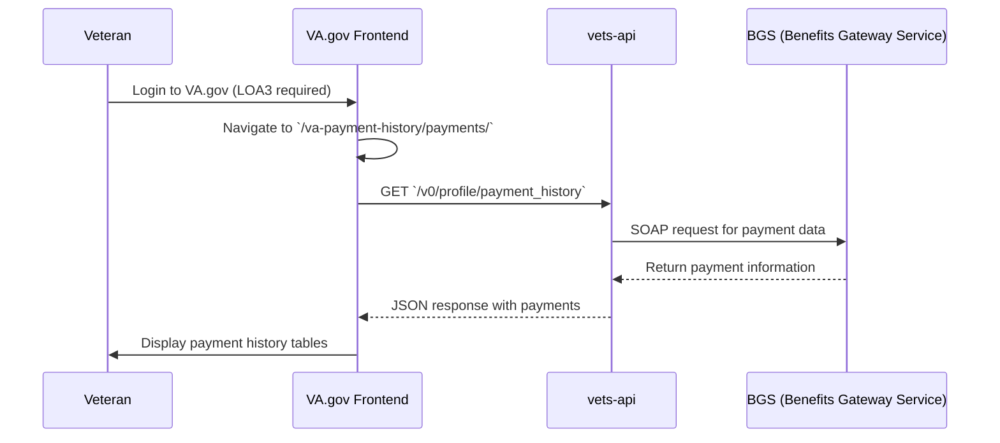
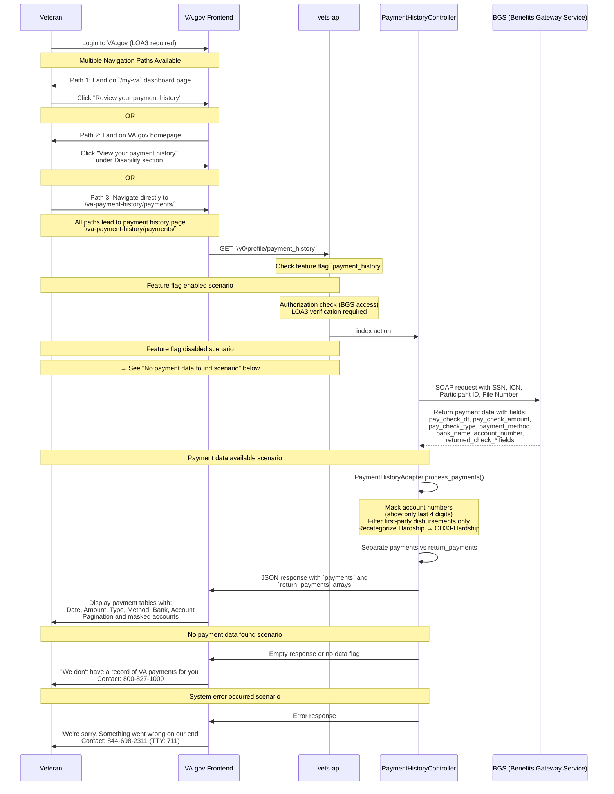

# VA.gov Payment History Architecture

This document outlines the architecture flow for a user accessing their payment history on VA.gov

## High-Level Architecture

## Detailed Implementation Flow

