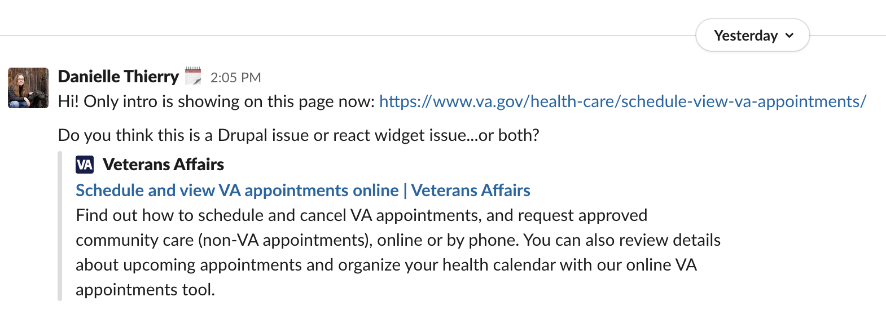

# Postmortem for sidebar not accessible on mobile devices

Date: 08/17/2020

Authors: Kelson Adams

Status: Resolved

## What happened?

In the morning of 08/17/2020, [a PR was merged](https://github.com/department-of-veterans-affairs/vets-website/pull/13882/files#diff-fbc145d9742763ba3cf52c0de9768e98R429) that updated legacy content on [www.va.gov/health-care/schedule-view-va-appointments](https://www.va.gov/health-care/schedule-view-va-appointments/) in response to [this request](https://github.com/department-of-veterans-affairs/va.gov-team/issues/12446#issuecomment-674324572).

The PR was deployed as part of the scheduled daily deployment at roughly 3:15pm EST. Danielle Thierry discovered the issue at 4:05pm EST and brought it to Kelson Adam's attention over a direct message on Slack. Shortly after, Rena Storey of the VAOS team [raised the issue](https://dsva.slack.com/archives/C52CL1PKQ/p1597695037082300) in the Public Websites Slack channel, as this health care page served as gateway to the VAOS application.

When Danielle raised the issue to Kelson Adams, Kelson opened up the dev console on the page [www.va.gov/health-care/schedule-view-va-appointments](https://www.va.gov/health-care/schedule-view-va-appointments/) and observed a runtime error with the common `<Telephone />` component on that page where there was a missing prop called `pattern` that is unexpectedly required for 3-digit phone numbers (in this case, it was TTY 711 numbers). A [PR was sent up to fix this](https://github.com/department-of-veterans-affairs/vets-website/pull/13896) 5 minutes later at 4:10pm EST. The PR was approved by VSP and merged at 5pm EST.

An [off-schedule deploy was requested](https://dsva.slack.com/archives/CBU0KDSB1/p1597695472119100?thread_ts=1597695207.118200&cid=CBU0KDSB1) at 4:17pm EST, which was then executed at 5:52pm EST, resolving the issue in production shortly after.

## Background
`/health-care/schedule-view-va-appointments/` serves as a gateway to the VA Online Scheduling health care application. The content on the page is housed largely in vets-website as a React widget. The reason for this is that the page content has various states based on the user's authentication status and whether the user's facilities are registered in the upcoming Cerner health care launch. This results in a fair amount of frontend logic, and means that a change to the content on that page has to be coordinated between a VA.gov writer and a frontend engineer in order to be written correctly and published at the correct time.

Via a [GitHub comment]([this GitHub comment](https://github.com/department-of-veterans-affairs/va.gov-team/issues/12446#issuecomment-674324572)), a request was made to a frontend engineer on the VSA Public Websites team to update the content on the scheduling page to promote new functionality offered by VAOS. The Public Websites team opened a pull request containing the latest content, unknowingly creating a runtime error deep in the application code.

## Detection
_How was the issue found?_ It was found by Danielle Thierry.

_Date/time of discovery_ 4:05pm EST

## Impact

_What was the impact on Veterans, business and team?_

Because `/health-care/schedule-view-va-appointments` serves as the gateway to VA Online Scheduling and was unavailable, traffic to VAOS from ceased from 3:15pm EST to 5:52pm EST.

## Root Causes

_What caused this situation?_

This situation was caused by 2 3-digit TTY 711 numbers that were using the `formation-react` `<Telephone />` component. These components required a prop called `pattern` that was not present, causing a runtime error, which resulted in the React widget not rendering.

## Resolution
_What steps were taken to resolve the issue?_ A PR that added the `pattern` prop to both `<Telephone />` components and an off-schedule deploy.

_Date/time of resolution_ At 5:52pm EST on August 17, 2020.

## Documentation links

- [Original PR with bug](https://github.com/department-of-veterans-affairs/vets-website/pull/13882)
- [PR with bug fix](https://github.com/department-of-veterans-affairs/vets-website/pull/13896)
- [Slack discussion in #vfs-platform-support with request of off-schedule deploy](https://dsva.slack.com/archives/CBU0KDSB1/p1597695207118200)
- [Slack discussion in #vsa-public-websites](https://dsva.slack.com/archives/C52CL1PKQ/p1597695037082300)

## Action Items

| Description                    | Type    | Owner        | Issue # |
| ------------------------------ | ------- | ------------ | ------- |
| Brainstorm alternatives of storing authenticated content in React widgets as opposed to Drupal | Frontend | Public Websites / CMS | Ticket not created yet |
| Implement some form of smoke tests for website templates | Frontend | TBD | https://github.com/department-of-veterans-affairs/va.gov-team/issues/12445 |
| Write unit tests that do not shallow render components for the Cerner page React widgets (the runtime error would have been caught this way). This may be a good use-case for React Testing Library. | Frontend | Public Websites | Ticket not created yet |
| Fix `formation-react`'s `<Telephone />` component's `pattern` prop to inherently support 3-digit numbers without a prop needing to be passed in. | Frontend | TBD | Ticket not created yet |

## Lessons Learned

We need increased quality assurance, perhaps as a high-level form of smoke test, that runs against the CMS templates of the website, to ensure certain components and elements exist on key pages.

### What went well

Root cause was discovered and resolved quickly once the issue was noticed.

### What went wrong

There was an hour gap between the time the PR was merged and the deployment. This was due to needing an off-schedule deployment authorization after hours and not having immediate knowledge of backup authorizers when one authorizer isn't available after hours.

### Where we got lucky

Deployment resolving the issue when very smoothly and the involved engineers on VSA and VSP were all very supportive.

### Takeaways

We have long identified the content templates of the FE code to need better test coverage, and this issue demonstrates the increasing importance as we continue to scale. A collection of unit tests that do full, deep renders of the React component trees across our FE widgets would also be a useful precedent to set.

## Timeline (all times ETC, asc order)

_date, time, step/event_

- 8/17/20, morning - [PR merged to update legacy content](https://github.com/department-of-veterans-affairs/vets-website/pull/13882/files#diff-fbc145d9742763ba3cf52c0de9768e98R429).
- 8/17/20, 3:15pm EST - Daily deployment occurs, VAOS thru traffic goes down to 0.
- 8/17/20, 4:05pm EST - Danielle Thierry discovers missing page content.
- 8/17/20, 4:10pm EST - [PR with fix sent up](https://github.com/department-of-veterans-affairs/vets-website/pull/13896).
- 8/17/20, 4:17pm EST - [Off-schedule deploy was requested](https://dsva.slack.com/archives/CBU0KDSB1/p1597695472119100?thread_ts=1597695207.118200&cid=CBU0KDSB1).
- 8/17/20, 5:00pm EST - [PR with fix merged](https://github.com/department-of-veterans-affairs/vets-website/pull/13896).
- 8/17/20, 5:52pm EST - Off-schedule deploy finalized, VAOS thru traffic returns to nominal levels.
