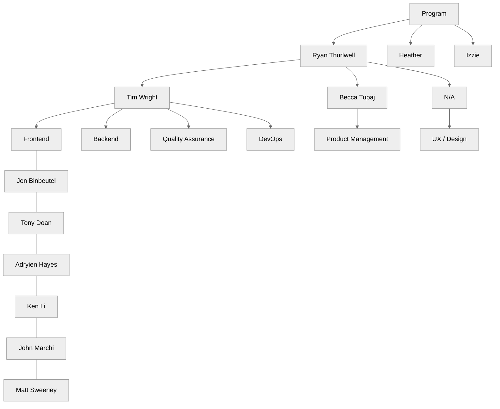

```mermaid
---
config:
  theme: neutral
  layout: fixed
---
flowchart TD
    A(["Ryan Thurlwell"]) --> B{"Tim W"} & G{"Becca T"} & U["Design and UX"]
    B --> C["Backend Engineering"] & D["Frontend Engineering"] & E["Quality Assurance"] & F["DevOps"]
    C --- I["Silvio Luthi <br>Backend Engineer"]
    I --- J["Ryan McNiel <br>Backend Engineer"]
    G --> H["Product Management"]
    H --- T["Brenda Rocha"]
    F --- K["Josh Bergman"]
    E --- L["Ken Harrison"]
    L --- M["Sam Kaplan"]
    D --- N["Jon Bindbeutel"]
    N --- O["John Marchi"]
    O --- P["Ken Li"]
    P --- Q["Tony Doan"]
    Q --- R["Matt Sweeney"]
    R --- S["Adryien Hayes"]
    U --- V["Christine Julian"]
    V --- W["Jonathan David Post"]
    W --- X["Maria Kravets"]

```

## Two

```mermaid
---
config:
  theme: neutral
  layout: fixed
---
flowchart TD
    PROG["Program"] --> RT["Ryan Thurlwell"] & HG["Heather"] & IZ["Izzie"]
    RT --> BET["Becca Tupaj"] & TW["Tim Wright"] & NA["N/A"]
    TW --> FE["Frontend"] & BE["Backend"] & QA["Quality Assurance"] & DEVOPS["DevOps"]
    BET --> PM["Product Management"]
    NA --> UX["UX / Design"]
    FE --- JB["Jon Binbeutel"]
    JB --- TOD["Tony Doan"]
    TOD --- AH["Adryien Hayes"]
    AH --- KL["Ken Li"]
    KL --- JM["John Marchi"]
    JM --- MS["Matt Sweeney"]
```
