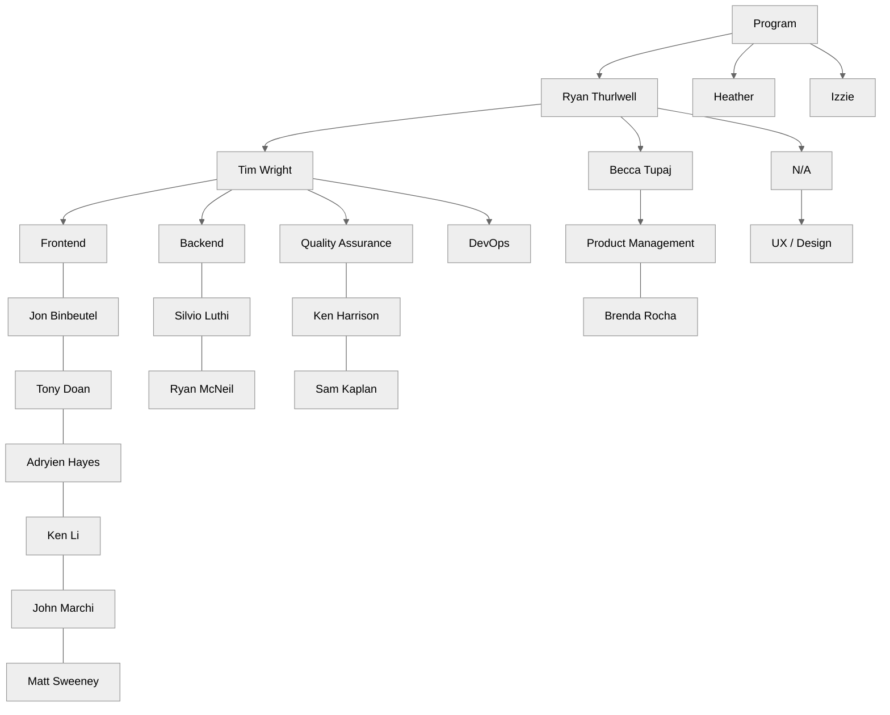

```mermaid
---
config:
  theme: neutral
  layout: fixed
---
flowchart TD
    PROG["Program"] --> RT["Ryan Thurlwell"] & HG["Heather"] & IZ["Izzie"]
    RT --> BET["Becca Tupaj"] & TW["Tim Wright"] & NA["N/A"]
    TW --> FE["Frontend"] & BE["Backend"] & QA["Quality Assurance"] & DEVOPS["DevOps"]
    BET --> PM["Product Management"]
    NA --> UX["UX / Design"]
    FE --- JB["Jon Binbeutel"]
    JB --- TOD["Tony Doan"]
    TOD --- AH["Adryien Hayes"]
    AH --- KL["Ken Li"]
    KL --- JM["John Marchi"]
    JM --- MS["Matt Sweeney"]
    BE --- SL["Silvio Luthi"]
    SL --- RM["Ryan McNeil"]
    QA --- KH["Ken Harrison"]
    KH --- SK["Sam Kaplan"]
    PM --- BR["Brenda Rocha"]
```
