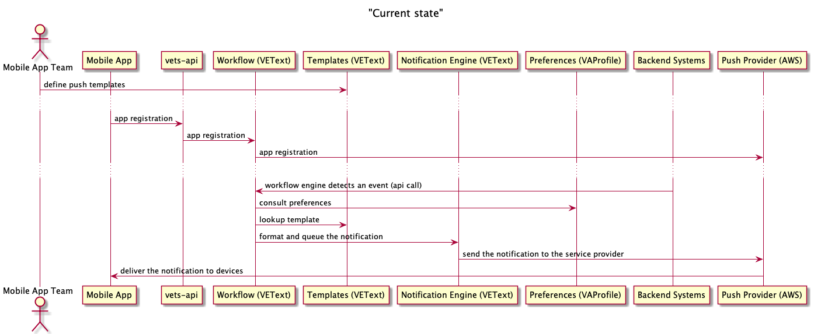

# Push Notifications for VA Mobile app

## Features (push types)

* appointment reminders
* secure message arrived
* claim status changes
* prescription refill ready

## Systems involved

### Mobile app
* device registration
* UX to opt-in to push and send registration info
* UX to disable/re-enable push in Settings

### vets-api
Proxy api calls to VEText

### VEText
* device registration
* get user preferences (on/off for device and push type) from VAProfile
* set user preferences in VAProfile
* intake for evants that can lead to push (/send api)

### VAProfile
Store notification (push/SMS/email) prefs

### VANotify
Not involved in mobile push notifications atm

## Feature: appointment reminders

Upcoming appointment event generated by VEText.

## Feature: secure message arrived

Secure message event generated by MHV (?). MHV would need to connect to VEText to publish the event.

## Feature: claim status changes

Claim status change event generated by ???. That system would need to connect to VEText to publish the events.

## Feature: prescription refill ready

Prescription events generated by ???. That system would need to connect to VEText to publish the events.
