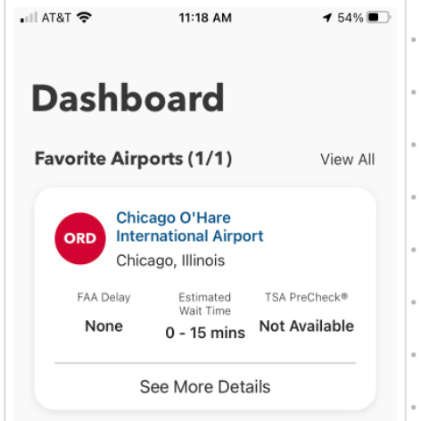

# VA Mobile Comparative Analysis: Personalized & contextual Home screen content

July 2023

[Mural with all the screenshots](https://app.mural.co/t/adhoccorporateworkspace2583/m/adhoccorporateworkspace2583/1645116475554/b9c0cc05f453a16c5a4a2f444fbbdd544693d892?sender=u98217f9fb71c48553bdb7841), [personalization comparison spreadsheet](https://docs.google.com/spreadsheets/d/1RPTVo-TXOhZE_bd5BNlzsuuZoduy7l7rmgGgeFzXnfo/edit#gid=0)

## Background & Goals

The VA mobile app’s navigation and home screen were redesigned as a part of the[ Information Architecture & Navigation Project](https://github.com/department-of-veterans-affairs/va.gov-team/blob/master/products/va-mobile-app/ux-design/information-architecture-navigation/High%20Level%20Project%20Summary.md) to include a home screen that supports a unified view of a Veteran’s interactions with VA, surfacing content and tasks that are most relevant to them (as well as evergreen features useful to all Veterans).

To better understand the landscape of patterns and best practices related to home screen personalization (by apps with similar features and/or functionalities with the VA mobile app—ex: robust user/account data, an emphasis on omnichannel interactions), we want to re-examine apps originally included in the earlier [Comparative Analysis of Navigation UI Patterns](https://github.com/department-of-veterans-affairs/va.gov-team/tree/master/products/va-mobile-app/ux-design/information-architecture-navigation/comparative-analysis#apps-reviewed-27) work, this time with a personalization lens.

We want to answer the following questions:

* How do apps that share similar features and/or functionalities with the VA mobile app approach personalized and contextual content?
    * What level of personalization (ex: light—"just their name" vs robust—timely actions, statuses, feature access, etc) do apps use? Are there patterns between industries or situations?
    * What types of personalized information do these apps display?
    * Do they make use of contextual data/actions? If so, how?
    * What UI patterns are used?
* What do these apps do well that we can apply to our context? What can we do better?

We used Mobbin as well as designers' devices to collect examples. The apps reviewed were primarily on iOS, but we cross-referenced the Google Play store to identify navigation differences between platforms.

_Note: This work is part of the [VA Mobile App - Personalization](https://github.com/department-of-veterans-affairs/va.gov-team/tree/master/products/va-mobile-app/features/design-personalization)_

_Addresses #[6390](https://app.zenhub.com/workspaces/va-mobile-60f1a34998bc75000f2a489f/issues/gh/department-of-veterans-affairs/va-mobile-app/6390)_

## Apps Reviewed (26)

The comparative analysis included (but was not limited to) app examples that share similar features and/or functionalities with the VA mobile app (ex: robust user/account data, with an emphasis on omnichannel). Apps that are crossed out appeared in original comparative analysis for Nav/IA, but do not make use of personalized or contextual content on their homescreens.

**Pharmacy/Health**
* Walgreens
* GoodRx
* ~~One Medical~~
* MyChart
* Withings Health Mate
* Apple Health

**Government**
* ~~USPS~~
* ~~VA Rx Refill~~

**Travel**
* TSA
* Southwest
* Delta Air Lines
* United
* American Airlines

**Financial**
* Bank of America
* Chase
* Fidelity
* USAA

**Insurance**
* ~~Sydney Health~~
* State Farm
* Liberty Mutual

**Retail**
* Walmart (May/June 2021; February 2022)
* H-E-B
* ~~Apple App Store~~

**Other**
* ~~iOS Settings~~
* GET (High Ed & Hospital ID Card Management)
* Airtable

##  Accessibility

We did not do an accessibility audit of the apps from a personalization standpoint. 

##  Summary of Findings

#### Term definitions for this comparative analysis:

* **Personalized:** Content that’s specific to the individual user.
    * **Contextual:** Content is specific to the user and is displayed based on specific circumstances/variables (like time, location, status).
* **Customized:** User chooses whether/what info is displayed (may or may not be personalized).

### How do apps that share similar features and/or functionalities with the VA mobile app approach personalized and contextual content?

20 out of 26 of the apps included in the original comparative analysis include personalized or contextual data on their home screens. Of those 20, apps made use of a range of levels of personalized and contextual content, from minimal (name or high level data with no explicit CTA) to robust (surfacing key actions based on time & previous user interaction). In addition to personalized and contextual content, app home screens also supported marketing messages and general announcements about new services or app functionality. One app had customizable home screen content.

#### What types of personalized information do these apps display? 

There was no single personalization method used on the home screen by all apps ([view the full list](https://docs.google.com/spreadsheets/d/1RPTVo-TXOhZE_bd5BNlzsuuZoduy7l7rmgGgeFzXnfo/edit#gid=0)), but five patterns were seen most frequently, and across sectors.

<table>
  <tr>
   <td colspan="3"><strong>Most commonly used personalization methods across apps</strong>
   </td>
  </tr>
  <tr>
<td width ="30%"><strong>Personalized module type</strong>
   </td>
   <<td width ="5%"><strong>#</strong>
   </td>
   <td width ="65%"><strong>Example</strong>
   </td>
  </tr>
  <tr>
   <td><strong>High level data</strong> (big number/status that’s not actionable: total number of airline miles, airline mileage ranking; “quantified self”) 
   </td>
   <td>15
   </td>
   <td>

   </td>
  </tr>
  <tr>
   <td><strong>Feature status </strong>(data that changes and is specific to a feature, but not actionable: a credit card balance, a shipped prescription, an upcoming booked trip “status overview”)
   </td>
   <td>13
   </td>
   <td>

   </td>
  </tr>
  <tr>
   <td><strong>Non-critical action items</strong> (actionable, but not critical: an after visit summary is available, you have a new insurance card, your account number has changed, past tasks to review )
   </td>
   <td>13
   </td>
   <td>

   </td>
  </tr>
  <tr>
   <td> <strong>Fixed content</strong>, like the user’s name, airline mileage account number, agent/contact person, favorite location (however, most app’s reserve only a small amount of space for this
   </td>
   <td>12
   </td>
   <td>

   </td>
  </tr>
  <tr>
   <td><strong>Critical action items & updates</strong> related to a feature’s status: whether a bill is due and its due date, the ability to check in for travel or an appointment, an unread message from a doctor
   <td>11
   </td>
   <td>

   </td>
  </tr>
</table>

Less commonly used were modules/elements available based on user location, user’s closest or favorite locations, their account number, and their agent/contact person.

Apps also used both static and variable personalized information of varying complexity: 

<table>
  <tr>
   <td colspan="2" ><strong>Categories of personalization</strong>
   </td>
  </tr>
  <tr>
   <td><strong>Static</strong>
   </td>
   <td><strong>Variable</strong>
   </td>
  </tr>
  <tr>
   <td>
<ul>

<li>The user’s name, account #

<li>The user’s favorite location

<li>The user’s agent/contact person
</li>
</ul>
   </td>
   <td>
<ul>

<li>Current feature status

<li>Critical action items for features

<li>Non-critical action items
</li>
</ul>
   </td>
  </tr>
</table>

##### Notifications
Notifications were present in half of the apps, but overwhelmingly they were not included on the home screen: 
* 9 apps had a placement for notifications/inbox in the primary or secondary navigation (top and bottom bars) of the app
* 1 app had an area for notifications/alerts on the home screen (but didn’t use it to display critical action items)
* 1 app used a feed of dismissable notification-style modules as it’s main homescreen UI. The modules appeared when features had critical action items, essential status updates, confirmation messages and when there were general messages from the app. They  disappeared once the user has interacted with them, leaving a “nothing new  to show” message in place when there no more modules in that category.

<table>
  <tr>
   <td>Notifications center in main navigation
   </td>
   <td>

      
   </td>
</tr>
   
<tr>
   <td>Notifications/alerts area on home 
   </td>
   <td>
   
   </td>
 </tr>
  
  <tr>
   <td>Notification style homescreen UI
   </td>
   <td>

      
   </td>
  </tr>
  
</table>

##### Customization
Two apps gave users the ability to customize the elements that appear on their home screen: TSA displays one or more of the user’s favorite airports and Bank of America has a customizable “quantified self” style dashboard on a secondary “dashboard” home screen tab. It is not the main/default part of the home screen.

#### Do they make use of contextual data/actions? If so, how?

Yes— 13 out of the 20 apps displayed personalized content that was also contextual on their home screens. Some apps displayed entirely new modules as the result of a new context (example: airline travel reservation module appearing when close to travel time), others modified the content of persistent widgets based on the new context (example: bank account module always displaying current balance & action items).  Contextual data and actions were either time, status or location based.

<table>
  <tr>
   <td colspan="2" ><strong>Contextual data and action types</strong>
   </td>
  </tr>
  <tr>
   <td><strong>Variable</strong>
   </td>
   <td><strong>Examples</strong>
   </td>
  </tr>
  <tr>
   <td><strong>Time</strong> 
   </td>
   <td>
<ul>

<li>Within a few days of a billing being due, credit card app surfaces the ability to pay the bill. 

<li>Within a few days of an appointment, health app displays the ability to pre-check in for that appointment.

<li>Within 24 hours of a flight, airline travel reservation module appears.
</li>
</ul>
   </td>
  </tr>
  <tr>
   <td>
<h4><strong>Location</strong></h4>

   </td>
   <td>
<ul>

<li>The nearest [airport, store] location, including maps, information & services within that location.

<li>An overall state change indicating that they are in a specific physical location and surfacing relevant actions (store mode).
</li>
</ul>
   </td>
  </tr>
  <tr>
   <td>
<h4><strong>Status</strong></h4>

   </td>
   <td>
<ul>

<li>Credit card or insurance app’s account module displays an overdue alert if a bill is overdue.

<li>Health app displays after visit summary when user has attended appointment & document is available, a prescription is ready for pickup or a new message from a doctor is available to read.

<li>Airline app’s travel reservation module includes a check in button or a link to their boarding pass if already checked in on a travel day. May also display a gate change information and/or a rebooking button in an irregular operations (IROP) scenario.
</li>
</ul>
   </td>
  </tr>
</table>

### What level of personalization (ex: light—"just their name" vs robust—timely and/or contextual actions, statuses, feature access, etc) do apps use? Are there patterns between industries or situations?

There are patterns around certain aspects of personalization and contextual information that relate to their industry sector or situation, but there was still some variability. Apps with an in-person element displayed the most personalized content and functionality, followed by apps with a time-based element. 

<table>
  <tr>
   <td colspan="3" ><strong>Contextual personalization patterns by industry </strong>
   </td>
  </tr>
  <tr>
   <td><strong>Aspect</strong>
   </td>
   <td><strong>App purpose</strong>
   </td>
   <td><strong>Industry sector</strong>
   </td>
  </tr>
  <tr>
   <td>Status + Location
   </td>
   <td>Apps containing tools with an <strong>in-person element</strong>.
   </td>
   <td>Travel, Retail
   </td>
  </tr>
  <tr>
   <td>Status + Time
   </td>
   <td>Apps that have <strong>time-based elements</strong>, like a bill being due or a policy expiring.
   </td>
   <td>Banking/Credit Cards, Insurance, Travel
   </td>
  </tr>
  <tr>
   <td>Status Only
   </td>
   <td>A variety of apps across sectors displayed<strong> status only</strong>. Some of these involve users doing in-person things, but don't support with location-based  features because the<strong> aspect of location is not essential to task completion</strong>.
   </td>
   <td>Retail, Banking/Credit Cards, Health, Insurance, Travel 
   </td>
  </tr>
</table>

### What UI patterns are used? 

The apps we reviewed used three high-level patterns to display personalized and contextual information: feature modules (17), feed (1) and multi-tab (2).

<table>
  <tr>
   <td colspan="2" ><strong>High-Level UI Patterns</strong>
   </td>
  </tr>
  <tr>
   <td width ="40%"><strong>Pattern Description</strong>
   </td>
   <td width ="60%"><strong>Example</strong>
   </td>
  </tr>
  <tr>
   <td><strong>Feature modules:</strong> Most app home screens display a list of modules (divided by feature) that bubble up timely actionable items & essential statuses. These modules appear in the first section of the screen, often followed by sections containing marketing banners and evergreen content.
   </td>
   <td>

   </td>
  </tr>
  <tr>
   <td><strong>Feed:</strong> One app’s home screen used a feed combining timely actionable items from various features, essential status updates, confirmation messages and general messages from the app followed by feature promotions. The modules disappear once the user has interacted with them, leaving a “nothing new  to show” message in place when there no more modules in that category.
   </td>
   <td>

   </td>
  </tr>
  <tr>
   <td><strong>Multi-tab: </strong>Two apps split personalized information over multiple tabs or two tabs within the same screen (using one screen for high level data from features and the other for action items.
   </td>
   <td>

   </td>
  </tr>
</table>

## Recommendations

### What do these apps do well that we can apply to our context? What can we do better?

#### Do well:

1. Many home screens display a **high-level snapshot of the user’s current status and interactions**, typically made up of a list of permanent feature modules (displaying high level feature data, changing statuses and action items).
    * Apps **combine fixed and variable personalized info** to ensure that they feel personalized even when there aren’t critical action items to complete.
       * **Personalized and contextual information is displayed first** on the screen and is distinguished visually from non-personalized features by appearing higher in the visual hierarchy as well as physically higher on the screen.
       * **Variable** personalized content (like an account balance or flight status) is given more emphasis in the visual hierarchy than static personalized content (like a name or account number).

2. Most of the apps containing features with a changing status used a **fixed module or category placement** on their home screen (and group high-level feature data, variable statuses and critical action items when necessary) as opposed to modules or sections that appear/disappear when there's a status update. Holding the space with is an accessible way to reassure users that there are no new changes in way that simply omitting the module does not.
    * Modules distinguish between critical action items and non-critical action items within the same module using type hierarchy. **Emphasis is on always on action**, when it's available. 
    * **Level of personalization within fixed module content can vary**: some apps show only high-level feature data while other add buttons or messages to indicate a status change).

3. The apps containing features with an **in-person element** use display logic leveraging **current location** to show newly-relevant tools and information in those contexts, and make use of the free space in intentional ways when those elements are not present (for example, an airline app promoting possible travel ideas to the user on a non-travel day).
     * That said, given our current feature set, location is less powerful than time & status.

4. In most apps that include it, the **notification center/inbox is treated as a feature in the primary or secondary navigation** rather than a module on the homescreen. 
    * This leaves the home screen free to display a high level snapshot/to-do list made up of permanent feature modules (displaying changing statuses and action items) without duplicating content between the modules and the notifications.

#### We can do better:

1. In the “feed” direction (example: MyChart), the combined a mix of critical action items from various features, essential status updates, confirmation messages and general messages from the app—followed by feature promotions and the lack of variation in visual treatment between modules makes it **difficult to differentiate between critical and non-critical** action items.
2. **General contextual information that is based on time** (displaying today’s date or a greeting like “good afternoon”) wasn’t obviously useful, and seemed either superfluous or crowding the available space. (example: State Farm, USAA, Chase)
3. Some apps **mixed promotional/marketing content with personalized content in the screen's order**, pushing personalized content lower down on the screen (example: Walgreens) and making it less discoverable.
