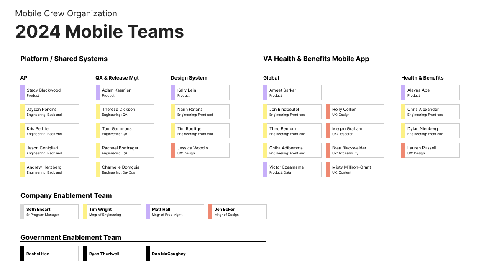

# 2024 Calendar Year: Mobile Team OKRs and Org Chart

As of December 13, 2024

VA: Health and Benefits mobile app, the first customer of Mobile Platform
Mission: Empower Veterans by providing fast, easy, and personalized access to the most popular VA health and benefits services.

## OCTO Objective 1: Better experiences.

Our digital experiences are the best way to access VA health care and benefits.

**Flagship App**

Objective 1: Improve Veteran retention at the 30, 60, and 90 day marks by 10%

Objective 2: Increase the number of tasks completed and their success rate

    KR1: All tasks are defined
    KR2: All tasks have baseline success rates collected
    KR3: Overall task success rates is increased by 10%
    KR4: Number of tasks completed is increased by 25%

Objective 3: Improve Veteran Satisfaction

    KR1: Baseline Veteran satisfaction score is established
    KR2: Veteran satisfaction score is increased by 10%
    KR3: App store rating remains above 4.8

## OCTO Objective 2: Stronger platforms.

Our platforms are the best way to deliver products at VA
* Our platforms hit the “elite” level (as defined by DORA) on Deployment Frequency, Lead Time for Changes, Change Failure Rate, and Time to Restore Service.
    * Our platforms measure and improve the satisfaction of their internal users.
    * Our platforms power twice as many interactions compared to last year.

**Mobile Platform**

Mission: Build the foundations for VA's digital stability and enable teams to build experiences with confidence, faster and more efficiently than everyone else. 
Stability: Enable teams to build with confidence
Productivity: Enable teams to build faster
Efficiency: Enable teams to build more with less

Objective 1: Stability: Enable teams to build with confidence.
Experience teams delivering changes fast and often is only half of the picture. Stability is enabling Experience teams to make changes confidently, without breaking the end user’s experience. We provide reliable services and consult Experience teams with guardrails and best practices.

    KR1: Change failure rate, e.g. hotfixes, rollbacks, etc.
    KR2: Number of incidents, incidence by severity, etc.
    KR3: Mean time to repair, e.g. time to detect, time to repair, etc.
    KR4: App load time
    KR5: Uptime and error rate

Objective 2: Productivity: Enable teams to build faster
Same input, more output.
Note: Emphasis on teams. Here, productivity is not a measure of individual performance.

    KR1: Lead time, the time between code change and release, is shorter. 
        e.g. Continuous Integration (CI) duration, PR review time, deployment time
    KR2: Deployment frequency, friction before code change, gets reduced. 
        • Onboarding, e.g. time to 1st PR, time to 10th PR, time to first impactful PR
        • Documentation, e.g. time to find documentation, documentation rating
        • Focus, e.g. context switching per task
    KR3: Platform user/developer happiness trends in positive direction.

Objective 3:
Efficiency: Enable teams to build more with less
Less input, more output.

    KR1:Cloud cost
    KR2: Off the shelf tools cost
    KR3: Platform + Experience Teams cost
        • velocity
        • platform and experience team people ratio

Mobile Platform Team-specific OKRs: https://github.com/department-of-veterans-affairs/va.gov-team/blob/master/products/va-mobile-app/platform/Metrics-and-Goals/Q1-Mobile-Platform-Teams-OKRs.md

## Mobile Team

