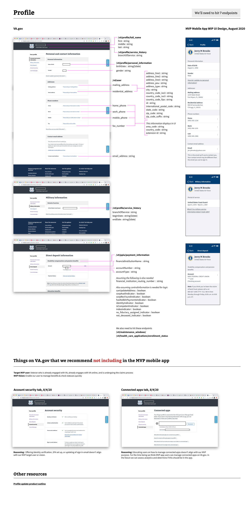

# UI data 

Goal: Summarize the endpoints we need to hit for MVP mobile app and fields we want to display in the UI. 

# Profile

Goal: Capture what data from what APIs we want to show in the **Profile** section of the MVP mobile app. 

