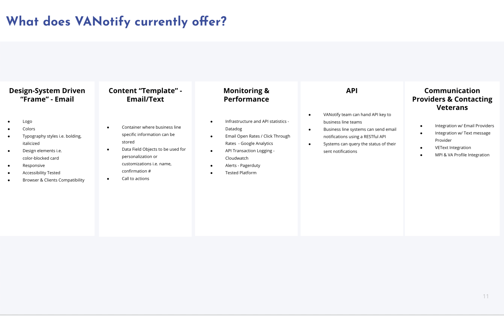
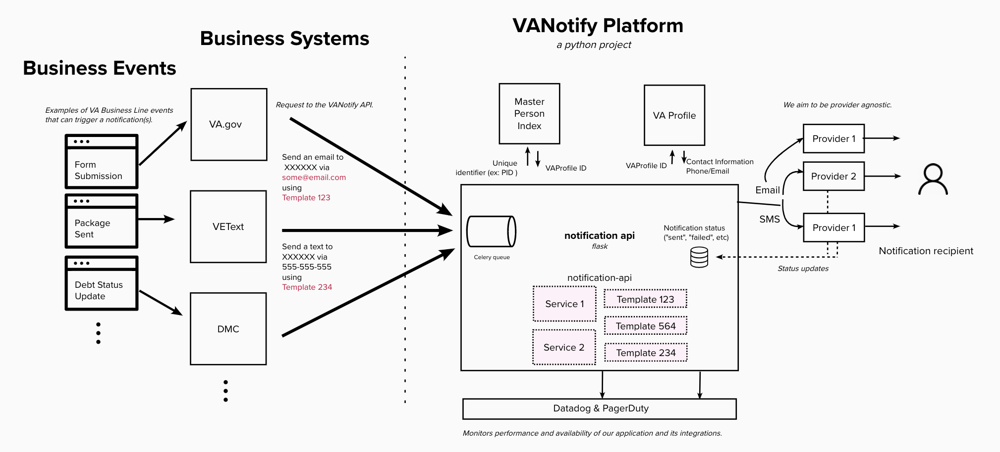
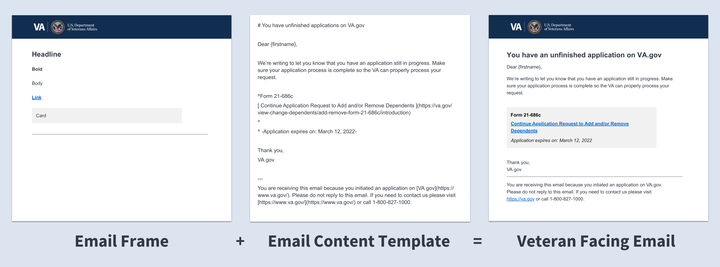
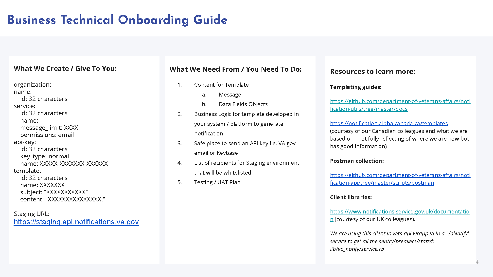
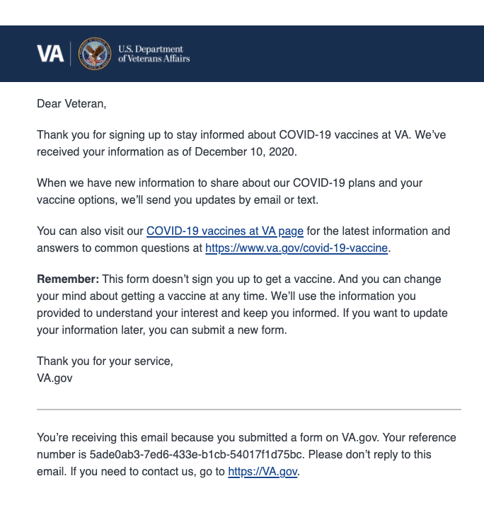

# VANotify Platform

## Our Mission
Improve the overall experience and quality of communications with veterans using modern digital technology, by building a centralized and self-service platform through which business lines and development teams can send communications to veterans.

## Services We Offer
 
- [What We Currently Offer](#what-we-currently-offer)
- [FAQs](#faqs)
- [How VANotify Works](#how-vanotify-works)
-  [Tech Stack](#tech-stack)

## Onboarding Information
- [Business Onboarding Guide](#business-onboarding-guide)
- [Email Frame & Template](#email-frame-and-template)
- [Pricing](#pricing)
- [Technical Onboarding Guide](#technical-onboarding-guide)
- [Post Launch Information Checklist](#Post-Launch-Information-Checklist)

## Things to Know
- [Upcoming Capabilities](#upcoming-capabilities)
- [See Who We Are Working With](#See-Who-We-Are-Working-With)
- [Recent Successes](#recent-successes)
- [Find Out More &amp; Get In Touch With Us](#find-out-more--get-in-touch-with-us)
- [Incident Response](#incident-response)
- [Terms and Conditions](#terms-and-conditions)
_____________________________________________________________________________________________________________________________________________________________

## What We Currently Offer

## FAQs
* Do you have any guidelines on when to send a notification and/or what kind to send? We do!  Look [here](notification-guide.md#vanotify-notification-guide)
* Does VANotify support variables in emails?  Yes - There is an an example [below](#successes)
* What about hyperlinks and attachements? Yes, VANotify supports hyperlinks and attachments.  See an example [below](#successes) Attachment example coming soon.....
* What's not supported? Currently VANotify does not support: cc, bcc, or images for email
* Should I run my email content by a Privacy Officer? Yes.  This will avoid sending Personally Identifiable Information inadvertantly

## How VANotify Works

## Tech Stack

| Application          | Infrastructure  | Monitoring & Security |
|:---------------------|:----------------|:----------------------|
| Python               | Terraform       | Datadog               |
| Flask                | GitHub Actions  | PagerDuty             |
| Celery               | AWS Fargate     | Twistlock             |
|                      | Bandit          |                       |

## Business Onboarding Guide

## Email Frame and Template

## Pricing

* The **Office of the VA Chief Technology Officer (OCTO)** will pay for the development and maintenance of VA Digital Notifications Ecosystem products (VANotify + VEText).  Also, **OCTO** will pay for AWS infrastructure and operational costs.
* **VA business lines (outside of OCTO)** will be responsible for funding of digital notifications (email, SMS, or mobile push notifications).  Currently, **VA business lines** can procure AWS credits to fund their digital notifications.  The current cost is **$0.93 per AWS credit**. 

| Communication Channel      | Unit Price                                       | Messages per AWS credit                                       |
|:---------------------------|:-------------------------------------------------|:--------------------------------------------------------------|
| Email                      | $0.000093/email                                  | 10,000 emails per credit                                      |
| SMS [outbound and inbound] | $0.0078/SMS [outbound] $0.0070/SMS [inbound] | 119.23 SMS/credit [outbound] 133.33 SMSs/credit [inbound] |

 

 To assign credits to VANotify, please follow these steps:
  -  Click [here](https://github.com/department-of-veterans-affairs/va.gov-team/blob/master/products/va-notify/VANotify%20Cloud%20Credit%20Purchase%20SOP.pdf) for detailed instructions.
  - Link in the pdf -  https://wfm.vaec.va.gov/servicedesk/customer/portal/5

## Technical Onboarding Guide
* [VANotify API Documentation](https://github.com/department-of-veterans-affairs/notification-api#api-documentation)
* Staging URL: https://staging.api.notifications.va.gov
* Postman Collection: https://github.com/department-of-veterans-affairs/notification-api/tree/master/scripts/postman
* Templating guides: 
  * https://design.va.gov/patterns/email_template
  * https://github.com/department-of-veterans-affairs/notification-utils/tree/master/docs
  * https://notification.canada.ca/templates

## Post Launch Information Checklist

* **How many notifications have been sent, since go-live, last week, etc?** 
In order to determine how many notifications have been sent, you can check with your technical team to see how many requests they have sent to us. You can also message us at #va-notify-public to request these stats and we will get them to you within 24 hours. In the future, we are working to expose such statistics in our self service portal as well as integrate with DOMO. 

* **How many notifications were successful vs. failed?** 
Depending on your level of integration with VANotify you may be set up for call-back responses – if you are, you will be able to know what notifications were successful or which ones have failed. If not, you can also message us at #va-notify-public to request these stats and we will get them to you within 24 hours. In the future, we are working to expose such statistics in our self service portal as well as integrate with DOMO. 

* **How many notifications have been opened?** 
Please note the SMS channel does not support Open Events. Each email notification sent with VANotify has a google pixel tracker automatically embedded within the email which allows us to track Open Events. Please note Open Events are not a great metric of success in terms of knowing if your email got in front of your end-user–you can learn more [here](https://blog.mailup.com/2013/12/email-open-rate-complexity). If measuring engagement is important to you we highly recommend tracking your click through rate – see below to learn more. In order to view your open events, you must: 

    I. Log in to the [VA.gov Production Google Analytics 360 account](https://analytics.google.com/analytics/web/#/report/content-event-events/a50123418w177519031p176188361/_u.date00=20210101&_u.date01=20210217&_r.drilldown=analytics.eventCategory:email,analytics.eventAction:open). If you don’t have access to Google Analytics you can access it [here](https://github.com/department-of-veterans-affairs/va.gov-team/issues/new?assignees=joanneesteban&labels=analytics-insights%2C+analytics-request%2C+access-request&template=analytics-request-google-analytics-domo-access.md&title=Request+access+to+Google+Analytics+and%2For+Domo).
    
    II. Navigate to [this](https://analytics.google.com/analytics/web/#/report/content-event-events/a50123418w177519031p176188361/_u.date00=20210101&_u.date01=20210217&_r.drilldown=analytics.eventCategory:email&explorer-segmentExplorer.segmentId=analytics.eventLabel&explorer-table.plotKeys=%5B%5D/) page. And select your notification from the list. 
  
 
  
   III. Select your time frame on the top right of the screen. This will give you the total open events for your email. 
 
 
  
   VI. If you want to determine your Open Rate – divide open events by total successful sends for the same time period and that number will indicate your    
    approximate Open Rate.  
 
 

* **How many click-throughs to links?** 
If you have enabled website visitor tracking that includes referrer information on the web page you are trying to drive traffic and you have included the tracking parameters (i.e. UTM) in the webpage URL you are utilizing in your notification template then you will be able to view the volume of traffic that originated from the email in your tracking system (i.e. Google Analytics, DOMO, etc). To get to your click-through rate divide your click-through traffic by total successful sends for the same time period and that number will indicate your approximate click-through rate.

## Upcoming Capabilities
 * Self Service Portal
 * Onsite Notifications

## See Who We Are Working With
* 526EZ (Application for Disability Compensation and Related Compensation Benefits) Email Confirmation - Sent automatically upon submission
* Covid KMI (Keep Me Informed) Update for Veterans and Non-Veterans Beneficiaries - Sent periodically after sign up on va.gov
* Covid KMI Email Sign-up Confirmation for Veterans and Non-Veterans Beneficiaries - Sent automatically upon sign up
* Rx Pharmacy Shipment Update Pilot Text Message -  Sent upon shipment of prescriptions only for Asheville and Denver VAMCs however we are working on expansion nationally, text messagewill come from a local number currently
* Debt Management Center - "You have new information" email - automatically sent after the Veteran calls the DMC for an update or information on their Debt status as well as may be sent if there is information in their account
Lighthouse
* Direct Deposit Email Confirmation - automatically sent when the Veteran updates their direct deposit account information on va.gov.
* Application Connect & Disconnection from VA account - sent when the Veteran allows an app to access their health information and vice versa on va.gov.
* VA.gov Authenticated experience - Email confirmation that a veteran has updated their contact information.
* Higher-Level Review Email Confirmation- Sent automatically upon submission

## Recent Successes

## Find Out More & Get In Touch With Us
* Fill out this form [here](https://github.com/department-of-veterans-affairs/va.gov-team/issues/new?assignees=bevnobev%2C+mjones-oddball&labels=vanotify-intake&template=VANotify-Business-Intake.md&title=Business+intake+form+for+%5BBusiness+or+team%5D)
* Slack - [#va-notify-public](https://dsva.slack.com/archives/C010R6AUPHT)

## Incident Response ##
Points of contact:
* Lead: [Kyle MacMillan](mailto://kyle.macmillan@oddball.io)
* Notifications SME: [Jacob Cheriathundam](mailto://jacob@docme360.com)
* Product Manager: [Melanie Jones](mailto://melanie.jones@oddball.io)

## Terms and Conditions
Please refer to the VA's [Digital Notification Terms and Conditions](https://www.va.gov/privacy-policy/digital-notifications-terms-and-conditions/) page to read about the VA's frequency, guidelines and policies around email, text, and online notifications to Veterans.
