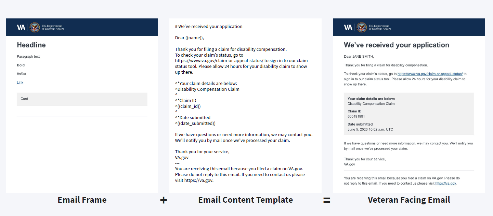
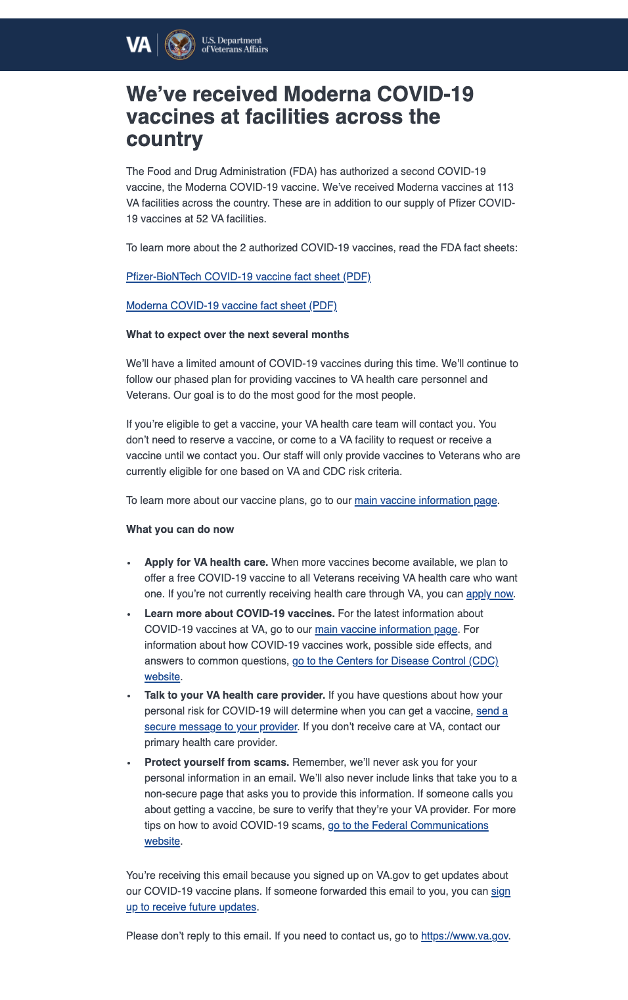

# VANotify Platform

## Our Mission
Improve the overall experience and quality of communications with veterans using modern digital technology, by building a centralized and self-service platform through which business lines and development teams can send communications to veterans.

## Services We Offer
 
- [What We Currently Offer](#current-offering)
- [How VANotify Works](#how-vanotify-works)
- [FAQs](#faqs)

## Onboarding Information
- [Business Onboarding Guide](#business-onboarding-guide)
- [Email Frame & Template](#email-frame-and-template)
- [Pricing](#pricing)
- [Technical Onboarding Guide](#technical-onboarding-guide)
-  [Tech Stack](#tech-stack)

## Things to Know
- [Upcoming Features](#upcoming-features)
- [Business Line Tracker](#business-line-tracker)
- [Successes](#successes)
- [Find Out More & Get In Touch With Us](#find-out-more)
- [Incident Response](#incident-response)

## Current Offering

## FAQs
* Do you have any guidelines on when to send a notification and/or what kind to send? We do!  Look [here](notification-guide.md#vanotify-notification-guide)
* Does VANotify support variables in emails?  Yes - There is an an example [below](#successes)
* What about hyperlinks? Yes, VANotify supports hyperlinks.  See an example [below](#successes)
* What's not supported? Currently VANotify does not support: cc, bcc, images or attachments for email
* Should I run my email content by a Privacy Officer? Yes.  This will avoid sending Personally Identifiable Information inadvertantly

## How VANotify Works

## Tech Stack

| Application          | Infrastructure  | Monitoring & Security |
|:---------------------|:----------------|:----------------------|
| Python               | Terraform       | Datadog               |
| Flask                | GitHub Actions  | PagerDuty             |
| Celery               | AWS Fargate     | Twistlock             |
|                      | Bandit          |                       |

## Business Onboarding Guide

## Email Frame and Template

## Pricing

* The **Office of the VA Chief Technology Officer (OCTO)** will pay for the development and maintenance of VA Digital Notifications Ecosystem products (VANotify + VEText).  Also, **OCTO** will pay for AWS infrastructure and operational costs.
* **VA business lines (outside of OCTO)** will be responsible for funding of digital notifications (email, SMS, or mobile push notifications).  Currently, **VA business lines** can procure AWS credits to fund their digital notifications.  The current cost is **$0.97 per AWS credit**. 

| Communication Channel      | Unit Price    | Messages per AWS credit |
|:---------------------------|:--------------|:------------------------|
| Email                      | $0.0001/email |9700 emails per credit   |
| SMS [inbound and outbound] | $0.0075/SMS   |129.33 SMSs per credit   |

 

 To assign credits to VANotify, please follow these steps:
  - Follow this link -  https://wfm.vaec.va.gov/servicedesk/customer/portal/5
  - Select - Sustainment/Operation Credit link
  - Choose VANotify under System/Application Name
  - Enter 812 as the Cloudkey ID
  - Enter AWS as the Cloud Provider
  - Enter the dollar amount
  - Enter your Project Manager and Business Owner

## Technical Onboarding Guide
* [VANotify API Documentation](https://github.com/department-of-veterans-affairs/notification-api#api-documentation)
* Staging URL: https://staging.api.notifications.va.gov
* Postman Collection: https://github.com/department-of-veterans-affairs/notification-api/tree/master/scripts/postman
* Templating guides: 
  * https://design.va.gov/patterns/email_template
  * https://github.com/department-of-veterans-affairs/notification-utils/tree/master/docs
  * https://notification.canada.ca/templates

## Upcoming Capabilities
 * Feb 2021 - Multiple Provider Integration & Delivery Statuses
 * Feb-March 2021 - Self Service Portal
 * Work Starting April 2021 - VA Profile / VA.Gov Integrated Preferences

## See Who We Are Working With
This is how we track the business lines that are reaching out to us, their particular use cases, where they are at in our process and key next steps: [Business_Line Tracker Zenhub Board](https://app.zenhub.com/workspaces/vanotify-business-implementation-5fb529d6d7154c000e027f32/board?repos=257953872,259991010,259989505,289179208,261511794)

## Successes

## Find Out More Or Get In Touch With Us
Fill out this form [here](https://app.smartsheet.com/b/form/2fe7e01103d44ae58706e72e12647c08)
Slack - #va-notify

## Incident response ##
Points of contact:
* Tech Lead: [Filip Fafara](mailto://filip.fafara@va.gov)
* Project Manager: [Anushya Prasad](mailto://Anushya.Bellur@va.gov)
* Product Manager: [Maria Becker](mailto://maria.becker@va.gov)
