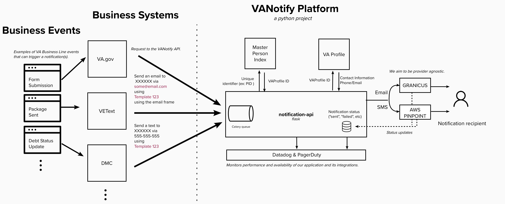

# VANotify Platform

## Our Mission
Improve the overall experience and quality of communications with veterans using modern digital technology, by building a centralized and self-service platform through which business lines and development teams can send communications to veterans.
## Communication
Slack - #va-notify

## Things to Know
 
- [How VANotify Works](#how-vanotify-works)
- [Tech Stack](#tech-stack)
- [Business Onboarding Guide](#business-onboarding-guide)
- [Technical Onboarding Guide](#technical-onboarding-guide)
- [Pricing](#pricing)
- [Business Line Tracker](#business-line-tracker)
- [Successes](#successes)
- [Upcoming Features](#upcoming-features)
- [Find Out More](#find-out-more)

## How VANotify Works

## Tech Stack

| Application          | Infrastructure  | Monitoring & Security |
|:---------------------|:----------------|:----------------------|
| Python               | Terraform       | Datadog               |
| Flask                | GitHub Actions  | Grafana               |
| Celery               | AWS Fargate     | PagerDuty             |
| Granicus GovDelivery |                 | Twistlock             |
|                      |                 | Bandit                |

## Business Onboarding Guide

## Technical Onboarding Guide
* [VANotify API Documentation](https://github.com/department-of-veterans-affairs/notification-api#api-documentation)
* Staging URL: https://staging.api.notifications.va.gov
* Templating guides: https://github.com/department-of-veterans-affairs/notification-utils/tree/master/docs

## Pricing

| Communication Channel      | Unit Price    | 
|:---------------------------|:--------------|
| Email                      | $0.0001/email |
| SMS [inbound and outbound] | $0.0075/SMS   |

* The Office of the VA Chief Technology Officer (OCTO) will pay for the development and maintenance of VA Digital Notifications Ecosystem products (VANotify + VEText).  Also, OCTO will pay for AWS infrastructure and operational costs.
* VA business lines will be responsible for funding of digital notifications (email, SMS, or mobile push notifications).  Currently, VA business lines can procure AWS credits to fund their digital notifications.  

## Business Line Tracker
This is how we will track the business lines that are reaching out to us, their particular use cases, where they are at in our process and key next steps

## Successes

## Upcoming Features - *Coming Soon*

## Find Out More
Fill out this form [here](https://app.smartsheet.com/b/form/2fe7e01103d44ae58706e72e12647c08)
