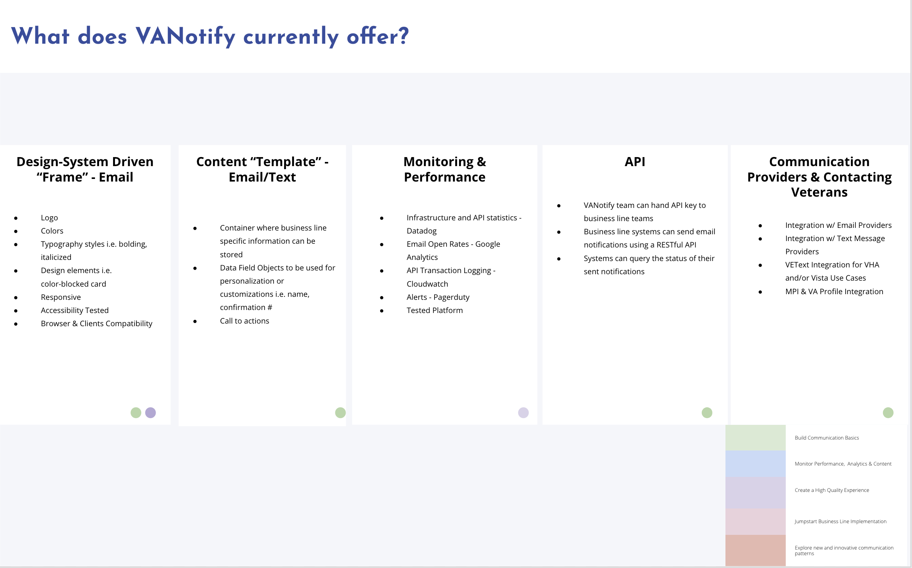
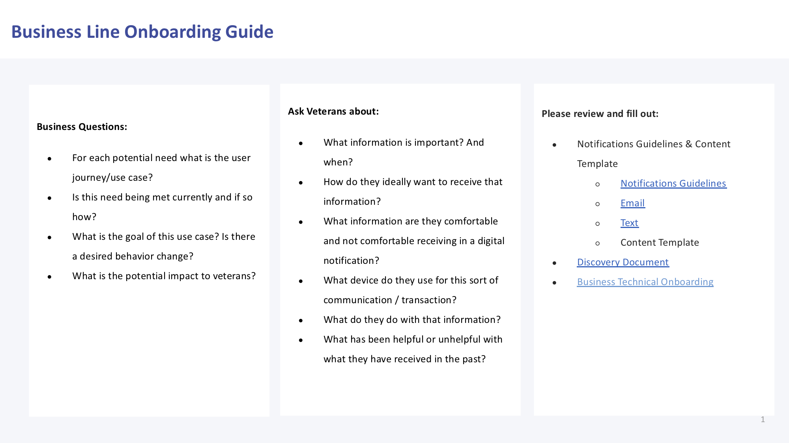
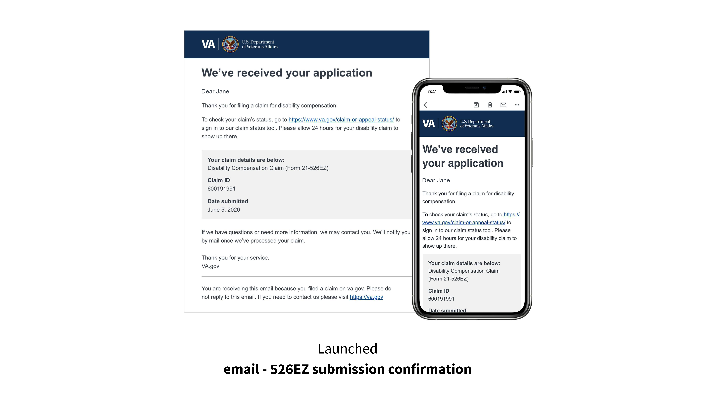

# VANotify Platform

## Our Mission
Improve the overall experience and quality of communications with veterans using modern digital technology, by building a centralized and self-service platform through which business lines and development teams can send communications to veterans.

## Services We Offer
 
- [What We Currently Offer](#current-offering)
- [FAQs](#faqs)
- [How VANotify Works](#how-vanotify-works)
-  [Tech Stack](#tech-stack)

## Onboarding Information
- [Business Onboarding Guide](#business-onboarding-guide)
- [Email Frame & Template](#email-frame-and-template)
- [Pricing](#pricing)
- [Technical Onboarding Guide](#technical-onboarding-guide)

## Things to Know
- [Upcoming Capabilities](#upcoming-capabilities)
- [See Who We Are Working With](#See-Who-We-Are-Working-With)
- [Recent Successes](#recent-successes)
- [Find Out More &amp; Get In Touch With Us](#find-out-more--get-in-touch-with-us)
- [Incident Response](#incident-response)
_____________________________________________________________________________________________________________________________________________________________

## What We Currently Offer

## FAQs
* Do you have any guidelines on when to send a notification and/or what kind to send? We do!  Look [here](notification-guide.md#vanotify-notification-guide)
* Does VANotify support variables in emails?  Yes - There is an an example [below](#successes)
* What about hyperlinks? Yes, VANotify supports hyperlinks.  See an example [below](#successes)
* What's not supported? Currently VANotify does not support: cc, bcc, images or attachments for email
* Should I run my email content by a Privacy Officer? Yes.  This will avoid sending Personally Identifiable Information inadvertantly

## How VANotify Works

## Tech Stack

| Application          | Infrastructure  | Monitoring & Security |
|:---------------------|:----------------|:----------------------|
| Python               | Terraform       | Datadog               |
| Flask                | GitHub Actions  | PagerDuty             |
| Celery               | AWS Fargate     | Twistlock             |
|                      | Bandit          |                       |

## Business Onboarding Guide

## Email Frame and Template

## Pricing

* The **Office of the VA Chief Technology Officer (OCTO)** will pay for the development and maintenance of VA Digital Notifications Ecosystem products (VANotify + VEText).  Also, **OCTO** will pay for AWS infrastructure and operational costs.
* **VA business lines (outside of OCTO)** will be responsible for funding of digital notifications (email, SMS, or mobile push notifications).  Currently, **VA business lines** can procure AWS credits to fund their digital notifications.  The current cost is **$0.93 per AWS credit**. 

| Communication Channel      | Unit Price                                       | Messages per AWS credit                                       |
|:---------------------------|:-------------------------------------------------|:--------------------------------------------------------------|
| Email                      | $0.000093/email                                  | 10,000 emails per credit                                      |
| SMS [outbound and inbound] | $0.0078/SMS [outbound] $0.0070/SMS [inbound] | 119.23 SMS/credit [outbound] 133.33 SMSs/credit [inbound] |

 

 To assign credits to VANotify, please follow these steps:
  -  Click [here](https://github.com/department-of-veterans-affairs/va.gov-team/blob/master/products/va-notify/VANotify%20Cloud%20Credit%20Purchase%20SOP.pdf) for detailed instructions.
  - Link in the pdf -  https://wfm.vaec.va.gov/servicedesk/customer/portal/5

## Technical Onboarding Guide
* [VANotify API Documentation](https://github.com/department-of-veterans-affairs/notification-api#api-documentation)
* Staging URL: https://staging.api.notifications.va.gov
* Postman Collection: https://github.com/department-of-veterans-affairs/notification-api/tree/master/scripts/postman
* Templating guides: 
  * https://design.va.gov/patterns/email_template
  * https://github.com/department-of-veterans-affairs/notification-utils/tree/master/docs
  * https://notification.canada.ca/templates

## Upcoming Capabilities
 * Self Service Portal
 * VA Profile / VA.Gov Integrated Preferences

## See Who We Are Working With
* 526EZ (Application for Disability Compensation and Related Compensation Benefits) Email Confirmation - Sent automatically upon submission
* Covid KMI (Keep Me Informed) Update for Veterans and Non-Veterans Beneficiaries - Sent periodically after sign up on va.gov
* Covid KMI Email Sign-up Confirmation for Veterans and Non-Veterans Beneficiaries - Sent automatically upon sign up
* Rx Pharmacy Shipment Update Pilot Text Message -  Sent upon shipment of prescriptions only for Asheville and Denver VAMCs however we are working on expansion nationally, text messagewill come from a local number currently
* Debt Management Center - "You have new information" email - automatically sent after the Veteran calls the DMC for an update or information on their Debt status as well as may be sent if there is information in their account
Lighthouse
* Direct Deposit Email Confirmation - automatically sent when the Veteran updates their direct deposit account information on va.gov.
* Application Connect & Disconnection from VA account - sent when the Veteran allows an app to access their health information and vice versa on va.gov.
* VA.gov Authenticated experience - Email confirmation that a veteran has updated their contact information.

## Recent Successes

## Find Out More & Get In Touch With Us
* Fill out this form [here](https://github.com/department-of-veterans-affairs/va.gov-team/issues/new?assignees=bevnobev%2C+miabecker&labels=vanotify-intake&template=VANotify-Business-Intake.md&title=Business+intake+form+for+%5BBusiness+or+team%5D)
* Slack - [#va-notify-public](https://dsva.slack.com/archives/C010R6AUPHT)

## Incident Response ##
Points of contact:
* Co-Tech Lead: [Filip Fafara](mailto://filip.fafara@va.gov)
* Co-Tech Lead: [Philip.Herbert](mailto://philip.herbert@va.gov)
* Product Manager: [Maria Becker](mailto://maria.becker@va.gov)
