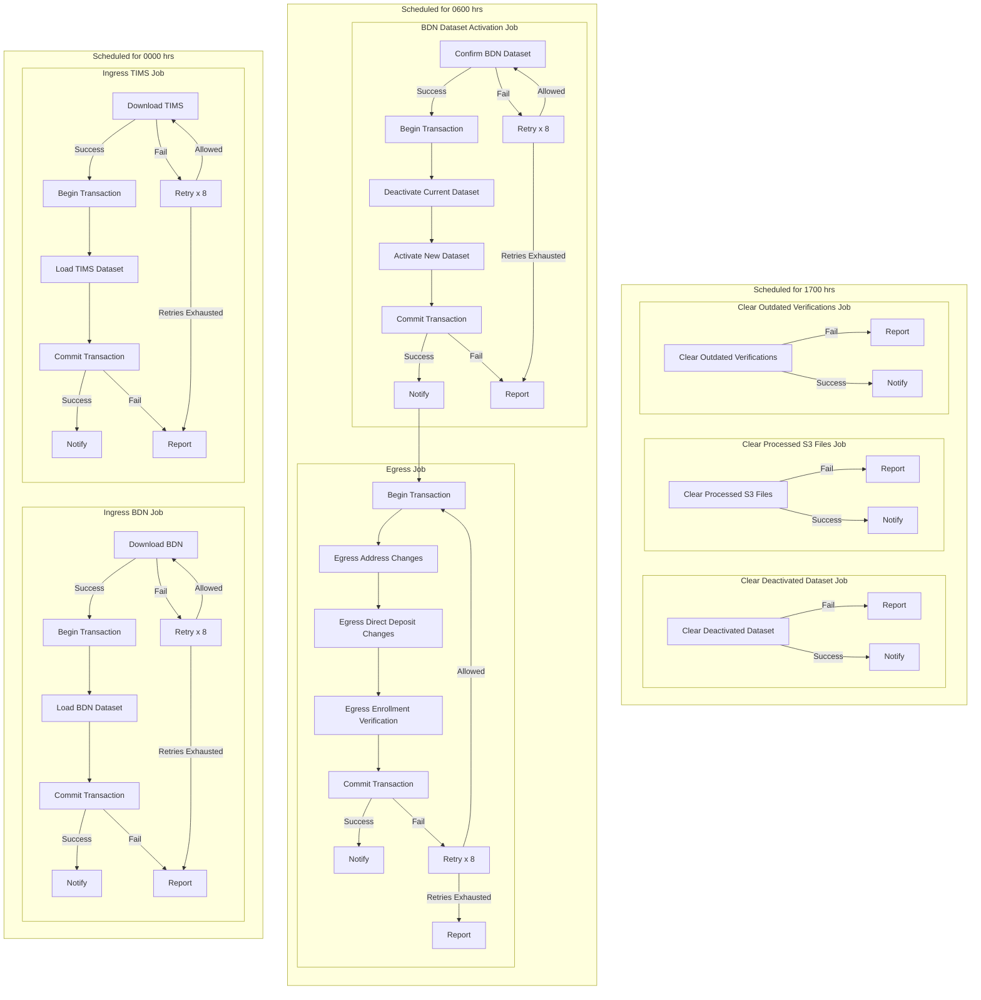

```mermaid
graph
    direction RL

    subgraph "Scheduled for 1700 hrs"
        subgraph "Clear Deactivated Dataset Job"
            direction LR

            ClearDeactivatedDataset[Clear Deactivated Dataset]
            ClearDeactivatedDatasetFail[Report]
            ClearDeactivatedDatasetSuccess[Notify]

            ClearDeactivatedDataset -->|Fail| ClearDeactivatedDatasetFail
            ClearDeactivatedDataset -->|Success| ClearDeactivatedDatasetSuccess
        end

        subgraph "Clear Processed S3 Files Job"
            direction LR

            ClearProcessedS3Files[Clear Processed S3 Files]
            ClearProcessedS3FilesFail[Report]
            ClearProcessedS3FilesSuccess[Notify]

            ClearProcessedS3Files -->|Fail| ClearProcessedS3FilesFail
            ClearProcessedS3Files -->|Success| ClearProcessedS3FilesSuccess
        end

        subgraph "Clear Outdated Verifications Job"
            direction LR

            ClearOutdatedVerifications[Clear Outdated Verifications]
            ClearOutdatedVerificationsFail[Report]
            ClearOutdatedVerificationsSuccess[Notify]

            ClearOutdatedVerifications -->|Fail| ClearOutdatedVerificationsFail
            ClearOutdatedVerifications -->|Success| ClearOutdatedVerificationsSuccess
        end
    end

    subgraph "Scheduled for 0600 hrs"
        direction TB

        subgraph "BDN Dataset Activation Job"
            ConfirmBdnDataset[Confirm BDN Dataset]
            BeginActivationTransaction[Begin Transaction]
            DeactivateOldDataset[Deactivate Current Dataset]
            ActivateNewDataset[Activate New Dataset]
            CommitActivationTransaction[Commit Transaction]
            ActivationFail[Report]
            ActivationSuccess[Notify]
            ActivationRetry[Retry x 8]

            ConfirmBdnDataset -->|Success| BeginActivationTransaction
            ConfirmBdnDataset -->|Fail| ActivationRetry
            BeginActivationTransaction -->
            DeactivateOldDataset -->
            ActivateNewDataset -->
            CommitActivationTransaction -->|Success| ActivationSuccess
            CommitActivationTransaction -->|Fail| ActivationFail

            ActivationRetry -->|Allowed| ConfirmBdnDataset
            ActivationRetry -->|Retries Exhausted| ActivationFail
        end

        subgraph "Egress Job"
            ActivationSuccess --> BeginEgressTransaction
            BeginEgressTransaction[Begin Transaction]
            EgressAddressChanges[Egress Address Changes]
            EgressDirectDepositChanges[Egress Direct Deposit Changes]
            EgressEnrollmentVerification[Egress Enrollment Verification]
            CommitEgressTransaction[Commit Transaction]
            EgressFail[Report]
            EgressSuccess[Notify]
            EgressRetry[Retry x 8]

            BeginEgressTransaction -->
            EgressAddressChanges -->
            EgressDirectDepositChanges -->
            EgressEnrollmentVerification -->
            CommitEgressTransaction -->|Success| EgressSuccess
            CommitEgressTransaction -->|Fail| EgressRetry

            EgressRetry -->|Allowed| BeginEgressTransaction
            EgressRetry -->|Retries Exhausted| EgressFail
        end
    end

    subgraph "Scheduled for 0000 hrs"
        subgraph "Ingress BDN Job"
            direction TB

            DownloadBdn[Download BDN]
            BeginBdnTransaction[Begin Transaction]
            LoadBdnDataset[Load BDN Dataset]
            CommitBdnTransaction[Commit Transaction]
            DownloadBdnRetry[Retry x 8]
            IngressBdnSuccess[Notify]
            IngressBdnFail[Report]

            DownloadBdn -->|Success| BeginBdnTransaction
            DownloadBdn -->|Fail| DownloadBdnRetry
            BeginBdnTransaction --> 
            LoadBdnDataset -->
            CommitBdnTransaction -->|Success| IngressBdnSuccess
            CommitBdnTransaction -->|Fail| IngressBdnFail
            DownloadBdnRetry -->|Allowed| DownloadBdn
            DownloadBdnRetry -->|Retries Exhausted| IngressBdnFail
        end

        subgraph "Ingress TIMS Job"
            direction TB

            DownloadTims[Download TIMS]
            BeginTimsTransaction[Begin Transaction]
            LoadTimsDataset[Load TIMS Dataset]
            CommitTimsTransaction[Commit Transaction]
            DownloadTimsRetry[Retry x 8]
            IngressTimsSuccess[Notify]
            IngressTimsFail[Report]

            DownloadTims --> |Success| BeginTimsTransaction
            DownloadTims -->|Fail| DownloadTimsRetry
            BeginTimsTransaction --> 
            LoadTimsDataset -->
            CommitTimsTransaction -->|Success| IngressTimsSuccess
            CommitTimsTransaction -->|Fail| IngressTimsFail
            DownloadTimsRetry -->|Allowed| DownloadTims
            DownloadTimsRetry -->|Retries Exhausted| IngressTimsFail
        end
    end
```
