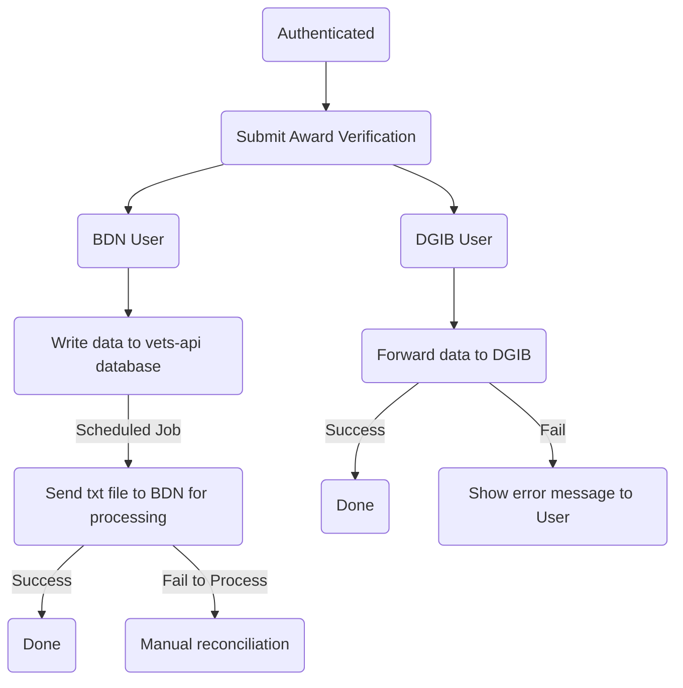

```mermaid
flowchart
A(Authenticated)-->B(Submit Award Verification)
B --> C(BDN User)
C --> E(Write data to vets-api database)
E --> |Scheduled Job|F(Send txt file to BDN for processing)
F --> |Success|G(Done)
F --> |Fail to Process|H(Manual reconciliation)
B --> D(DGIB User)
D --> I(Forward data to DGIB)
I --> |Success|J(Done)
I --> |Fail|K(Show error message to User)
```