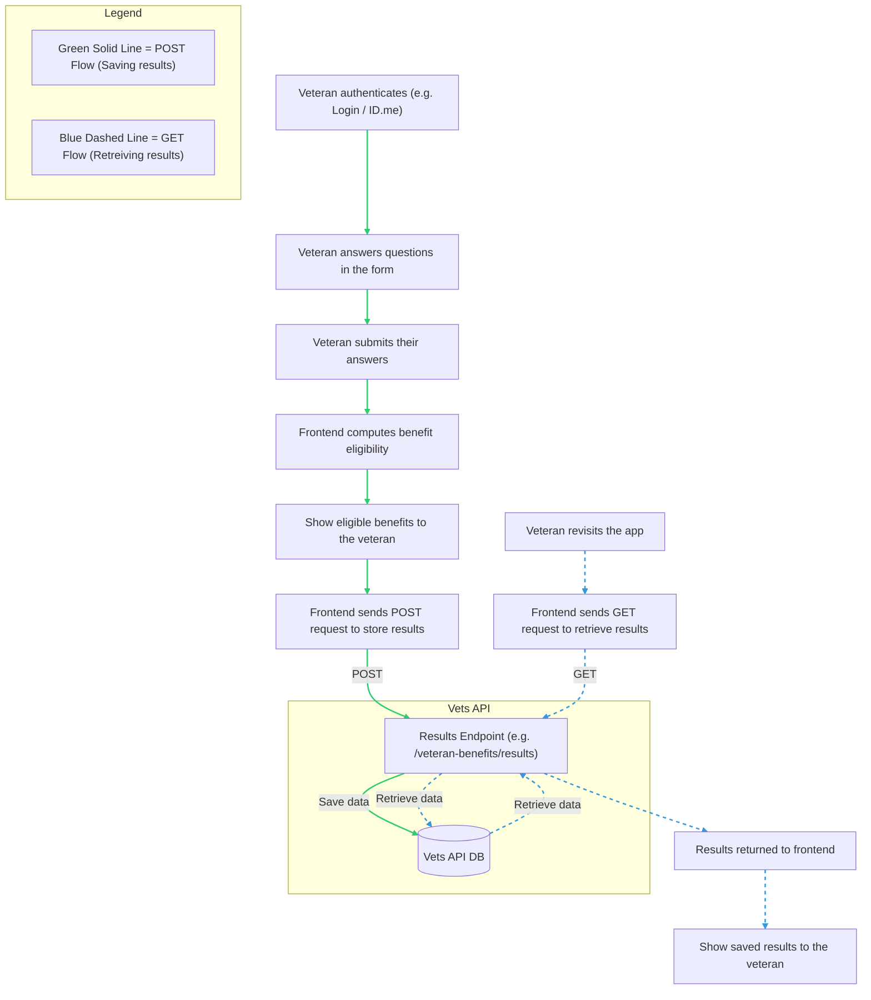

# Authenticated Experience Architectural Intent

## Overview

The intent of this document is to outline the feasibility and recommended path for implementing an API that allows us to store a veteran's recommended benefits.

## State of the app

The current state of the app is an unauthenticated form that veterans complete, and upon submission, they are shown a list of recommended benefits that they may be eligible for. A major goal of the app is to allow functionality for veterans to save their results so they can revisit them at a later time without needing to refill the form. This was previously done via a `Copy link` button that would save the link to the user's clipboard, allowing them to bookmark or save it. This was possible because each submission generates a unique URL that contains a list of recommended benefits. So when the link is opened at a later time, the app is able to pull the benefits from the URL and display them to the user.

From research studies, it was proven that the `Copy link` button wasn't as helpful as initially thought to be, and has been removed from the app. With that, leaves the need for a more efficient way of saving veterans's recommended benefits.

One option for saving veterans's results in a more efficient way is to connect the benefits to a veteran's profile on VA.gov, which is what this document intends to explore.

## Unauthenticated flow

The app is currently entirely unauthenticated, meaning anyone can submit a form submission and see results without an account. This is good since most of the veterans who use the app are transitioning service members going into civilian life, so they most likely don't have a  VA.gov account yet.

It's expected that we will always want to maintain some form of unauthenticated experience for the app, to ensure as many veterans as possible can benefit from it. There is a challenge that stems from saving results for an unauthenticated user, as there is no way to connect the results to the individual, which is why authentication would be needed. Trying to save the user's results in the idle period while they make their account is tricky, because there aren't any good ways to map the results back to that user once the user has created a VA.gov account. There are a few potential ways of handling this:

### Browser local storage

Once a user completes the form, we could save a key or token to their browser's local storage, so that when they revisit the app after creating a VA.gov account, the app can pull the key from local storage and use that to populate the user's recommended results. This key could be the same key that is generated in the URL of the results page that specifies what benefits are being recommended.

The problem with this approach is the user could either:
- Clear browser data
- Use a different browser to log on to VA.gov and access the app

Either of those scenarios would render this approach insufficient. It's not safe to assume the user will be using the same browser and not have cleared any site data within their browser.

### Collecting an email address

Once a user submits a form, we could collect their email address that they anticipate using for their VA.gov account in advance and save their email along with their recommended benefits. This way, when they revisit the app authenticated, we will be able to recognize this user's email address and populate their recommended benefits.

This approach seems more promising than using local storage, but there are also a few caveats here:

- The user may not end up using the same email to create their account
- Since the form is unauthenticated, we could end up storing unnecessary submissions that aren't ever connected to an account

In general, syncing unauthenticated submissions to future accounts is more of a challenge and should not be covered in the V1/MVP of this new flow. This can be thought of in a future iteration.

## Authenticated flow

The authenticated flow would be in play when a veteran who is logged in is using the app. When they complete the form and submit it, their recommended benefits will be synced to their account, so they can revisit the results whenever they'd like without having to refill the form. There may be a modal or button on the intro page of the app that gives veterans the option to sign in so that they can save their results.

The exact flow will be determined by UX design, but the saving of the benefits would likely occur automatically on submission, or on the results page with the click of a `Save results` button.

When the user revisits the app, they would either be automatically taken to the results page with their recommended benefits or taken to some sort of benefit management portal, where they see a portal of all their recommended benefits are and be able to manage which ones they've applied for, etc. This will again be largely driven by UX design and what makes the most sense from an experience perspective.

### Architectural diagram

