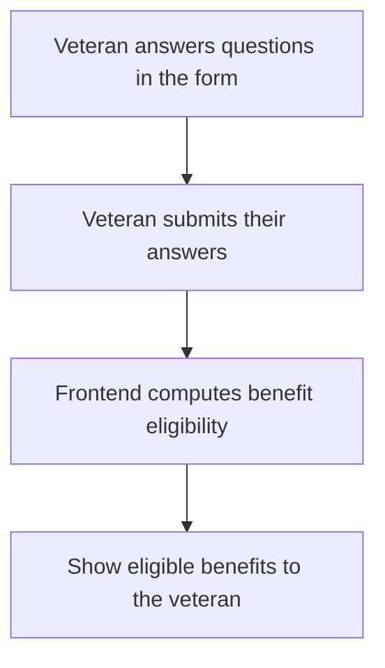
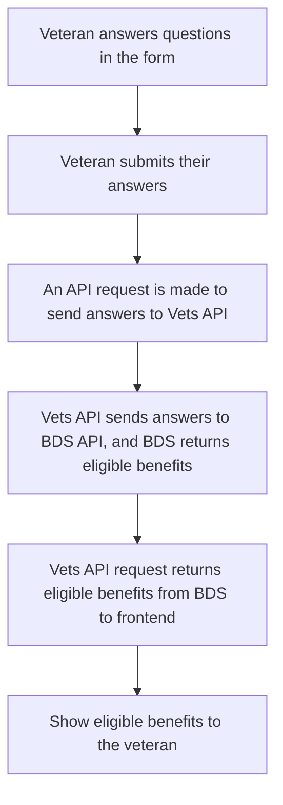

# Vets API Integration Discovery

## Overview

The intent of this write-up is to explore the technical requirements, reasonability, and lift for integrating the [BDS API](https://github.com/department-of-veterans-affairs/ves-benefits-discovery-service) with the `Discover your Benefits` app on VA.gov.

## Vets API Overview

All apps on VA.gov that rely on any API have to go through [vets-api](https://github.com/department-of-veterans-affairs/vets-api), the API that powers VA.gov applications. This is because of how VA.gov is configured. The [Cross Origin Resource Sharing (CORS)](https://developer.mozilla.org/en-US/docs/Web/HTTP/Guides/CORS) for the VA.gov server is configured to only allow requests from [api.va.gov](https://api.va.gov/). This means attempting to access an upstream API service (i.e. one hosted via lighthouse, e.g. BDS) directly isn't possible, for more than one reason.

Therefore, in order to integrate with the BDS API, we would most likely need to create a [module](https://depo-platform-documentation.scrollhelp.site/developer-docs/backend-endpoint-tutorial) in the `vets-api` repo, which would essentially be its own API that handles requests to and from the BDS API. Implementing this API in `vets-api` would require work from backend engineers familiar with Ruby on Rails.

While the technical lift wouldn't be large since the [BDS API](https://effective-adventure-ozmrjm3.pages.github.io/) doesn't have many endpoints, the lift for this wouldn't be small either, as there would be a lot of work sorting out the API schema and making sure the data flow between our app and BDS is consistent. Many VFS teams I've seen in the past often have dedicated backend engineers on their team that handles the API portion of the app, as the frontend and backend can be seen as two separate apps.

## Authentication

Apps on VA.gov do not need to require users to be authenticated in order to use an API from `vets-api`. An example of this can be seen with the [Find VA locations](https://www.va.gov/find-locations) and [GI Bill Comparison Tool](https://www.va.gov/education/gi-bill-comparison-tool) applications. This means we could still manage an unauthenticated experience even when integrating with the BDS API.

### Benefits of authentication

Some potential benefits to having users be authenticated are:

- Having some of their data already pre-populated, so we wouldn't need to ask them as many questions
- Being able to save their recommended benefits to their account, so they could return and access them at a future time

This would need to be verified by the backend engineer who works on the `vets-api` portion of this work.

### Frontend authentication

Authentication can be made required via the [RequiredLoginView](https://github.com/department-of-veterans-affairs/vets-website/blob/89fafd8f72c9acb15394af779231a48b539971bc/src/platform/user/authorization/components/RequiredLoginView.jsx#L38) component, which checks whether an active authenticated session is present before allowing access to the app, and if one isn't, the user will be prompted to sign in.

This works great for the authenticated workflow of our app, but becomes a bit more tricky accounting for both the authenticated and unauthenticated workflows. From my findings, there aren't any apps that support both authenticated and unauthenticated workflows, so our app would potentially be the first to do so. There are a few ways we could potentially handle this:

1. The [Sign-in](https://www.va.gov/sign-in) application on the VA.gov website essentially directs the user to the sign-in page so they can authenticate. We could have an entry page to the app that allows the user to choose whether they want to log in and continue the app (explaining the benefits of logging in) or continue unauthenticated, and based on that selection, we would navigate them to the `Sign-in` app so they can authenticate.

- Pros:

  - We wouldn't need to explicitly wrap our app in an authenticated view, meaning it would be more or less up to the veteran and the `Sign in` app to handle authentication. We would somewhat be the messenger (i.e. it would be like telling the veteran "Do you want to sing in before continuing? If so, go to this other page to sign in, and we'll see you back when you're done, otherwise, continue onto our app)

- Cons:

  - It's not clear whether the user would be automatically be navigated back to our app, which if they aren't, would be a less than ideal user experience. 

2. Another approach, similar to the first option is that after the user decides which workflow to proceed with, instead of routing them to the `Sign in` application, we render the version of the app wrapped in the `RequiredLoginView`, that way we are enforcing authentication before they continue.

- Pros:

  - Easier to ensure they stay within the app after signing in. When routing them to the Sign in application, It's not certain whether they'd be automatically routed back to the app that sent them there

  - Implementation would probably be less cumbersome because we wouldn't need to send them to a different app for authentication, we would be supporting it natively in ours

  - We wouldn't be dependent on another app. While unlikely to happen, if anything changed with the URL of the `Sign in` app, or the implementation changed, this could impact the consistency of our app

- Cons:

  - We'd need to handle certain edge cases, e.g. if the veteran navigates back to the options screen after already having selected an option, we'd want to make sure we reset the state of their initial choice. We'd also need to figure out how to handle if the user tried to supersede the option page that asks them whether they'd like to sign in or not. (e.g. do we automatically kick them back to the options page if they haven't selected an option? Do we just show the unauthenticated version of the app?) So it would require more thinking and logic on our end to handle edge cases like that

3. One last way would be to not ask the user whether they would like to sign in, and just check whether they are authenticated or not, and if they are authenticated, use the authenticated workflow.

- Pros:

  - This is probably the simplest approach out of the 3, requiring minimal extra work from an engineering standpoint, as we'd just be performing a check to see whether they are authenticated or not and proceed from there

- Cons:

  - Not clear to the veteran that there are 2 different workflows, and that there could be added benefits if they were authenticated before using the app

## Scalability of Vets API Integration

By integrating `vets-api` into the app, we gain more scalability, in the sense that there is room for additions to the app. We could eventually get to a place where we could have some sort of benefit portal where we help veterans track which recommended benefits they've applied to, potentially even showing status updates to them.

But in the near future, we would still gain reducing the amount of questions we ask veterans on the form by having their information pre-populated, and being able to save their benefits for them to revisit on the site.

## Workflow diagrams

### Current workflow

### BDS integrated workflow

## Next steps

I think the main focus for the path forward should be in integrating with the BDS API via Vets API first, so that we can get as much of the recommended benefits as possible from their API. This would mean holding off on authentication until the API integration is complete. The implementation of the API in the `vets-api` repo would require a backend engineer to compare the BDS API endpoints with the data the app receives from the form, and pave a path for connecting the two.

Doing the work in this order would give us an even clearer vision of what we would need in our app's API to support a seamless, authenticated experience.
