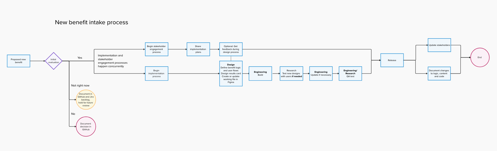

# **Process for Adding Benefits to DYB**

## **Introduction**

This document outlines the process for evaluating and adding new benefits to the Do You Benefit (DYB) tool. It serves as a guide for the team to systematically assess whether a benefit should be included, and if so, how to implement it.

### **What is DYB?**

**Product Link:** [Discover Your Benefits | Veterans Affairs](https://www.va.gov/discover-your-benefits/introduction)

**Purpose:** The primary goal of Discover Your Benefits is to aid in simplifying the enrollment process by acting as a hub for Transitioning Service members (TSMs) or recently separated Veterans (RSVs) to discover their benefits and understand eligibility. The product is an unauthenticated questionnaire hosted on VA.gov and is publicly accessible.

**Main Goals:**

* Increase the utilization of benefits  
* Improve awareness of benefits beyond the most well-known (healthcare, disability, home loan) as well as other non-VA benefits (SBA, DoL, etc.)  
* Create earlier engagement between VA and active service members  
* Increase the proportion of Veterans that engage with VA post-service

**Scope:** While the initial value proposition is aimed at TSMs and RSVs, the Veteran Transition Support product is meant to be useful for anyone engaging with the VA including family members and caregivers, as well as Veterans re-engaging with VA regardless of their time since service.

### **How to Use This Document**

This document describes the **happy path/baseline** for adding benefits. Not every benefit will require all steps (for example, some additions may not need new research if existing research already validates the need). Use this as a framework and adapt as needed for each specific case.

 Link to [Mural board](https://app.mural.co/t/adhoccorporateworkspace2583/m/adhoccorporateworkspace2583/1761571241741/728bec469b2ef56279adda11062861c2d094f37f) with a flow chart of this process. 

 

## **Step 1: Summary and Context**

### **Description of the New Benefit**

Provide a clear description of the benefit being considered.

**Links:**

* \[Relevant benefit information links\]

**Eligibility:**

* \[Standardized eligibility criteria\]  
* Note: We should continue to standardize eligibility criteria across benefits

**Context for Adding:**

* Was this benefit requested by a stakeholder?  
* Did a research participant mention it?  
* Other context for why we're considering this addition

### **Type of Change**

Identify what type of change this represents:

* **Additive:** Adding a new benefit without changing existing benefits  
* **Split:** Breaking an existing benefit into multiple benefits  
* **Removal:** Removing or consolidating existing benefits  
* **Highlight:** Making a non-obvious benefit more visible (e.g., Native American loan guarantee)

---

## **Step 2: Evaluate the Benefit**

This evaluation will result in one of three decisions:

* **Yes** – Proceed with adding the benefit  
* **No** – Do not add the benefit  
* **Not Right Now** – Add to backlog for future consideration

### **Potential Benefits**

**Who is it for?**

* Target audience/beneficiary population

**How would it benefit them?**

* Specific value proposition  
* Impact on users

**How is it different from other benefits in that category?**

* Example: How is VA mental health care different from general VA health care?  
* What makes this benefit distinct or necessary as a separate entry?

### **Potential Risks**

**Complexity and Resource Costs:**

* All additions increase complexity for users and use development resources. Is it worth it?

**Other Risks:**

* Technical risks  
* Usability/user experience risks  
* Maintenance burden  
* Political or relationship considerations

### **What Does the Research Say?**

* Is the addition of the benefit validated by our team's research? By other VA research?  
* Does the benefit fill an unmet need?  
* Note: **Do not assume new research is required.** Existing research may already support the decision.

### **Holistic Review**

* Does this benefit fit within the overall DYB ecosystem?  
* Are there dependencies or relationships with other benefits?  
* Could this create confusion or overlap with existing benefits?

---

## **Step 3: Stakeholder Consultation**

### **Who Do We Need to Talk To?**

**VA Stakeholders:**

* \[List VA contacts/teams\]

**Non-VA Stakeholders:**

* \[List external contacts/teams\]

**Considerations:**

* Is there a political/relationship cost to adding (or not adding) this benefit?  
* Document any stakeholder concerns or requirements  
* Explain the process, timeline, and how we will update them on progress

---

## **Step 4: Decision and Recommendation**

### **Summary of Pros and Cons**

**Pros:**

* \[List advantages\]

**Cons:**

* \[List disadvantages\]

### **Recommendation**

**Decision:** \[Yes / No / Not Right Now\]

* If yes, move to implementation process  
* If not right now, document in GitHub and create a backlog ticket  
* If no, document decision in GitHub

**Rationale:** \[Explanation of recommendation\]

---

## **Step 5: Implementation (If Approved)**

If the decision is **Yes**, proceed with the following implementation steps:

### **Design Process**

**Define Logic for Benefit:**

* Determine eligibility logic and decision tree  
* Map user pathways to this benefit

**Update Benefit Logic:**

* Document logic changes needed in system

**Design Results Card:**

* Create visual design for how the benefit will appear in results  
* Ensure consistency with existing benefit cards  
* Include all necessary information (description, eligibility, next steps, links)

### **Content Process**

* Write or revise content for the benefit  
* Review for plain language and accessibility  
* Ensure alignment with VA content standards

### **Engineering Process**

**Update the Code:**

* Implement logic changes  
* Add new benefit to system  
* Update any affected components or pages

**Testing:**

* Unit testing  
* Integration testing  
* User acceptance testing

### **Stakeholder Review Process**

* Share implementation plans with stakeholders identified in Step 3  
* Incorporate feedback

### **Release**

* Deploy to production  
* Monitor for issues  
* Document release in change log

### **Post-Release**

**Go Back to Stakeholders:**

* Inform stakeholders of successful implementation
