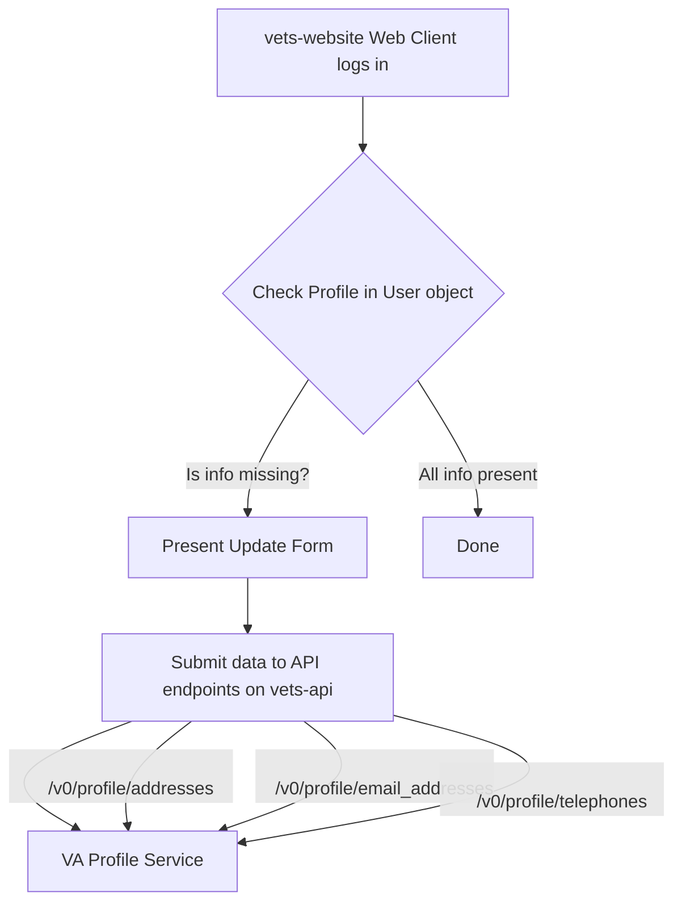

## ATO Documentation: Welcome to My VA (Missing Contact Info Flow)
**_Last Updated: 09/05/2025_**

_Please Note: The Veteran-Facing Services Platform ATO boundary includes all environments: Dev, Staging, Utility, Sandbox, and Production, as well as all VFS teams/Products, Platform teams, CMS, VA Notify, and VA Mobile. If the environments your team uses have different configurations, we will need this information for each environment._

#### POC
1. **What is the name of your product(s)/system(s)?** Welcome to My VA
2. **Describe its purpose in a few sentences.** In order to ensure VA can communicate with Veterans, if key pieces of contact information (phone number, email, physical address) are missing from the Veteran's profile, we request they add that information, providing them with a form to allow them to do so.
3. **If you represent multiple products, please describe the relationship between them, if there is any.**  This product sits within the "My VA Dashboard" but it does not interact with them. 
4. **What is the expected duration of your project? This information helps us understand how our processes need to adapt** This is a permanent feature.

#### AWS Resources
1. **List AWS services used.**  This service does not utilize any AWS resources
2. **Describe named instances of each service used.** N/A
3. **Which of your resources handle PII? List the types of PII.** N/A
4. **Do you utilize any other cloud resources beyond VA.gov?** N/A

#### Repositories
1. **List repos maintained by your team, provide links.**  The only repo that we maintain exclusively is the [Performance Dashboard](https://github.com/department-of-veterans-affairs/performance-dashboard).  The rest of the work we do is within `vets-api` and `vets-website`
2. **List repos used by your team, provide links.** [vets-api](https://github.com/department-of-veterans-affairs/vets-api), [vets-website](https://github.com/department-of-veterans-affairs/vets-website)
3. **Do you have a POC for each repo? Please list – Individuals are preferred, but groups are acceptable.** [IIR Team](https://github.com/orgs/department-of-veterans-affairs/teams/va-iir) 
4. **List other groups you know use your repos.** N/A

#### Tools

This product is implemented in [vets-api](https://github.com/department-of-veterans-affairs/vets-api) and [vets-website](https://github.com/department-of-veterans-affairs/vets-website).  It does not use any additional tools.

~~1. List CI/CD or Infrastructure as Code tools.
2. Describe where each tool is hosted and if they handle PII.
3. List software included in deployment or generate SBOM.
4. List all packages/plugins/modules/gems/etc. Include version numbers.~~

#### Connections

This product does not implement any additional connections, either within or outside of the VA Network.  It uses the existing endpoints which connect to VA Profile, but does not modify those calls.

~~1. List the connections your team makes/maintains with systems outside the Platform AWS Environment.
2. Are these connections Internal or External to the VA?
3. Do you have a POC? Please list.
4. Describe the encryption used for the connection in transit (e.g., Not Encrypted, TLS 1.2, TLS 1.3, mTLS). Specify the certificate source if applicable (e.g., AWS ACM, Let's Encrypt, self-signed).
5. List the types of PII shared (in each direction) with this connection.
6. Do you have an MOU, ISA, IAA, or other formal agreement that documents this connection? If so, please provide it.~~

#### Data Flow Diagram
The following is a data flow diagram that shows this product’s relationship to Platform:

