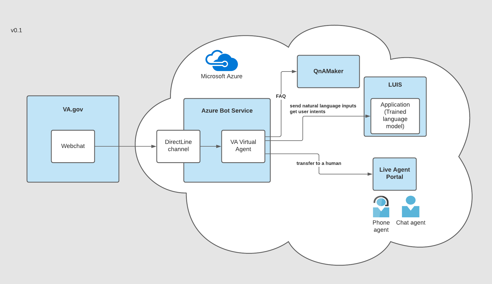

# Virtual agent architecture

## Microsoft Tools

### LUIS (Language Understanding)

What is it?

- Cloud based service for understanding natural (human) language
- Returns an **intent** based on a user's input and training data

When would you use it?

- Example: Booking a flight through chat
  - User types "Book me a flight to Paris"
  - LUIS would return the intent of `BookFlight` and entity `Paris`
  - Then code could handle booking a flight and may ask for more information

Inputs

- List of **intents**
  - Intents should be very distinct from each other. Overlapping intents confuse LUIS
- Each intent has **example utterances**
  - Example: "Book me a flight to Paris"
  - Recommended range is 15 to 30 utterances per intent
  - Utterances can contain **Entities** which extract key data (Ex. Paris)
    
Links
- [Best Practices](https://docs.microsoft.com/en-us/azure/cognitive-services/luis/luis-concept-best-practices)
- [Good Example Utterances](https://docs.microsoft.com/en-us/azure/cognitive-services/luis/luis-concept-utterance)

### QnA Maker

What is it?
- QnA Maker is a cloud based service for finding the best answer to a question
- Finds most appropriate answer for any input from your custom **knowledge base** (KB)

When would you use it?
- FAQs
- For giving information back to the user. Does not require further action
- Example:
    - User types "What is the VA doing to deal with Covid-19?"
    - QnA Maker would search the knowledge base for the closest matching question
    - Answer would be returned to user

Inputs
- Knowledge Base
    - **Questions**
        - Questions can have **alternative phrasings**
    - **Answers** to questions
        - Answers can have **followup prompts** (Ex: Would you like to learn more about this)
    
Links
- [Overview](https://docs.microsoft.com/en-us/azure/cognitive-services/qnamaker/overview/overview)

### Azure Bot Service

What is it?
- Hosting for bots created using the Microsoft Bot Framework SDK (code)

### PVA (Power Virtual Agent)

What is it?
- PVA is a SaaS based chat software
- Conversation flows are creating through a graphical interface (**authoring canvas**) with integrations to other Microsoft Services handled through Power Automate
- In the above diagram PVA would replace Azure Bot Service and potentially LUIS

What can it do?
- You can define **topics** with **trigger phrases**
- When a user enters a trigger phrase the bot will enter the conversation flow corresponding to that topic

When would we use it?
- Creating a simple bot that needs to be maintained by a non-technical team

When not to use?
- If the bot is very complex
    - As there are more topics/intents to cover the graphical interface will be more difficult to navigate than code
- The cost of bugs is high
    - Bugs are more likely because we can't add unit testing
