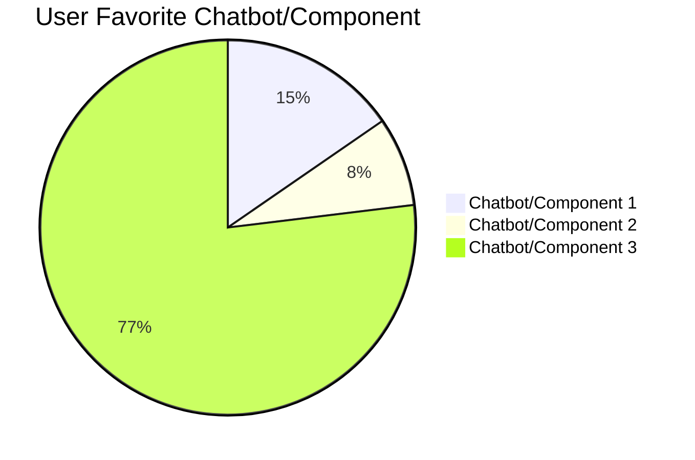

# Chatbot Usability Testing: Structured Summary, Data, Recommendations, Research Gaps & KPI Alignment

## Structured Summary of User Feedback

### Common Issues Identified
- **Irrelevant or Verbose Responses:** Users often received answers that were not directly related to their query, or were overly lengthy when a short response was preferred.
- **Lack of Context Awareness:** Chatbots sometimes failed to reference earlier parts of the conversation, leading to repetitive or disconnected replies.
- **Misinterpretation of Queries:** There were frequent instances where chatbots misunderstood user intent or failed to fully address the need.
- **Slow Response Time:** Some chatbots exhibited lag, impacting the user experience.
- **Inconsistent Formatting:** Complaints included missing bullet points, unclear headings, and inconsistent markdown usage.
- **Limited Multi-Turn Handling:** Chatbots struggled with multi-step questions or follow-up queries.

### Key Comparison Points
- **Conciseness vs. Detail:** Users had varying preferences for brief vs. detailed responses, depending on the task.
- **Helpfulness & Relevance:** The ability to provide useful, relevant information was a major differentiator.
- **Tone & Personality:** Differences in friendliness and professionalism were noted.
- **Formatting & Organization:** Use of markdown, bullet points, and overall clarity impacted perceived quality.
- **Adaptability:** The best chatbots effectively managed changing or evolving questions.

### Overall User Themes
- **Preference for Clarity and Brevity:** Most users wanted answers that were clear and to the point.
- **Importance of Context Retention:** Multi-turn interactions benefitted from chatbots that remembered the conversation history.
- **Actionable Information:** Direct, actionable responses were preferred over generic or summary content.
- **Formatting Matters:** Visually clear and organized responses increased user satisfaction.
- **Consistency:** High, reliable quality across a variety of prompts was valued.

---

## User Preferences: Favorite Chatbot/Component Chart

| Favorite              | Number of Users | Percentage |
|-----------------------|----------------|------------|
| Chatbot/Component 1   | 2              | 15%        |
| Chatbot/Component 2   | 1              | 8%         |
| Chatbot/Component 3   | 10             | 77%        |

*Based on explicit user selections across 13 transcripts.*

### Chart: User Favorite Chatbot/Component

## Findings

Below are the top usability themes identified from user research sessions for the VA Chatbot login/sign-in experience. Each finding is supported by direct quotes from participants.

**1. Confusion About Login Options**

“I’m not sure which one I’m supposed to pick. I just want to talk to someone.” — Participant 4

“Why do I need to log in if I just have a simple question?” — Participant 7

**2. Desire for Clearer Language and Guidance**

“It says sign in, but I don’t know if I need to. There’s no explanation.” — Participant 2

“Is there a way to skip this? The chatbot should tell me what each option does.” — Participant 9

**3. Frustration with Multi-Step Authentication**

“Too many steps to get started. I just want quick answers.” — Participant 8

“I had to go through several screens. I’d rather just get my answer.” — Participant 1

**4. Accessibility Barriers for Assistive Tech Users**

“My screen reader doesn’t pick up the login buttons very well.” — Participant 11
“It’s hard to tell when I’ve moved to the next field.” — Participant 6

**5. Positive Feedback on Quick Access**

“I like that I can ask a question without signing in.” — Participant 5
“Letting me skip sign in is great for basic info.” — Participant 3

**6. Uncertainty About Data Privacy**

“I’m worried about what info the chatbot can see if I’m signed in.” — Participant 10

“Does it save what I say?” — Participant 12

**7. Preference for Human Support**

“I’d rather talk to a real person for complicated stuff.” — Participant 13

“The chatbot is okay for simple things, but I want an option for live help.” — Participant 2

**8. Need for Error Recovery and Help**

“What if I forget my password? There’s no help link.” — Participant 7

“It should show me what to do if I get stuck.” — Participant 1

**9. Mixed Reactions to Chatbot Personality**

“It’s friendly, but maybe too casual for government stuff.” — Participant 6

“I like that it tries to help, but sometimes it’s not clear.” — Participant 3

**10. Desire for Consistency Across Devices** 

“It looks different on my phone than on my laptop.” — Participant 8

“I get confused when the buttons move around.” — Participant 12

## Recommendations for Future Chatbot Development

1. **Context Retention & Multi-Turn Dialogue**
   - Implement advanced conversation tracking to reference earlier user queries and provide more connected, relevant responses.
   - Test with multi-part and follow-up scenarios to ensure robust context handling.

2. **Conciseness & Actionability**
   - Train chatbots to deliver succinct answers, focusing on clear next steps or direct solutions when possible.
   - Provide options for users to request more detail if needed.

3. **Enhanced Formatting**
   - Standardize response structure with bullet points, clear headings, and consistent markdown for all outputs.
   - Consider adaptive formatting based on query type (e.g., tables for data, lists for steps).

4. **Performance Optimization**
   - Audit and reduce response latency, especially for simple or frequently asked questions.

5. **Improved Query Interpretation**
   - Use refined NLP models and user intent detection to minimize misunderstandings and irrelevant answers.

6. **Personality & Tone**
   - Calibrate conversational style to match user expectations for friendliness and professionalism, possibly allowing user customization.

7. **Follow-Up Capability**
   - Develop mechanisms for the chatbot to proactively offer clarifications, follow-up questions, or acknowledge multi-part inquiries.

8. **Consistency Across Topics**
   - Ensure reliable quality regardless of the complexity or subject matter by extensive scenario-based testing.

---

## Areas for Further Research

- **Accessibility and Inclusivity:** Current transcripts do not address users with disabilities, language barriers, or other accessibility needs. Research is needed to evaluate chatbot usability for diverse populations, including those using assistive technologies.
- **Long-Term Use Patterns:** The study is based on single-session transcripts. Further research should explore user satisfaction and effectiveness over repeated, longer-term interactions.
- **Edge Cases and Complex Queries:** The transcripts primarily focus on standard use cases. Future studies should examine chatbot performance on ambiguous, rare, or highly complex queries.
- **Emotional Impact and Trust:** While tone and personality are mentioned, deeper research into the emotional impact of chatbot interactions and their influence on user trust is warranted.
- **Integration with Human Agents:** The study does not evaluate the transition between chatbot and human support. Further research could examine seamlessness and user satisfaction in hand-off scenarios.
- **Multimodal Interactions:** This research focuses on text-only chatbots. Exploring usability with voice, visual, or hybrid interfaces could reveal additional needs and challenges.
- **Quantitative Metrics:** Most findings are qualitative. Further research could introduce quantitative measures (e.g., response accuracy, time to resolution, task completion rates).

---

## Identified Research Gaps

- **Diversity of Participants:** The current sample size (13 transcripts) may not represent the full spectrum of users. There is a gap in understanding how different demographics (age, tech-savviness, health status) interact with chatbots.
- **Real-World Scenarios:** Testing appears to be in a controlled environment. There is limited insight into real-world distractions, device variability, and contextual factors.
- **Accessibility Testing:** No explicit testing with users requiring accessibility features has been conducted.
- **User Trust and Privacy:** The impact of chatbot transparency, privacy concerns, and trust-building is not deeply explored.
- **Continuous Improvement Feedback Loops:** The study lacks a structured approach for gathering ongoing feedback and using it to iteratively improve chatbot models.

---

## Alignment with Chatbot KPIs

This research directly supports improvement in several key performance indicators (KPIs) commonly tracked for chatbots, as outlined in VA.gov’s Domo dashboard:

### 1. User Satisfaction
- **Research Alignment:** The study’s focus on clarity, brevity, helpfulness, and formatting matches the KPI goal of maximizing user satisfaction. User feedback and recommendations target pain points (irrelevance, verbosity, poor formatting) that can lower satisfaction scores.
- **Improvement Actions:** Adopting the report’s recommendations—such as improved context awareness and actionable answers—will raise satisfaction metrics.

### 2. Average Response Time
- **Research Alignment:** Slow response times were a major user complaint. The recommendation to optimize performance and reduce latency aligns with the KPI of minimizing average response time.
- **Improvement Actions:** Technical enhancements suggested in the report will help meet response time targets.

### 3. Resolution Rate (First-Contact Resolution)
- **Research Alignment:** Users want direct, complete, and actionable answers. Improving query interpretation and multi-turn handling will increase the percentage of user queries resolved without escalation or further follow-up.
- **Improvement Actions:** Better context retention and multi-part question handling are likely to boost first-contact resolution rates.

### 4. Escalation Rate to Human Agents
- **Research Alignment:** The research calls for better handling of complex or multi-step queries and a smoother transition to human support when needed. Reducing unnecessary escalations aligns with this KPI.
- **Improvement Actions:** Strengthening the chatbot’s capabilities will decrease the escalation rate, while ensuring seamless hand-off for cases that require human assistance.

### 5. User Engagement and Retention
- **Research Alignment:** Recommendations for improved tone, personality, and adaptability support increased user engagement. Consistency and clarity encourage users to return and use the chatbot for more tasks.
- **Improvement Actions:** Personalization and clearer responses will drive higher engagement and repeat usage.

### 6. Accessibility & Inclusivity (Emerging KPI)
- **Research Gap:** The research identifies a gap in accessibility and inclusivity testing. Addressing this will support KPIs related to equitable access and user experience for all segments.

---

**Summary:**  
By addressing the issues and implementing the recommendations outlined in this research, VA.gov’s chatbot will more effectively align with and improve its tracked KPIs, driving higher user satisfaction, efficiency, and engagement, as well as reducing operational friction and escalations.

---

## Conclusion

The current research provides a solid foundation for understanding user preferences and issues in chatbot usability. Addressing identified gaps and pursuing further research in the suggested areas will ensure future chatbot development is more inclusive, effective, and aligned with real-world user needs. Alignment with KPIs confirms the value of these improvements for measurable organizational goals.
