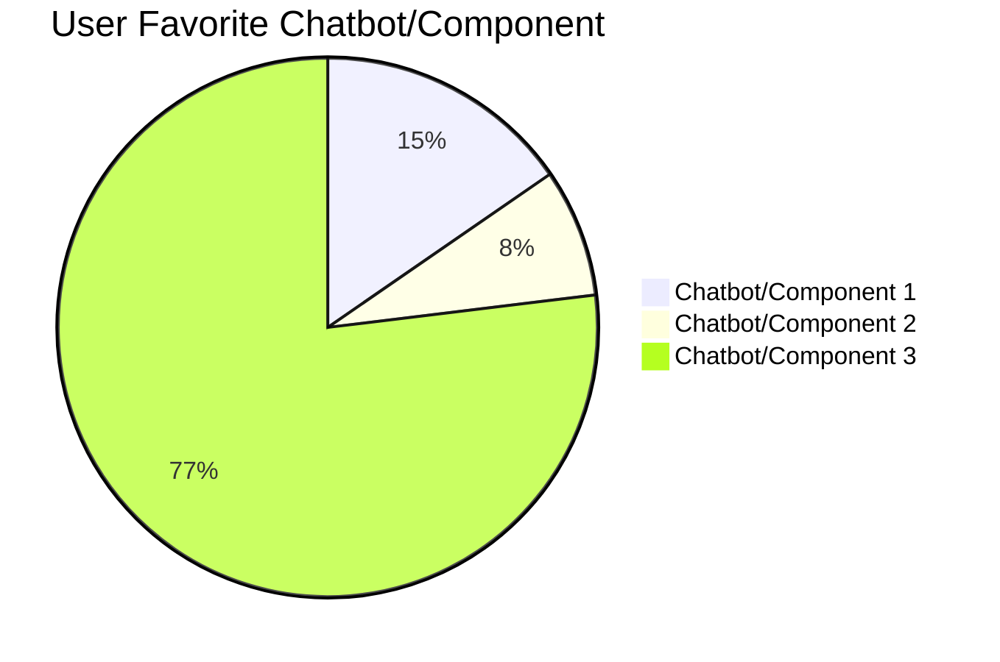

---

# Chatbot Research Findings 

**Office of the CTO - Digital Experience (OCTO-DE), VA Chatbot (fka VA Virtual Agent), Chatbot Team**

**Date:** 08/2025

**Contacts:** Lucas Wright

**Jump to:**
- [Hypotheses and conclusions](#user-content-hypotheses-and-conclusions)
- [Key findings](#user-content-key-findings)
- [Recommendations](#user-content-recommendations)
- [Product User and Business Outcomes](#user-content-product-user-and-business-outcomes)
- [Key Performance Indicators](#user-content-key-performance-indicators)
- [Next Steps](#user-content-next-steps)
- [Further research needed](#user-content-further-research-needed)
- [Appendix](#user-content-appendix)
- [Research participants](#user-content-research-participants)

## Research Goals
The VA chatbot can be used at any point in the Veteran journey to help assist the Veteran complete tasks on VA.gov. Once fully realized, the chatbot will be ubiquitious and on every page ov VA.gov. The POC will focus on login tasks specifically.  

## Research Questions

* Is the chatbot design easy to use and understand for users of all technical ability?
* Are users able to find answers to simple questions without authentication?
* Are the disclaimers and warnings timely and useful?
* Are users getting frustrated if questions are not properly answered?
* Are the lenghts of answers appropriate?
* How can we improve design?
* Are interactions quick and get the user to their intended destination in a timely manner?
* How does the chatbot impact Veterans’ perceptions of VA digital services?
* What prevents users from trying or returning to the chatbot?
* Are there differences in experience based on device type or internet access?

## Methodology 

We conducted 14 separate hour-long remote moderated research sessions from July 18-30, 2021. Participants were asked to type 2 different phrases into each of the chatbot prototypes. 

- [POC 1](https://dev.va.gov/contact-us/virtual-agent/)
- [POC 2](https://chatbot-test-1-fe.whitlock.app/component-2)*
- [POC 3](https://chatbot-test-1-fe.whitlock.app/component-3)*

*test user email must be added to a white list by team

Each participant used the links above to navigate to the 3 different chatbot proof of concepts.  Users were then asked the list of questions provided in the [conversation guide](https://github.com/department-of-veterans-affairs/va.gov-team/blob/master/products/virtual-agent/research/2025-07-Chatbot%20User%20Testing/ConversationGuide.md) to determine their feelings towards each different version.

The questions that users typed into each chatbot were:
1. "How can I sign into VA?"
2. "I need to help my dad log in to get his benefits information."

## Hypotheses and Conclusions

- **1. Hypothesis Statement:** By utilizing LLM and/or AI in the 3 proof of concept designs, we will be able to more accurately answer Veterans' questions and help them complete tasks on VA.gov by interacting with users and responding to feedback. 

   i. **Not enough information** While it was clear that users preferred the answers of POC 3 much more than POC 1 and 2, POC 2 also used LLM technology to generate answers so it is not clear that it it was the use of AI or the use of LLM that users preferred.

- **2. Hypothesis Statement:** Answers will be clear, trustworty and channel agnostic.
 
   i. **Definaitely False** In all 3 POC versions of the chabot, users expressed confusion and inability to clearly understand the information presented.  For the first question about logging in, POC's 1 and 2 seemed to pull up FAQ links about logging in while POC 3 was much more direct but the verbosity of the answer was difficult for users to navigate. In addition, POC's 1 and 2 failed to provide adequite info for the question regarding helping dad to login for benefits while again, POC 3 did provide a much more accurate but long answer to the same question.

- **3. Hypothesis Statement:** More users will prefer POC 2 or 3 due to the use of LLMs and/or AI technology

   i. **Definately True** Of the 14 users surveyed, 11 preferred Chatbot 3, whereas only 2 preferred Chatbot 1 and only 1 user preferred Chatbot 2. 

## Key Findings

Below are the top usability themes identified from user research sessions for the VA Chatbot login/sign-in experience. Each finding is supported by direct quotes from participants.

1. **Confusion About Login Options**

      “I’m not sure which one I’m supposed to pick. I just want to talk to someone.” — Participant 4

      “Why do I need to log in if I just have a simple question?” — Participant 7

    *Several users were confused about the task they were asked to complete and thought they had to login to use the VA Chatbot.*

2. **Desire for Clearer Language and Guidance**

      “It says sign in, but I don’t know if I need to. There’s no explanation.” — Participant 2

      “Is there a way to skip this? The chatbot should tell me what each option does.” — Participant 9

    *Users were confused by the responses that the chatbot gave and repeatedly commented that they just wanted short, simple responses with a link to take them exactly where they needed to go.*

3. **Positive Feedback on Quick Access**

      “I like that I can ask a question without signing in.” — Participant 5

      “Letting me skip sign in is great for basic info.” — Participant 3

      *Some users liked the simplicity with which they were able to use the chatbots, without having to login to use them.*

4. **Preference for Human Support**

      “I’d rather talk to a real person for complicated stuff.” — Participant 13

      “The chatbot is okay for simple things, but I want an option for live help.” — Participant 2 

      *Numerous users voiced their preferance for human agents instead of using an automated chatbot without being asked or prompted.*
  
5. **Mixed Reactions to Chatbot Personality**

      “It’s friendly, but maybe too casual for government stuff.” — Participant 6

      “I like that it tries to help, but sometimes it’s not clear.” — Participant 3

      *The voice or tone of the chatbot may need to be tweaked as numerous participants commented on the casual demeanor of the chatbot and also many noted that clarity needed to be a top priority.*

6. **Desire for Clearer Language and Guidance**

      “It says sign in, but I don’t know if I need to. There’s no explanation.” — Participant 2

      “Is there a way to skip this? The chatbot should tell me what each option does.” — Participant 9

      *Confusion about lengthy answers and whether the user needed to sign in were common themes, so there is a need for clarity in instructions for the users.*

7. **Answers Are Too Long and Cause Confustion**
    “That was a lot of extra info that I didn't need that made a little more confusing.” - Participant 10

    “Be direct in what you're asking and make it short. Not a long 10 sentence thing.” - Participant 6 

    *The AI version of the chatbot gave answers that most users pointed out were just way too long and unnecessary.  There is a common theme to just "hit the user in the face" with what they need to do in as few words as possible.*

### Common Issues Identified
- **Irrelevant or Verbose Responses:** Users often received answers that were not directly related to their query, or were overly lengthy when a short response was preferred.
- **Lack of Context Awareness:** Chatbots sometimes failed to reference earlier parts of the conversation, leading to repetitive or disconnected replies.
- **Misinterpretation of Queries:** There were frequent instances where chatbots misunderstood user intent or failed to fully address the need.
- **Slow Response Time:** Some chatbots exhibited lag, impacting the user experience.
- **Inconsistent Formatting:** Complaints included missing bullet points, unclear headings, and inconsistent markdown usage.
- **Limited Multi-Turn Handling:** Chatbots struggled with multi-step questions or follow-up queries.

### Key Comparison Points
- **Conciseness vs. Detail:** Users had varying preferences for brief vs. detailed responses, depending on the task.
- **Helpfulness & Relevance:** The ability to provide useful, relevant information was a major differentiator.
- **Tone & Personality:** Differences in friendliness and professionalism were noted.
- **Formatting & Organization:** Use of markdown, bullet points, and overall clarity impacted perceived quality.
- **Adaptability:** The best chatbots effectively managed changing or evolving questions.

### Overall User Themes
- **Preference for Clarity and Brevity:** Most users wanted answers that were clear and to the point.
- **Importance of Context Retention:** Multi-turn interactions benefitted from chatbots that remembered the conversation history.
- **Actionable Information:** Direct, actionable responses were preferred over generic or summary content.
- **Formatting Matters:** Visually clear and organized responses increased user satisfaction.
- **Consistency:** High, reliable quality across a variety of prompts was valued.

---

## User Preferences: Favorite Chatbot/Component Chart

| Favorite              | Number of Users | Percentage |
|-----------------------|----------------|------------|
| Chatbot/Component 1   | 2              | 15%        |
| Chatbot/Component 2   | 1              | 8%         |
| Chatbot/Component 3   | 10             | 77%        |

*Based on explicit user selections across 13 transcripts.*

### Chart: User Favorite Chatbot/Component

## Recommendations

Based on the key findings, there are a few areas to concentrate on for the next POC or updates to the chatbot.  Participants of the test overwhelmingly selected POC or component 3 as their favorite, even though the answers given by that version were often long and sometimes confusing to users.  Numerous users also voiced frustration that the simple link or answer was not just provided to login.  While still other participants were not happy that context was lost during the chatbot session.  Almost all users discussed the load time for POC 3 and that it was much longer than POCs 1 & 2.  However, a few users pointed out that they liked the link buttons in the design of POC or component 1.    It is therefore recommended that future development use the AI model of POC 3 but to simplify and shorten the answers, which will improve load time, but use the the button UI design of POC 1 and keeping context of the conversation througout the entire chat session and ask follow up clarifying questions when needed.  

1. **Context Retention & Multi-Turn Dialogue**  
    - Implement advanced conversation tracking to reference earlier user queries and provide more connected, relevant responses.

    - Test with multi-part and follow-up scenarios to ensure robust context handling.
2. **Conciseness & Actionability**
    - Train chatbots to deliver succinct answers, focusing on clear next steps or direct solutions when possible.

    - Provide options for users to request more detail if needed.

3. **Performance Optimization & Formatting**
    - Audit and reduce response latency, especially for simple or frequently asked questions.

    - Standardize response structure with bullet points, clear headings, and consistent markdown for all outputs.

4. **Improve Query Interpretation & Consistency**
    - Use refined NLP models and user intent detection to minimize misunderstandings and irrelevant answers.

    - Ensure reliable quality regardless of the complexity or subject matter by extensive scenario-based testing.

5. **Follow-Up Capability**
    - Develop mechanisms for the chatbot to proactively offer clarifications, follow-up questions, or acknowledge multi-part inquiries.

## Product User and Business Outcomes

As detailed in the [Product Outline](https://github.com/department-of-veterans-affairs/va.gov-team/blob/master/products/virtual-agent/product/Chatbot%20PoC%20Initiative.md), user use of the Chatbot has decreased significantly due in part to the fact that the current model not being able to recognize synonyms and its limited scope to just the VA.gov website. "This causes it to have to follow up to understand what topic to direct the user to leading to longer user journeys, especially when the question is personalized. With GenAI sites that are able to not only understand the intent of the question, but also provide answers to questions by sourcing data from not only the VA site, but other sites across the internet. Veterans are more likely to use them instead of the VA Chatbot to ask questions that are more personalized to their needs."

### Desired User Outcome 
This research supports our desired user outcome by getting valuable feedback from Veterans to steer us towards the model that most satisfies their needs.
 
### Desired Business Outcome
This research supports our desired business outcome by adding perceived value to the business-end that handles troubleshooting tickets.

### Desired Business Outcome
This research supports our desired business outcome by giving Veterans a more efficient option for answering their question thus deflecting calls to VA call centers.

## Alignment with Chatbot Key Performance Indicators

This research directly supports improvement in several key performance indicators (KPIs) commonly tracked for chatbots, as outlined in VA.gov’s [Domo dashboard](https://va-gov.domo.com/page/939649897): 

### 1. User Satisfaction
- **Research Alignment:** The study’s focus on clarity, brevity, helpfulness, and formatting matches the KPI goal of maximizing user satisfaction. User feedback and recommendations target pain points (irrelevance, verbosity, poor formatting) that can lower satisfaction scores.
- **Improvement Actions:** Adopting the report’s recommendations—such as improved context awareness and actionable answers—will raise satisfaction metrics.

### 2. Average Response Time
- **Research Alignment:** Slow response times were a major user complaint. The recommendation to optimize performance and reduce latency aligns with the KPI of minimizing average response time.
- **Improvement Actions:** Technical enhancements suggested in the report will help meet response time targets.

### 3. Resolution Rate (First-Contact Resolution)
- **Research Alignment:** Users want direct, complete, and actionable answers. Improving query interpretation and multi-turn handling will increase the percentage of user queries resolved without escalation or further follow-up.
- **Improvement Actions:** Better context retention and multi-part question handling are likely to boost first-contact resolution rates.

### 4. Escalation Rate to Human Agents
- **Research Alignment:** The research calls for better handling of complex or multi-step queries and a smoother transition to human support when needed. Reducing unnecessary escalations aligns with this KPI.
- **Improvement Actions:** Strengthening the chatbot’s capabilities will decrease the escalation rate, while ensuring seamless hand-off for cases that require human assistance.

### 5. User Engagement and Retention
- **Research Alignment:** Recommendations for improved tone, personality, and adaptability support increased user engagement. Consistency and clarity encourage users to return and use the chatbot for more tasks.
- **Improvement Actions:** Personalization and clearer responses will drive higher engagement and repeat usage.

### 6. Accessibility & Inclusivity (Emerging KPI)
- **Research Gap:** The research identifies a gap in accessibility and inclusivity testing. Addressing this will support KPIs related to equitable access and user experience for all segments.

---

## Next Steps

The Chatbot team's next steps are to further enhance and fine tune POC / component 3 to:

- Monitor and establish guardrails against jailbreaking
    
- Add additional call center documentation from Tier 1 support into VectorDB
    
- Harden DeepEval metrics and create custom metrics for answer correctness
    
- Add Google Analytics to track the Sign in support intent
    
- Add Datadog logs for monitoring and alerting
    
- Move DeepEval metrics to Databricks for automated analysis
    
- Conduct internal VA employee testing
    
- Perform moderated usability testing with Veterans 
    
- Launch sign in support LLM in production for a 2 month trial 

## Further research needed

- **Accessibility and Inclusivity:** This round of user testing was limited to users with disabilities, language barriers, or other accessibility needs. Research is needed to evaluate chatbot usability for diverse populations, including those using assistive technologies.
- **Long-Term Use Patterns:** The study is based on single-session transcripts. Further research should explore user satisfaction and effectiveness over repeated, longer-term interactions.
- **Other Use Cases and Complex Queries:** The transcripts primarily focus on only one use case of logging in. Future studies should examine chatbot performance on ambiguous, rare, or highly complex queries.
- **Integration with Human Agents:** The study does not evaluate the transition between chatbot and human support. Further research could examine seamlessness and user satisfaction in hand-off scenarios.

## Appendix

### Research documents
- [Product Outline](https://github.com/department-of-veterans-affairs/va.gov-team/blob/master/products/virtual-agent/product/Chatbot%20PoC%20Initiative.md)
- [Product Overview](https://docs.google.com/presentation/d/1vNElpZOhDNT7Ed6FBenw4jEGYP172IVr/edit?slide=id.p1#slide=id.p1)
- [Conversation Guide](https://github.com/department-of-veterans-affairs/va.gov-team/blob/master/products/virtual-agent/research/2025-07-Chatbot%20User%20Testing/ConversationGuide.md)
- [Interview Transcripts](https://github.com/department-of-veterans-affairs/va.gov-team/tree/master/products/virtual-agent/research/2025-07-Chatbot%20User%20Testing/Transcripts)
- [Copilot Analysis](https://github.com/department-of-veterans-affairs/va.gov-team/blob/master/products/virtual-agent/research/2025-07-Chatbot%20User%20Testing/Copilot_Analysis_FINAL.md)
- [VA Chatbot Evaluation Summary](https://docs.google.com/presentation/d/1fw2GLrYaQ8IXjQL7gp0P-VxncS5a3Vo_XF7-QWWAUI0/edit?usp=sharing)
- [Test Session Notes](https://app.mural.co/t/vachatbot1224/m/vachatbot1224/1752070920501/956b0e14039b4fedb6fac5ca8f1d17bc62b76ebb?sender=u6feac4dfb60185c471ca2132)

### Tools used for Synthesis

- Mural
- Copilot
- Zoom  
  
### Pages and applications used

- [POC 1](https://dev.va.gov/contact-us/virtual-agent/)
- [POC 2](https://chatbot-test-1-fe.whitlock.app/component-2)*
- [POC 3](https://chatbot-test-1-fe.whitlock.app/component-3)*

*test user email must be added to a  list by team

### Secondary research

- [White Paper:AI Use in the VA.gov Chatbot](https://drive.google.com/file/d/1EpKdlzaa27eoGWaqliyrDskv74GaOkss/view?usp=drive_link)
-   

### Research participants 

#### Recruitment criteria

We are looking for Veterans who are both tech savvy and not so tech savvy so that we are sure the chatbots are approachable and usable by all demographics. Looking for individuals of any/all age ranges and demographics.

#### Demographics 

We talked to **14 participants.**

Audience segment:
* Veterans: 14 
* Caregivers: 0 
* Family members of a Veteran: 0  

Gender:
* Male: 8 
* Female: 6 

LGBTQ+:
* Transgender: 1 
* Nonbinary, gender fluid, gender queer, Two-Spirit (Indigenous only), or another gender beyond man or woman: 0
* Gay, lesbian, or bisexual: 4

Devices used during study: 
* Desktop: 14 
* Tablet: 0 
* Smart phone: 0 
* Assistive Technology: 1

Age:
* 25-34: 3
* 35-44: 2
* 45-54: 1
* 55-64: 4
* 65+: 4
* Unknown: 0

Education:
* High school degree or equivalent: 1
* Some college (no degree): 2
* Associate's degree, trade certificate or vocational training: 3
* Bachelor's degree: 3
* Master's degree: 4
* Doctorate degree: 1
* Unknown: 0

Geographic location:
* Urban: x
* Rural: x
* Unknown: 14

Race:
* White: 9
* Black: 2
* Hispanic: 1
* Biracial: 1
* Asian: 0
* Native: 0
* Prefer not to say: 1

Disability and Assistive Technology (AT):
* Cognitive: x
* AT beginner: x
* AT advanced user: x
* Desktop screen reader: 1
* Mobile screen reader: x
* Magnification/Zoom: x
* [Speech Input Technology](https://www.w3.org/WAI/perspective-videos/voice/) like Siri/Dragon Naturally Speaking: x
* Hearing aids: 1
* Sighted keyboard: x
* Captions: x

#### Underserved groups we haven’t talked to 

This research does not include the perspectives of the following marginalized Veteran groups:
* Immigrant origin
* No Degree
* Expat
* Latino
* Biracial
* Native
* Nonbinary, gender fluid, gender queer...

[Table of underserved groups of Veterans showing how many of each were in this study as compared to target numbers. Data available in the table below this image](https://github.com/department-of-veterans-affairs/va.gov-team/blob/master/products/virtual-agent/research/2025-07-Chatbot%20User%20Testing/TableOfUnderServedVeterans.png)

  
A more accessible version of the table in the above image

### Underserved groups in VA Chatbot user testing 

**Final # of participants:** 15  
**# of AT users:** 2  
**# of no shows:** 1

#### General

| Category | % | Target | Study | p1 | p2 | p3 | p4 | p5 | p6 | p7 | p8 | p9 | p10 | p11 | p12 | p13 | p14 |    
|----------|---|---------|-------|---|---|---|---|---|---|---|---|----|----|----|----|----|---|
| Age 55-64+ | 50% | 8 | 0 | 1 | 0 | 0 | 0 | 0 | 1 | 1 | 1 | 0 | 1 | 1 | 1 | 1 | 0 |
| Cognitive Disability | 50% | 8 | 0 | 0 | 0 | 0 | 0 | 0 | 0 | 0 | 0 | 0 | 0 | 0 | 0 | 0 | 0 |
| Mobile user | 50% | 8 | 0 | 0 | 0 | 0 | 0 | 0 | 0 | 0 | 0 | 0 | 0 | 0 | 0 | 0 | 0 |
| Rural | 25% | 4 | 0 | 0 | 0 | 0 | 0 | 0 | 0 | 0 | 0 | 0 | 0 | 0 | 0 | 0 | 0 | 0 |
| No degree | 25% | 4 | 0 | 0 | 0 | 0 | 0 | 0 | 0 | 0 | 0 | 0 | 0 | 0 | 0 | 0 | 0 |
| Other than honorable | 21% | 4 | 0 | 0 | 0 | 0 | 0 | 0 | 0 | 0 | 0 | 0 | 0 | 0 | 0 | 0 | 0 |
| Immigrant origin | 17% | 3 | 0 | 0 | 0 | 0 | 0 | 0 | 0 | 0 | 0 | 0 | 0 | 0 | 0 | 0 | 0 |
| Women | 10% | 2 | 6 | 1 | 0 | 0 | 0 | 1 | 0 | 1 | 1 | 0 | 1 | 1 | 0 | 0 | 0 |
| Expat (living abroad) | .40% | 1 | 0 | 0 | 0 | 0 | 0 | 0 | 0 | 0 | 0 | 0 | 0 | 0 | 0 | 0 | 0 |

Our research did not include Veterans who were mobile users (on purpose), expats, or other than honorable discharges.

#### Race

| Category | % | Target | Study | p1 | p2 | p3 | p4 | p5 | p6 | p7 | p8 | p9 | p10 | p11 | p12 | p13 | p14 |
|----------|---|---------|-------|---|---|---|---|---|---|---|---|----|----|----|----|----|----|
| Black or African American | 15% | 3 | 2 | 0 | 0 | 1 | 0 | 0 | 0 | 0 | 1 | 0 | 0 | 0 | 0 | 0 | 0 |
| Hispanic, Latino, or Spanish origin | 12% | 2 | 0 | 0 | 0 | 0 | 0 | 0 | 0 | 0 | 1 | 0 | 0 | 0 | 0 | 0 | 0 |
| Biracial | 3.90% | 1 | 1 | 0 | 0 | 0 | 0 | 0 | 0 | 0 | 0 | 0 | 0 | 1 | 0 | 0 | 0 |
| Asian | 3% | 1 | 1 | 0 | 0 | 0 | 0 | 0 | 0 | 1 | 0 | 0 | 0 | 0 | 0 | 0 | 0 |
| Native Hawaiian or other Pacific Islander | --% | -- | 0 | 0 | 0 | 0 | 0 | 0 | 0 | 0 | 0 | 0 | 0 | 0 | 0 | 0 | 0 |
| First Nations (Canada) | --% | -- | 0 | 0 | 0 | 0 | 0 | 0 | 0 | 0 | 0 | 0 | 0 | 0 | 0 | 0 | 0 |
| Native, American Indian or Alaska Native | .30% | 1 | 0 | 0 | 0 | 0 | 0 | 0 | 0 | 0 | 0 | 0 | 0 | 0 | 0 | 0 | 0 |

#### LGBTQ+

| Category | % | Target | Study | p1 | p2 | p3 | p4 | p5 | p6 | p7 | p8 | p9 | p10 | p11 | p12 | p13 | p14 | 
|----------|---|---------|-------|---|---|---|---|---|---|---|---|----|----|----|----|----|----|
| Gay, lesbian, or bisexual | --% | 1 | 4 | 1 | 1 | 0 | 0 | 1 | 0 | 0 | 0 | 0 | 1 | 0 | 0 | 0 | 0 |
| Transgender | --% | 1 | 1 | 1 | 0 | 0 | 0 | 0 | 0 | 0 | 0 | 0 | 0 | 0 | 0 | 0 | 0 |
| Nonbinary, gender fluid, gender queer, Two-Spirit | --% | 1 | 0 | 0 | 0 | 0 | 0 | 0 | 0 | 0 | 0 | 0 | 0 | 0 | 0 | 0 | 0 |

#### Assistive Tech (AT)

| Category | % | Target | Study | p1 | p2 | p3 | p4 | p5 | p6 | p7 | p8 | p9 | p10 | p11 | p12 | p13 | p14 | 
|----------|---|---------|-------|---|---|---|---|---|---|---|---|----|----|----|----|----|----|
| Beginner AT User | 50% | 1 | 0 | 0 | 0 | 0 | 0 | 0 | 0 | 0 | 0 | 0 | 0 | 0 | 0 | 0 | 0 |
| Experienced AT User | 50% | 1 | 0 | 0 | 0 | 0 | 0 | 0 | 0 | 0 | 0 | 0 | 0 | 0 | 0 | 0 | 0 |
| Desktop Screen Reader (SR) | 20% | 1 | 1 | 0 | 1 | 0 | 0 | 0 | 0 | 0 | 0 | 0 | 0 | 0 | 0 | 0 | 0 |
| Mobile Screen Reader (SR) | 20% | 1 | 0 | 0 | 0 | 0 | 0 | 0 | 0 | 0 | 0 | 0 | 0 | 0 | 0 | 0 | 0 |
| Magnification/Zoom | 20% | 1 | 0 | 0 | 0 | 0 | 0 | 0 | 0 | 0 | 0 | 0 | 0 | 0 | 0 | 0 | 0 |
| Speech Input Tech (Siri, Dragon) | 20% | 1 | 0 | 0 | 0 | 0 | 0 | 0 | 0 | 0 | 0 | 0 | 0 | 0 | 0 | 0 | 0 |
| Hearing Aids | 20% | 1 | 0 | 0 | 0 | 0 | 0 | 0 | 0 | 0 | 0 | 0 | 0 | 0 | 0 | 1 | 0 |
| Sighted Keyboard | 20% | 1 | 0 | 0 | 0 | 0 | 0 | 0 | 0 | 0 | 0 | 0 | 0 | 0 | 0 | 0 | 0 |
| Captions | --% | 1 | 0 | 0 | 0 | 0 | 0 | 0 | 0 | 0 | 0 | 0 | 0 | 0 | 0 | 0 | 0 |
| Switch Device | --% | 1 | 0 | 0 | 0 | 0 | 0 | 0 | 0 | 0 | 0 | 0 | 0 | 0 | 0 | 0 | 0 |
| Braille Reader | --% | 1 | 0 | 0 | 0 | 0 | 0 | 0 | 0 | 0 | 0 | 0 | 0 | 0 | 0 | 0 | 0 |

 

