---

# 2025-05 Save in Progress Usability Findings 

**Office of the CTO - Digital Experience (OCTO-DE), Accessibility Digital Experience (ADE)**

**Date:** 06/25/2025

**Contacts:** Cindy Merrill

**[Link to Research Readout--TBD](link)**  

**Jump to:**

- [Hypotheses and conclusions](#hypotheses-and-conclusions)
- [Key findings](#key-findings)
- [Recommendations](#recommendations)
- [Next Steps](#next-steps)
- [Further research needed](#further-research-needed)
- [Appendix (including screenshots of design prototype)](#appendix)
- [Who we talked to](#who-we-talked-to)

## Research Goals
Veterans may fill out web forms on VA.gov throughout their lives, including ALL stages of the Veteran Journey--Serving and separation, Living civilian life, and Retiring and aging. Saving in-progress work while filling out an online form is an interaction for which the current implementation on VA.gov has two known accessibility issues. This research was designed to get user feedback on a revised design that may resolve both issues.

Click to see details of the two accessibility issues and the revised design that we tested.

	
1. While VA.gov users are signed in (authenticated) and filling out a form, the "save in progress" alert (see below with light green background) flashes on and then off with every field entry or edit. Because this alert displays *below* the Continue button, screen readers don't announce it, which is an accessibility issue. All users should have access to the same information about the user interface.

2. There's a "Finish this request later" button that looks like a link (see below), which is another accessibility issue. Links that take you to another page should look like links, and buttons that do actions should look like buttons. 

We are testing a modification of the VA Design System [Header - Minimal component](https://design.va.gov/components/header/header-minimal), which is recommended for the design of new web forms. To address the above accessibility issues, we have removed the "save in progress" alert, as well as changed the "Finish this request later" button that looks like a link into looking like a button (see below). We believe that removing the "save in progress" alert will be OK because there is already text about saving on both the authenticated version of the form intro page and the first page of the form. One goal of this current research is to get user feedback on the revised design.

Previous research has validated the minimal header component, including its lack of "Back" button (research participants successfully used the "Back to previous page" breadcrumb link at the top of each page). Other research studies have tested various locations for the "Save in progress" alert, and subsequent research studies have documented usability and accessibility issues with those locations.

The **goals of this research** were to 
1. (primary) Learn about Veterans' expectations for saving information while filling out an online form before submitting it.
1. (primary) Get user feedback on design revisions for "save in progress" and "finish this request later" that reduce redundant messaging around saving.
1. (secondary) Get user feedback on error messages and the progress bar while filling out online forms.

Findings and recommendations from this research will **inform guidance and documentation for the "save in progress" feature** for authenticated users filling out forms on VA.gov. Matt Dingee asked ADE to help with this because some VFS teams are innovating new designs, whereas "save in progress" should be a standard pattern used by all teams for consistency across VA.gov.

In addition, user feedback collected on "finish this request later", error messages, and the progress bar will be helpful to accessibility specialists advising VFS teams.

## Research Questions

**Research goal 1: Learn about Veterans' expectations for saving information while filling out an online form before submitting it.**
1. What experiences have Veterans had around saving while filling out VA forms?
1. What expectations do Veterans have about whether information will be saved while filling out an online form?
     1. What do Veterans expect to happen to their form data if they stop in the middle of filling out a form?
     1. What do Veterans expect to happen to their form data if they close the form page?
     1. How do Veterans expect to resume working on a form that they previously started filling out?

**Research goal 2: Get user feedback on design revisions for "save in progress" and "finish this request later" that reduce redundant messaging around saving.**

3. Do Veterans think that their form data is being saved? If so, how do they know?
1. Are Veterans able to stop working on a form and return to it later? If so, how do they do it?
1. Do Veterans notice the alert about saving on the form intro page?
1. Do Veterans notice the text about saving on the first page of the form (below the progress stepper)?

**Research goal 3: Get user feedback on error messages and the progress bar while filling out online forms.**

7. What reactions do Veterans have to error messages? 
     1. Do they know what the errors mean, and how to resolve them?
     1. How do they want to find out about errors?
1. What reactions do Veterans have to the progress bar? Do they notice it?

## Methodology 

We conducted **remote moderated usability testing** to observe research participants filling out an online form. The participants were logged in so that the information they entered was automatically saved before the form was submitted. We used a GitHub Codespace that was accessible to screen readers and screen magnifiers, which half of our participants were using.

Research sessions were conducted over Zoom during May 12-21, 2025. Sessions were 90 minutes long for Veterans using assistive technology (i.e., screen readers or screen magnifiers), and 60 minutes for Veterans not using any assistive technology (AT). 

## Participants
 Perigean recruited all **11 research participants**. All were Veterans. 
 - **6 were full-time assistive technology users**:
   - 4 used a screen reader
   - 2 used a screen magnifier
  - 5 were on a computer, 5 were on a smart phone, and 1 was on a tablet

The assistive technology used by the 6 participants is summarized in the table below. All had experience using their assistive tech for at least 2 years.

P# | Screen Reader/Magnifier | Software | Device | O/S | Browser 
-- | ----- |------|-------|--------|--------
1 | Screen reader | JAWS | computer | Windows | Chrome 
2 | Screen magnifier | Magnified in browser to 250% | computer | Windows | Edge 
3 | Screen reader | JAWS | computer | Windows | Chrome
4 | Screen reader | VoiceOver | phone | iOS | Safari 
5 | Screen reader | VoiceOver | phone | iOS | Safari then Chrome 
13 | Screen magnifier | Microsoft Zoom Magnification ~300% | computer | Windows | Edge 
8 | none | none | phone | Android | Chrome
9 | none | none | tablet | iOS | Chrome
10 | none | none | phone | iOS | Safari
11 | none | none | computer | Windows | Firefox
12 | none | none | phone | iOS | Safari

For demographic details, see [Who we talked to](#who-we-talked-to).

## Hypotheses and Conclusions

1. While filling out online forms, Veterans expect that their form data will be saved.
    - **Likely False** because many participants shared about losing their work while filling out forms that time out or get rejected, and then they have to start all over again. 

1. With the new design, Veterans are confident that their form data will be saved.
    - **Likely False** because participants didn't assume this would happen, and most didn't read and remember the information alerts that said it would. All saw their data saved after clicking *Finish later* and most concluded that saving happened only if they clicked *Finish later* or *Continue*. They said that they *hoped* their work would be saved but were *not confident* that it would be. 

1. With the new design, Veterans will know how to resume filling out a form that they started previously.
    - **Likely True** because the *Continue your request* button was readily found and used by most participants (although the user wasn't signed out), and those who were brought to the My VA page found the *Continue your application* link there. This could be tested again in a different study with a prototype that signed out the user during a break in filling out the form.

1. When Veterans encounter error messages while filling out online forms, they are able to resolve the errors.
    - **Likely False** because one participant using a screen reader had 4 different errors that he was unable to resolve on his own. All 8 other participants who encountered errors were able to resolve the errors by themselves, including 2 other participants using screen readers.

1. While filling out an online form, Veterans will notice the progress bar and find it useful.
    - **Definitely False** because half of the participants didn't mention it, including several screen reader users who never heard it announced because it's above the H1 on form pages.

## Key Findings

1. Most participants didn't know that their information was being saved automatically with every edit.
1. Most participants didn't see the informational alerts about saving, and the few who did, didn't remember what they said.
1. ALL participants tried the *Finish later* button and from that learned that their information was saved.
1. All participants were able to resume filling out the form after taking a short break and a long break.
1. My VA had accessibility issues for screen magnifiers.
1. VA forms in general had accessibility issues for screen readers and screen magnifiers.
1. The Request Personal Records form had many accessibility issues for screen readers and screen magnifiers.
1. Most participants who encountered form errors understood how to resolve them, but there were some exceptions.
1. Only half of the participants mentioned the progress bar.

## Details of Findings 

**Finding 1: Most participants (9 of 11) didn't know that their information was being saved automatically with every edit.**
- 5 of 11 participants said that they wanted their information to be saved automatically with every edit.
  > *"I'm hoping it's saving constantly like [Microsoft] Word does every so many seconds" (p5)*.
- Most participants hoped or assumed that saving would happen after they clicked the *Finish later* (9 participants) or *Continue* button (7 participants). 
  > *"I don't remember reading anything that said your information is saved as you go, but that's usually what 'Continue' does" (p1)*.

  > "*'Finish later' is like a contract that says this stuff's gonna be here when I come back" (p1).*
- More than half of the participants (6 of 11) made assumptions about saving based on their previous experience with forms, not because of anything in the prototype.
  > *"I don't think you know it's gonna...automatically save or not" (p4)*.

  > *"In my experience, because I didn't manually request it to save, it doesn't save anything" (p11)*. 
- More than half of the participants (6 of 11) were worried about their session timing out and losing the information they entered. 3 of these participants hoped their work would be saved--one based on previous experience with VA forms--but didn't know whether that would happen.
- Some participants (4 of 11) wondered if their information would be saved if they logged out and then came back later. A couple participants tested this during their research session and found that it was saved.
- Two participants said they expected a notification if saving was happening automatically, as one said that a social security form did, and another said that Microsoft Word does. 
- Only one participant was confident that her information would be saved because of her experience filling out VA forms.
  > *"When I fill out forms on VA.gov...when you log back in or go back...it'll start you where you left off" (p4).*

**Finding 2: Most participants didn't see the informational alerts about saving, and the few who did, didn't remember what they said**.

- 7 of 11 participants didn't notice the informational alert on the authenticated form intro page, and 7 of 11 participants (including 6 of the previous 7) didn't notice it at the top of the first page of the form. When some of these participants were later shown the alert, they suggested making it easier to notice by making the text larger, red, or in a dialog box that you have to close.
- 4 participants who read the informational alert on the intro page before starting the form didn't remember it by the end of the session when they were asked about saving. One of the participants commented aloud after reading the alert but didn't remember this later:
  > *"We're gonna save it every time. So that's good. I can stop and come back as long as I sign back in" (p8).*
- When participants are opening the form from the intro page and filling out the form, they seemed to focus only on the form itself. 
  > *"My brain kind of skipped over what I read and went to the more important stuff...I've filled out a decent amount of these [online forms], and...because I'm used to it, I just go straight to answering questions" (p11).*

- 3 participants who read the alert didn't understand it as saving every edit automatically. They thought that it saved only when you clicked *Finish later* or *Continue*. 
  > *"So every time you put something in and you hit 'Continue' or 'Finish later', it will save it for you, so you can pick up right where you left off instead" (p9).*
- 1 participant thought he understood the informational alert but was thrown off by the *Finish later* button. He also said that the wording "We'll save your request on every change" is curious, and the *Finish later* button is confusing, too:
  > *"'On every change' sounds like...only every time I go back and make a change to what I've already input" (p12).*

   > *"Maybe...if the button doesn't say 'Finish later'...something like 'Save and close', because what it's doing is actually closing the form...because it's already being saved as you go along...There's the other threat...does that mean I'm just canceling this form? So having 'save', there is the reassurance that this is gonna save the last thing that I input. And then it's gonna close the form" (p12).*

- The alert on the first page of the form was not accessible to some screen reader and screen magnifier users. Two screen reader users (1 on desktop, 1 on mobile) never heard the save alert on the first page of the form because it's above the H1, which is where their focus starts when the page is loaded. Plus, participants were focused on completing the form and generally didn't scroll up to explore. One screen magnifier user didn't notice the alert because their magnified area was focused on the fields to fill out and wasn't large enough to also see higher up on the screen.

  > *"It took me directly to the question, so I just answered the question" (p5).*  
  > *[Everything in the header] "is garbage that will be on every page that I am not going to listen to. I will go to the top of the page and hit 'H'. If the page is laid out right, it will have an H1 and tell me where to start" (p1).*

**Finding 3: ALL participants tried the *Finish later* button and from that learned that their information was saved**.
- After the first time each participant clicked the *Finish later* button, they saw the "Your records request has been saved" message. Then when they returned to the form, they saw the information they had entered previously. This is how most participants learned that the *Finish later* button saved their information, and they (incorrectly) assumed that you had to click this button in order to save. 
  > *"I assume when it says 'Finish later', it does save what I've done so far. But that's an assumption...Okay, cool. It says that my personal record request has been saved" (p11).*

  > *"Exactly where I left off" (p9).*
- The "Your records request has been saved" message appears to be well positioned because ALL participants read it, unlike the two informational alerts. It appears at a time that users have intentionally stopped filling out the form and are wondering whether their work will be saved.
- For the long break in filling out the form during the research sessions, 9 of 10 participants used the *Finish later* button--at least some because they were worried that their session might time out and they would have to start over. One participant just left their browser open, which would have timed out if 30 minutes had passed, but we didn't stop for that long during the research sessions. For the short break, 4 of 11 participants used *Finish later*, and the other 7 just left the browser open.
  > *"So maybe I hit 'Finish later' because I don't want to start all over again...I think it's gonna save it. And then whenever I log back in, it should take me to the same spot" (p8).*
- 4 of 11 participants were unsure about what the *Finish later* button would do. Does it mean that you will quit for a while? Or skip the current page and proceed to the next page? Or save my current place in the form and the information I entered? 
   > *"Finish later...does that mean I can walk away from it? Usually it means I'm quitting for awhile, but I don't know if it's just letting me skip this page...Maybe 'Stop and return later'?" (p3).*
- One participant (screen magnifier on desktop) clicked *Finish later* accidentally and thought he was going to lose information entered, but then noticed that the form saved his work. He then assumed that his information was being constantly saved (not only when you click *Finish later*). This was the ONLY participant who thought correctly that we're saving form data *all the time*, and it wasn't from seeing either information alert.
- At the end of the session when the moderator showed a different participant (screen magnifier on desktop) the informational alert at the top of the first page of the form, he asked why *Finish later* is needed when we already said that it's saving everything. 

**Finding 4: All participants were able to resume filling out the form after taking a short break and a long break**.
- Participants got interrupted twice by the moderator, and all were able to resume filling out the form during the sessions.
- Most participants (9 of 11) clicked on the *Continue your request* button in the informational alert displayed after clicking *Finish later*.
- 3 participants (including 2 of the 9 above) clicked on the *Continue your application* link on the "Application for personal records request" card at the bottom of the My VA page. 
- 1 participant didn't use either of the above methods and instead just went back to their open browser window, which hadn't timed out. 
- 3 participants noticed that they were returned to the *page before* the one that they had been on. This is because no information had been entered on the page they were on [a known issue], but they said that they would have preferred to come back to the actual (blank) page that they had been on last.

**Finding 5: My VA had accessibility issues for screen magnifiers.**
- One participant using a screen magnifier (on a Windows computer using the Edge browser and Microsoft Zoom Magnification at least 300%) asked why the **"Continue your application" link in the form request card on My VA was so much smaller than everything else on the card**. The link text didn't scale up like the text above it.

Click to see a screenshot of the issue.

- This same screen magnifier user missed that the header "Benefit applications and forms" was relevant because he only saw the words "Benefit applications". He didn't see the word "forms" because it was to the right of the magnified portion of the page that he was looking at. 

Click to see a screenshot of the issue.

**Finding 6: VA forms in general had accessibility issues for screen readers and screen magnifiers.**
- Two screen reader users (VoiceOver on iOS with Safari) had **difficulty navigating while using Safari because focus kept jumping** to the top of the page or to the Safari controls below the page. p5 was unable to navigate the form and so switched to Chrome, where navigation worked normally. p4 was able to navigate the form well enough in Safari to fill it out.
  > *"A lot of the government websites are not working that great with Safari anymore, and...you need to use Google Chrome" (p5).*

- On the Review/Submit page, a **screen magnifier user didn't see the "+"'s to expand the accordions because they're so far to the right**. He saw the names of the form sections, but there was no visual indication that there was anything more to scroll right to see. 

Click to see a screenshot of the issue.

- Many people navigate through forms quickly and miss things, regardless of whether they're using assistive tech (AT). Below is a summary of AT **navigation strategies that we observed in this study**, some of which were used to go through the new form slowly and carefully, while others were short-cuts that sometimes caused problems.
  - **Navigation strategies for screen reader users (desktop and mobile):** 
    - (On a computer) Arrow through the pages from the very top (1 user) or from the H1 (1 user) instead of using Forms mode.
       > *"If you just have forms mode on...you may not hear the instructions for what it wanted...for that field" (p1).*

       > *"It's too easy to skip over important information...I go arrow line by line on new forms and new information" (p3).*
    -  Often stopped the screen reader before it had finished reading the current line, and thus sometimes missed the word "Required" at the end (i.e., some participants didn't know that the VA file number field was optional). 
       > *"If I could hear 2 words, I kind of know what it's going to tell me, and I go to the next thing...I don't listen anymore. It's just like everything's gonna be required...That VA file number...did not have an asterisk or tell me it was required. But honestly, I'd already tuned that out because I just assumed in my head that it was going to want that" (p1).*
    - (On a phone) swipe to the right to move to the next item on the page, and swipe left to move to the previous item.
    - Typed "E" to navigate to the next editable field, but that jumps to the next text field--missing dropdowns and checkboxes. This led to one participant not seeing the military base checkbox and the Country field dropdown, which they discovered when an error message stopped them from going on. 
       > *"Normally, I don't do...that the first time through. I'd be a little more careful" (p3).*
    - Searched for the name of the button to jump to (e.g., "cont" for the Continue button).
    - Typed "B" for buttons to get to the *Finish later* button.
       > *"Now I know that those buttons are down there, it just got me there a lot faster" (p1).*
  
  - **Navigation strategies for screen magnifier users (desktop):**
    - Saw very little of the page at once, not only vertically but also horizontally. The *Finish later* and *Continue* buttons were on separate lines with white space on the sides because zooming and magnifying resized the computer's viewport to mobile layout and made everything appear larger.  
    - Moved up and down with arrow keys on keyboard with his left hand. When he wanted to continue reading across the page, he moved the mouse sideways with his right hand, but *not* for every line. Skimmed down the page while not all the words across are in his view, and he assumed what it said--often accurately but sometimes not.

**Finding 7: The Request Personal Records form had many accessibility issues for screen readers and screen magnifiers.**
- Three participants (2 of whom were using screen readers) said that the signed-in version of the form intro page looks the same as the non-signed in version, except at the very bottom, which is disorienting and repetitive. The screen reader users had to listen to the entire intro page being read twice--once before signing in, and then again after signing in. One participant suggested that the "Sign in to start your request" link could bring you directly to the first question in the form (rather than to the authenticated version of the form intro page). 

- A screen reader user expected to be able to click on one of the record types listed on the intro page, but they weren't clickable. 

- Two screen reader users (1 using JAWS and desktop, and 1 using VoiceOver on mobile) had difficulty entering their date of birth on the phone.
  - The desktop screen reader user tried to type a numeric date of birth into the dropdown birth month field because he stopped the screen reader before it announced that the field was a popup.
    > *"If I tab to someplace normally that wants my birth date, I just type in the whole thing. But here it wants to go month, and then it wants to go to the day, and then it wants to go to the year, which is 3 separate fields. I would have known that if I would have just listened...It didn't tell me to put in the whole thing...I listen to this thing [screen reader] so much--I just tend not to listen any more than I have to" (p1).*
  - The mobile screen reader user (using VoiceOver and Safari) had 3 different problems:

    1. The participant thought she was thought she was on the DOB field, and the focus rectangle was there, but there was a blinking cursor in the previous field (last name). When she typed a number for the date of birth month, the number was entered into the last name field, which surprised her.
       > *"I thought I was on the date of birth, and I was still on the last name. So I didn't hear where the insert was when it got down to date of birth...I didn't hear the text field in the date. It had the month, didn't say I was in the text field, then had to swipe, double tap on the month. Caught me off guard" (p4).*
    2. When the participant finally heard the month field announced, she didn't understand when it said, "Double tap to activate the picker". Later she heard the same prompt for the Country and  State fields.  
       > *"How would somebody know what a 'picker' is?" (p4).*
    
    3. After the participant selected the month and the "Done" button to close the picker, focus was moved to the top of the page. Is this a known focus issue with VoiceOver?
       > *"It took me back up to the beginning of the page automatically when I hit Done...I had to swipe right to get down to where I was at" (p4).*

- Two screen reader users (both JAWS on desktop) said that they were **hearing every records checkbox option twice while using the arrow keys** to navigate. One of these users also said that the names of the mailing address fields were announced twice. It appears that the fields announce the label, and then the label and field are announced again with "edit". 
  > *"It's reading everything twice...I just went to the radio button that little check box there. It tells me what it is, and then if I arrow down again, see it, then it tells us. It's almost like it's got 2 labels there" (p1).*

  > *"There's a lot of information duplicated everywhere...Everywhere there's an entry, there's two. The commands are spoken twice. That's a programming bug...There's a lot of redundancy in the talking...I don't see this on all the VA websites" (p3).*

- One screen reader user (VoiceOver on iOS) **didn't know that the citizenship question was a radio button** when they tapped on it, but they figured it out. Riley Orr tested and found that it's announced as a checkbox (bug) and radio button on her iPhone, but announced as a radio button on desktop. After she updated her phone, it announced as only a radio button, so it maybe be an iOS issue, not ours. 
  > *"It doesn't let you know that there's a radio button before that, so it's sometimes confusing...In our world of using accessibility, we can only wish for so much...it works. Would be nice if as soon as I clicked on that, it said 'radio button' and then [when I] swiped right, it would read what that was and then go down" (p5).*

- One participant using a screen magnifier (Microsoft Zoom Magnification at least 300% on a Windows computer with Edge browser) checked "I live on a United States military base outside of the U.S." and then didn't understand why he being asked for APO/FPO/DPO and got stuck. He had seen "I live on a United States" and thought that applied to him. He had no idea that the rest of the statement said "military base" because that was not in his view and he didn't scroll to the right. 

Click to see a screenshot of the issue.

- One screen reader user (JAWS on desktop) reported that the State/Province/Region and Postal code fields said "has pop up", even though they're both text fields. 
  > *"It is saying 'pop up', which usually means it's gonna be a list. So the first thing I try to do is hit 'M' to get me down to 'Missouri'. But it's not really a pop up because it actually wants me to type something in there...As soon as I hit the first letter, it typed it in instead of going to the M's" (p1).*

- One screen reader user (JAWS on desktop) said he heard the affirmation statements on the Review/Submit page read four times. Here's what he heard:
     1. "Statement of truth. I confirm that the identifying information in this form is accurate and has been represented correctly."
     1. "I have read and accept the link privacy policy opens in a new tab"
     1. "Your full name star required" -- *While focus is on the field name*
     1. "Your full name star required. Statement of truth. I confirm that the identifying information in this form is accurate and has been represented correctly." -- ***Repeated** while focus is in the name field*
     1. "Statement of truth. I confirm that the identifying information in this form is accurate and has been represented correctly." -- ***Repeated again** while focus is in the name field* 
     1. "I certify the information above is correct and true to the best of my knowledge and belief."  -- *Read while focus is in the name field*
     1. "I certify the information above is correct and true to the best of my knowledge and belief." -- ***Repeated again** when focus is on this line*
        > *"I heard it about 4 times there...I'm not sure why they put it both before and after my name...That's the kind of thing that causes me to rush through the repeats and maybe miss something. If something is only present once, then I have a much better chance of paying attention to it" (p3).*

Click to see a screenshot of the bottom of the Review/Submit page.

        
- Another screen reader user (JAWS on desktop) didn't expect the checkbox to be announced _after_ the "I certify..." line instead of before it.
    > *"It says, 'I certify'. Usually when something starts out with the words 'I certify', there's a checkbox there...You're telling me and then you're given my name, and then you put the actual box underneath of it, which is not typically what I'm used to...I had to listen to the whole thing to find out if that was a checkbox or not...cause it wouldn't have told me until the end" (p1).*

**Finding 8: Most participants who encountered form errors understood how to resolve them, but there were some exceptions.** 
- 9 of 11 participants encountered errors while they were filling out the form, and most of them understood their meaning and what they needed to do to fix them.
   > *"Tells me where I screwed up" (p13).*

   > *"That's awesome...I like that. It caught it" (p9).*
- One screen reader user (JAWS on desktop) encountered 4 different errors that he didn't understand how to resolve:
     1. He didn't understand the "Country is required" error message because he never saw the field (due to skipping over it before by navigating with the command "e" in JAWS to the next editable field). 
        > *"I don't understand that. I didn't see any place to enter a country, and yet when I hit 'Continue'...I don't remember seeing that [the Country] come up before I entered the address" (p3).*
     1. He was confused by the Social Security Number (SSN) field error when he entered the 9 digits "123456789" after he was asked to enter fake data. This error also confused a non-AT user. Disallowing this input is not clear to users but shouldn't be an issue when users enter their actual SSN.
     1. After fixing the SSN error, he heard another error that he thought was still for SSN but was actually for the VA file number field. That field had an "e" in it from navigating to the next editable field, which must have gotten accidentally typed into the web page but he didn't hear the screen reader announce it. He thought he entered the SSN incorrectly again, which wasn't the problem. Only when the moderator said that there's something in the VA file number field did he notice the "e" and understand that it came from his JAWS command.
        > *"I guess if they didn't like the social security number, it's asking for a file number. I'm not sure, because it says you only need one. It looks like it took the social security number. Didn't say it was bad. It did say error as I started typing...I'm not sure what it's upset about" (p3).*

        > *"I got a little frustrated...My fingers don't always work right, and I usually hear any mistakes I make...I didn't catch that until I slowed down and looked at what was actually there" (p3).*
     1. On the Review/submit page, the participant submitted the form without entering his full name, and he wasn't able to correct the error on his own because of several issues:
        - The error brought focus to the beginning of the component instead of the *Your full name* field, which is required.
        - A LOT of text was read aloud (with redundant announcing, as documented above) before finally getting to the error message at the end:
          - Please enter your name exactly as it appears on your application: Joe X Smith
        - The participant thought that his name was entered correctly because it was read aloud. He didn't realize that the error text was instructing him to type that name into a field.
        - The participant checked the box to certify and thought that was all that he needed to do.
          > *"I've already read this. I don't need to read this again" (p3).*

- Only one participant said that they would prefer to be informed about errors differently--right after they leave a field, as opposed to after they click *Continue*, so they know right away where the problem is. They also said that it's not really an issue with this form because it's so short (and the individual pages are short).

**Finding 9: Only half of the participants (6 of 11) mentioned the progress bar.** 
- The screen reader users who navigated the form starting from the H1 on each page didn't know about the progress bar because they never heard it announced.
- Four participants said that the step numbers are helpful so they know how close they are to being done.
   > *"Tells how far I'm in what I'm doing...and how much longer to fill out something" (p11).*

   > *"I do like that. It has 1 of 6. That is nice because you never know how many pages this thing's gonna be" (p9).*
  
- Two other participants mentioned the step numbers. Only one participant mentioned the visual bars. 
- Three participants (1 using a screen reader on desktop, 1 using a screen magnifier on desktop, and 1 using no assistive tech on a phone) said that the form had too many short pages and that they preferred fewer longer pages with related information on the same page, rather than across multiple pages (e.g., your name and social security number on different pages). 
   > *"You can have one page that puts in your personal information and your demographics...And then the next page can be what I'm requesting...It could be cut down a lot. It didn't have to be 6 pages" (p2).*

   > *"If you ask me for my street address, and then I have to hit 'Continue' to get to the next thing, that annoys me. So when I'm doing a form, I'd like as much information on that page to fill out all at one time as possible. I really don't like to have to go 'Continue' 'Continue' all the time because that's just another thing that I have to do and have to listen to" (p1--screen reader user).*

## Additional Insights
There are a number of findings that were outside the scope of the research goals, and they are listed below. 

1. Two screen reader users (both VoiceOver on iOS) were **frustrated at not being able to use dictation** and had difficulty typing into the text fields. The dictation key on the phone keyboard was grayed out, presumably because Zoom disabled it during the meeting. 
   > *"Wish I could talk it, but that's OK" (p4).*

   > *"A lot of times I just dictate everything in, and then I check it to make sure it's right. And if it's not, then I correct it" (p5).*

1. **Usability issues were discovered with the Request Personal Records form**. Each issue below was encountered by one research participant, unless otherwise noted.
     1. Four participants didn't know what a "VA file number" was and why you might need it. One of them mentioned that there's no helper text for it, and another one didn't notice at first that you could continue without entering it.
     1. Three participants were confused by the "VA regional office" field so they skipped it. One didn't know whether to enter their regional office because they go to a clinic in a different region, and whether it should be a clinic or a hospital. 
     1. Two participants were curious about the ability to request your military records (including DD214) through the VA. One of them had military records unable to be accessed thru VA, and had needed to provide a paper copy that helped him to transition out and apply for medical benefits with the VA. The other participant was very concerned about privacy because he thought that VA wasn't supposed to know about some things from the military, and the military isn't supposed to know about some things from the VA. He told a story about wanting to keep his VA treatment for PTSD off his military records so it wouldn't change his assignments.
         > *"If you get the proper treatment, people don’t need to be stigmatized...They [military] found out that I had PTSD...They blackballed me...They pulled me off the range...You don't want that past medical history to come and haunt you and actually ruin your career" (p13).*
     1. One participant accepted an autofill suggestion from their phone to fill in the postal code with a valid value, but it resulted in an error ("Enter a ZIP code"). This is a known issue with autofilling; there's a coding workaround in [this ticket](https://github.com/department-of-veterans-affairs/vets-design-system-documentation/issues/2668).
      1. One participant said that after they sign in, their name and address should be prefilled in the form. Then they could correct it if needed.
      > *"I'm looking for the least amount of work I have to do every single time" (p10).*
      1. On the intro page, seeing the "Freedom of Information Act (FOIA)" right underneath the name of the form on the intro page was confusing because it was unclear what the connection is. They expected to see something about the specific form, such as its name, which was at the end of that line. 
     

Click to see a screenshot of the top of the intro page.

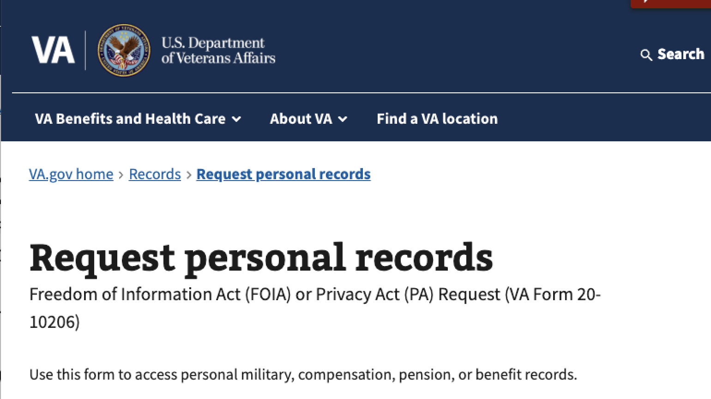

3. One participant who uses a screen reader on a phone said that they had a lot of **difficulty signing in**, making a strong password and remembering it, creating a passkey, setting up two-factor authentication, and getting logged out with timeout. A different participant wished that they could sign in with a fingerprint, didn't get logged out, and had a "remember this device" option so you wouldn't have to log in again.
   > *"First I had to tangle up with login.gov because now they want you to. They want to do a video of your face and...that's very difficult for people that have limited vision or no vision...So by the time you get there, you're pretty frustrated (p5).*

## Recommendations

### For the Design System and Forms Library team
1. **Revise the Save in Progress messaging to communicate more effectively that we're saving the user's form information as it's being entered/updated**. We need to revisit how we communicate what the form is doing so that we inform every user without being annoying.
   - *Supporting evidence:* We're saving automatically with every edit, which participants asked for, but most didn't realize that was actually happening because they didn't see or understand the informational alerts.   
   - Consider the suggestions below:
      1. Messaging should be better integrated into the user's interaction flow with the form. It's possible that no messaging will be effective before the user has started filling out information, so we should find somewhere other than the intro page and the top of the first page of the form. Users may be more receptive to an alert that shows up later while they're editing and then pause, such as right after they click the *Continue* button. 
      1. All messaging must be positioned so that it's accessible to AT users. All screen reader users should be able to hear the messaging, even if they start navigating pages from the H1. Messaging should also be aligned with the left margin so that it's most likely to be visible on magnified screens.
      1. Messaging could be reworded for clarity and to lead with what's most important at the beginning to attract attention and ensure visibility to users of both screen readers and screen magnifiers. For example, we could change "We'll save your request on every change" to "Saving will happen automatically..." or "Your information will be saved..."
           1. If we want a message that shows up with every automatic save, it could be very short (e.g., "Saving..." or "Autosaved now"). 
      1. Consider relabeling the *Finish later* button to better align with the revised messaging.

1. **On the forms Review/Submit page, consider moving the "+" from the right margin to the left margin**.
     - *Supporting evidence:* A screen magnifier user didn't see the "+"'s to expand the accordions because they're so far to the right and there was no visual indication that there was anything there that needed scrolling. 
1. **After you click *Finish later*, you should be able to sign out** in the Minimal header format, which is currently not possible. We should revert to the full VA.gov header for the authenticated intro page in order to enable signout.
     - *Supporting evidence:* There's currently no way to sign out after you click *Finish later* and land on the intro page because you're still seeing only the Minimal header.

1. Investigate the **form navigation issues that 2 screen reader users had while using VoiceOver on iPhones with the Safari** web browser in which focus kept jumping to the top of the page or to the Safari controls below the page after almost every field. 
    - *Supporting evidence:* These focus issues made it very difficult for 2 mobile screen reader users to fill out the form. One of them stayed with Safari, and the other gave up and switched to Chrome.  

1. **Consider whether having many short pages in a form is preferable to a smaller number of longer pages**. Be aware of the feedback that some Veterans dislike VA forms having so many short pages. 
    - *Supporting evidence:* 3 of 11 participants (1 using a screen reader on desktop, 1 using a screen magnifier on desktop, and 1 using no assistive tech on a phone) said that the form had too many short pages and that they preferred fewer longer pages with related information on the same page. The screen magnifier user said that having to repeatedly click _Continue_ to see the next question was annoying because it's more of his screen reader that he has to listen to.

### For the My VA team
#### Fix these accessibility issues:
6. In the draft cards under "Benefit applications and forms", **make the "Continue your application" link scale up with magnification** like everything else on the card already does.
    - *Supporting evidence:* One participant using a screen magnifier found it difficult to read this link because its font didn't magnify like all the other text on the card and so it was small and hard to read.
1. **Consider renaming the header "Benefit applications and forms" to "Applications and forms"** or something else similarly short so that it will be more accessible to screen magnifier users.
   - *Supporting evidence:* One participant using a screen magnifier didn't recognize that his draft form was under "Benefit applications and forms" because all he saw was "Benefit applications".

### For the Request Personal Records form
#### Fix these accessibility issues:
8. See if **field type announcing by screen readers can happen sooner**, perhaps *before* the field name, to set the user's expectations for  the type of interaction expected.
    - *Supporting evidence:* A desktop screen reader user didn't know that the birth month field was a popup because he stopped the screen reader before it was done announcing. A mobile VoiceOver user also didn't know that field was a popup and so tried to type a number into the field. In addition, on the Review/Submit page, a JAWS screen reader user heard the checkbox announced *after* the entire "I certify the information above is correct and true to the best of my knowledge and belief" line, which was unexpected. 

1. **Change the announcement text for dropdown fields from "Double tap to activate the picker" to use plain language**. For example, "Double tap to select the month", "Double tap to select the country", and "Double tap to select the state".
    - *Supporting evidence:* One participant didn't know what a "picker" was and got confused.

1. Try to **fix announcing issues with JAWS where it says "has popup" for the State/Province/Region and Postal code text fields**. 
    - *Supporting evidence:* One screen reader user (JAWS on desktop) reported that the State/Province/Region and Postal code fields said "has pop up", even though they're both text fields.

1. Try to **fix announcing issues with VoiceOver for the citizenship question, which said it was a checkbox instead of a radio button**.
    - *Supporting evidence:* One screen reader user (VoiceOver on iOS) didn't know that the citizenship question was a radio button when they tapped on it. Riley Orr tested and found that it's announced as a checkbox (bug) and radio button on her iPhone, but announced (correctly) as a radio button on desktop. After she updated her phone, it announced (correctly) as a radio button.

1. See if the **duplicate messaging from JAWS for the records checkboxes and mailing address fields can be removed**.
    - *Supporting evidence:* Two screen reader users said that they were hearing every records checkbox option and mailing address fields twice while using the arrow keys to navigate through the form.

1. Try to **fix focus issues with VoiceOver while getting in and out of the date of birth Month field**.
    - *Supporting evidence:* Focus was on the Month field, but there was also a blinking cursor in the previous field (last name). When the participant typed a number for the date of birth month, the number was entered into the last name field. And when she was done picking the Month, focus was moved to the very top of the page. 

1. Streamline error handling on the Review/Submit page for the ***Your full name* field so that (1) focus goes to the name field (*vs*. the top of the component), and (2) the error message is announced immediately** (*vs*. after two repetitions of most of the text in the component). 
    - *Supporting evidence:* This is so verbose for screen reader users that they perceive it as multiple repetitions of the same information and don't listen all the way to the end when the error is finally mentioned.

1. **On the Review/Submit page, consider shortening the text to be less redundant and less repetitive for screen reader users.**
    - *Supporting evidence:* The verbose text "Statement of truth. I confirm that the identifying information in this form is accurate and has been represented correctly." is read 3 times by JAWS, and the text "I certify the information above is correct and true to the best of my knowledge and belief." is read 2 times. This is while the screenreader user is going through the form the first time--not because of any errors generated--and is specified in the code so that all users hear it, regardless of how they navigated to the field (by tabs or arrows).

1. Consider **differentiating the unauth and auth versions of the form intro page so they don't look exactly the same** except for the very bottom.
    - *Supporting evidence:* Participants found this disorienting after they signed in but then seemed to still be on the same page. Screen reader users had to listen to the entire page being read out a second time, unlike sighted users who can visually scan to see that most of it's the same and not read every word.

#### Fix these usability issues:
17. Explore **prefilling the Veteran's name and address**, which we know once they've signed in. 
    - *Supporting evidence:* This suggestion came from a participant, who wanted to type less but was willing to make corrections if any information was wrong.

1. At the **top of the form's intro page, consider simplifying the text directly under the H1**: 
    > "Freedom of Information Act (FOIA) or Privacy Act (PA) Request (VA Form 20-10206)"
    - *Supporting evidence:* One participant was confused by "Freedom of Information Act (FOIA)" right underneath the name of the form on the intro page where they expected to see something about the Request personal records form.

1. **Fix the postal code field so it will accept a valid autofill suggestion without returning an error** ("Enter a ZIP code"). This is a known issue with autofilling with a coding workaround in [this ticket](https://github.com/department-of-veterans-affairs/vets-design-system-documentation/issues/2668).
    - *Supporting evidence:* One participant accepted the (correct) autofill suggestion from their phone for their zip code, and the form gave an error.

1. Consider adding some **help text that says what the "VA file number" is**.
    - *Supporting evidence:* Four participants didn't know what a "VA file number", why you might want to use one, and how you would find it.

1. Consider adding a **description of what a "VA regional office" is**. 
    - *Supporting evidence:* Three participants were confused by the field and skipped it. One didn't know whether to enter their regional office because they go to a clinic in a different region, and whether it should be a clinic or a hospital.

1. Consider adding an **explanation or disclaimer about how the VA can provide military records**. 
    - *Supporting evidence:* Two participants questioned the ability to request your military records through the VA. One of them had military records previously that the VA was unable to access. The other participant was concerned about privacy because he thought that VA wasn't supposed to know about some things from the military. 

1. Consider the design suggestion: The **error message for SSN validation could provide more information**. Instead of saying that it needs 9 digits, it could also say how many digits you entered: "You entered 8 digits for your social security number, but you need 9 digits."
     - *Supporting evidence:* Participants were confused when they thought they entered 9 digits but actually hadn't. This issue may be less of an issue when users enter their actual SSN, rather than a fake one for the research session.

## Next Steps

1. Discuss findings and recommendations with Jeana Clark, the ADE team, and the accessibility specialists community of practice.
1. Discuss findings and recommendations with Matt Dingee.
1. Reach out to the My VA team to share relevant findings and recommendations.
1. Reach out to the analytics team about instrumenting the current "Finish this request later" link.

## Further research needed

1. Check analytics for the existing "Finish this request later" link on VA forms to see how much it's being used, but unfortunately it's not currently being tracked (only autosaves are currently tracked). Request that the "Finish this request later" link be instrumented for analytics, and then see if changing this link to a button (as tested in this study) results in more clicks.
1. If the Save in Progress messaging gets revised as a result of this research, another round of usability testing would be useful to see if it works better than the version tested in this study. For a more realistic user experience, we could simulate the timeout experience to sign out the user. 

## Appendix
[Research plan](./research-plan.md)

[Conversation guide](./conversation-guide.md)

[Interview notes](./notes)

## Tools used for Synthesis
[Synthesis spreadsheet](./analysis/SiP%20usab%20notes%20&%20data%20analysis--final.xlsx)

[Mural board](https://app.mural.co/t/departmentofveteransaffairs9999/m/departmentofveteransaffairs9999/1746465528913/8de22b81ea78a8e67d167bb339abd845a820a519)
  
## Pages and applications used

[Prototype in a GitHub Codespace that needs to be started manually--CONTACT CINDY](https://musical-space-goggles-7wxj74rqgvpfv9v-3001.app.github.dev/records/request-personal-records-form-20-10206/introduction?loggedIn=false)

#### Screenshots of the prototype (Codespace)

  
Informational alert about saving on intro page (Click to show screenshot)

   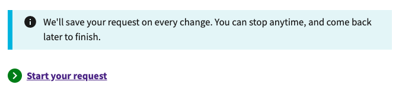

  
Intro page--not signed in (Click to show screenshots)

  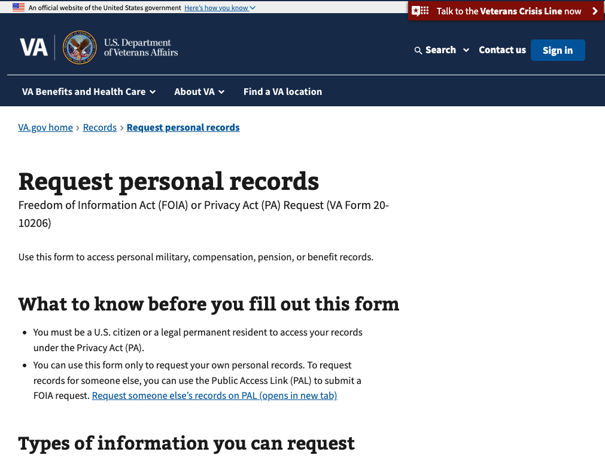
  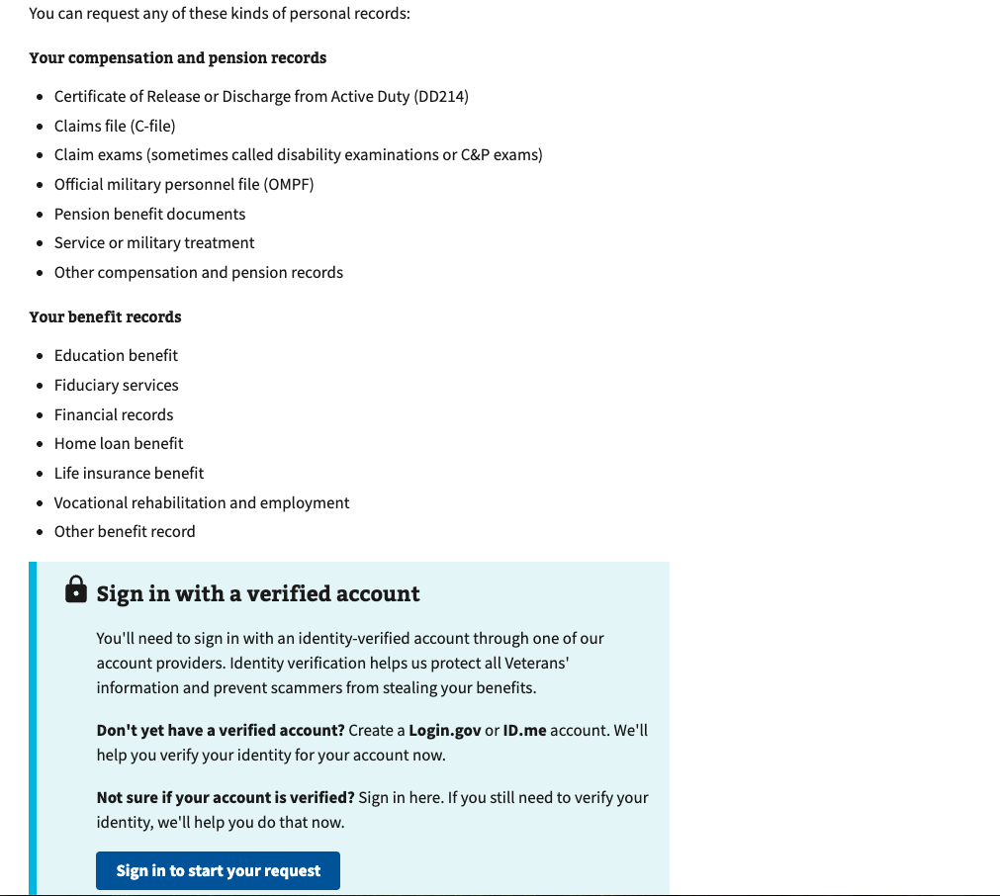

  
Intro page--signed in (Click to show screenshots)

   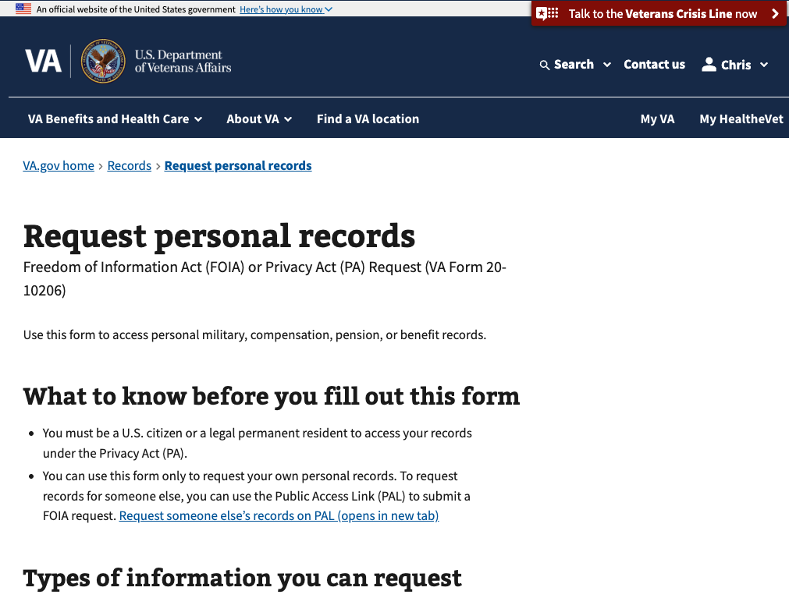
   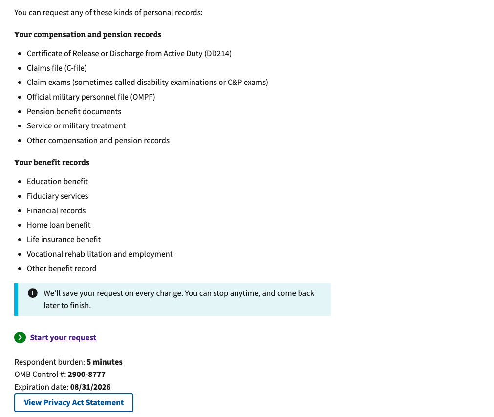

  
Form pages (Click to show screenshots)

   
   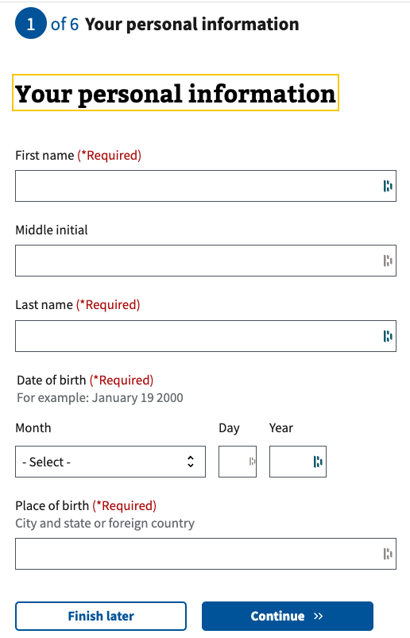
   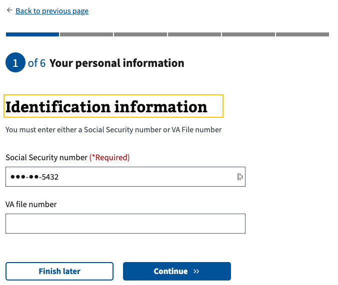
   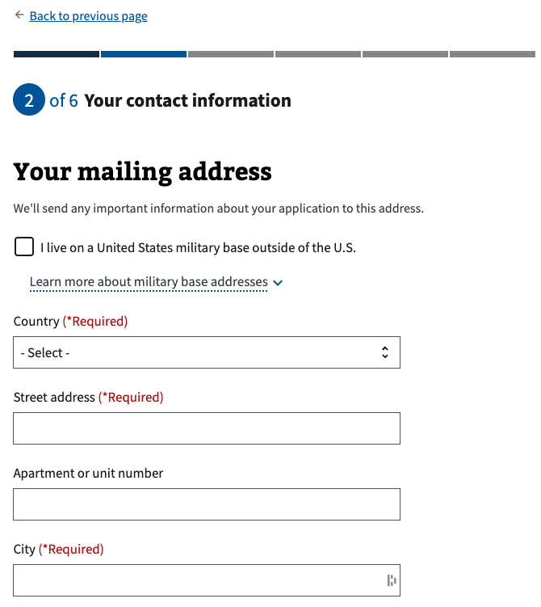
   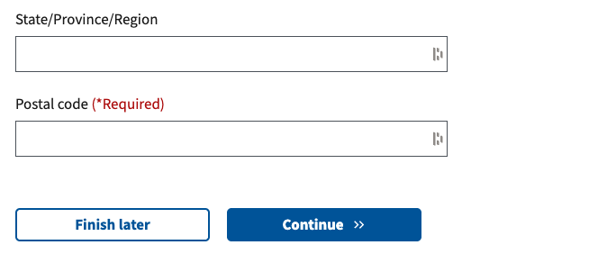
   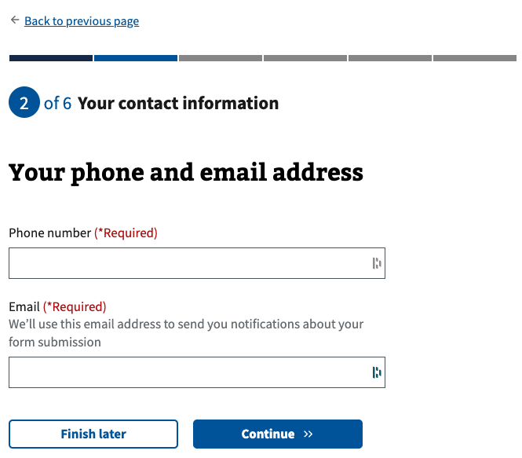
   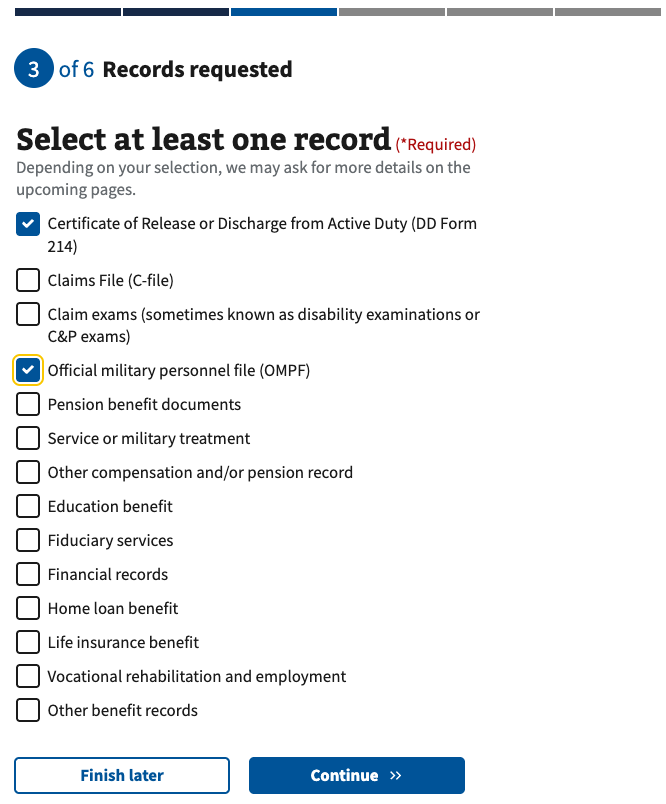
   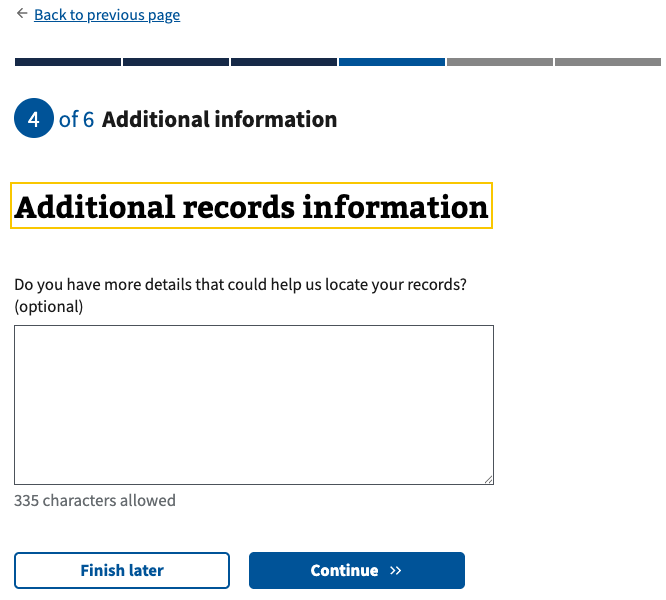
   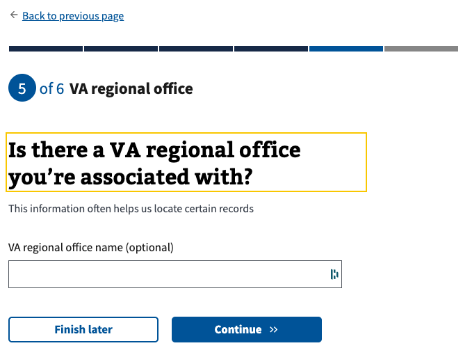
   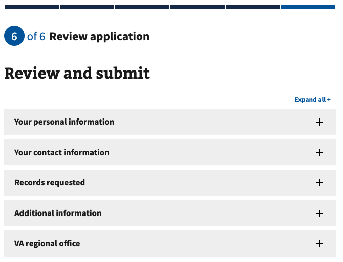
   

  
After clicking "Finish later" (Click to show screenshot)

   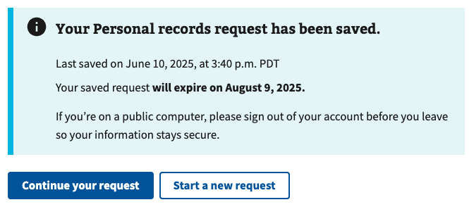

  
My VA (Click to show screenshots)

   
   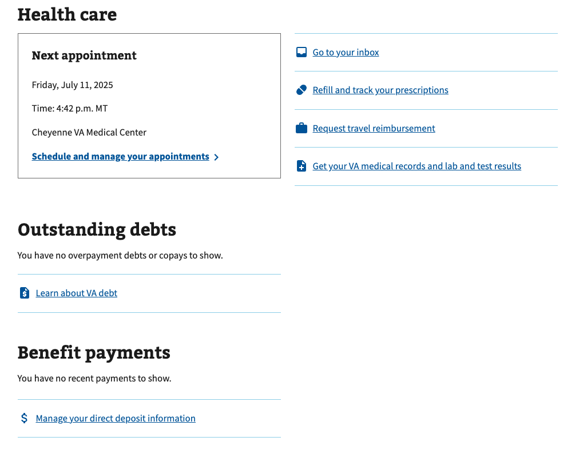
   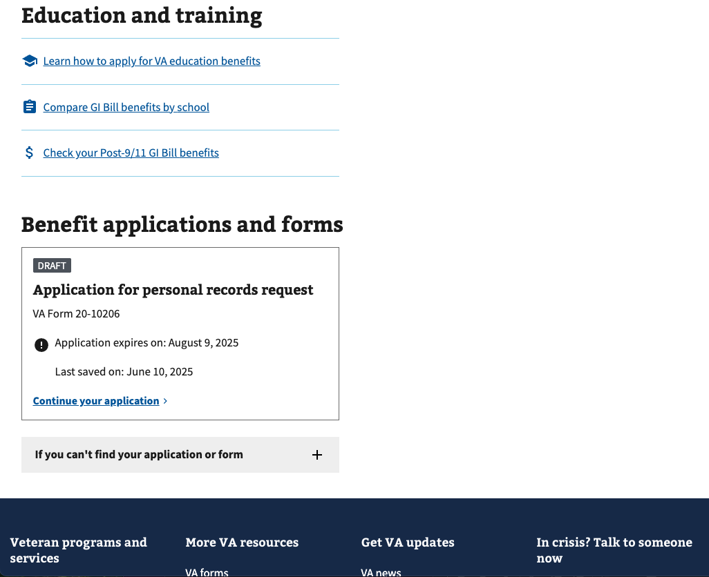

## Who we talked to 

**Recruitment criteria**

We talked to **11 participants.**

Audience segment:
* Veterans: 11 
* Caregivers: 0 
* Family members of a Veteran: 0  

Gender:
* Male: 9 
* Female: 2 

LGBTQ+:
* Transgender: unknown 
* Nonbinary, gender fluid, gender queer, Two-Spirit (Indigenous only), or another gender beyond man or woman: unknown
* Gay, lesbian, or bisexual: unknown

Devices used during study: 
* Desktop: 5 
* Tablet: 1 
* Smart phone: 5 
* Assistive Technology: 6

Age:
* 25-34: 1
* 35-44: 2
* 45-54: 3
* 55-64: 2
* 65+: 3

Education:
* High school degree or equivalent: 0
* Some college (no degree): 1
* Associate's degree, trade certificate or vocational training: 2
* Bachelor's degree: 2
* Master's degree: 4
* Doctorate degree: 2

Geographic location:
* Urban: 8
* Rural: 3

Race:
* White: 6
* Black: 3
* Hispanic: 0
* Biracial: 0
* Asian: 2
* Native: 0

Disability and Assistive Technology (AT):
* Cognitive: 6
* AT beginner: 0
* AT advanced user: 6
* Desktop screen reader: 2
* Mobile screen reader: 2
* Magnification/Zoom: 2
* [Speech Input Technology](https://www.w3.org/WAI/perspective-videos/voice/) like Siri/Dragon Naturally Speaking: 0
* Hearing aids: unknown
* Sighted keyboard: unknown
* Captions: unknown

## Underserved groups we haven’t talked to 

This research does not include the perspectives of the following marginalized Veteran groups:
_List all groups in red from the spreadsheet_
* Identify as Hispanic, Biracial, or Native
* Other than honorable discharge
* Immigrant origin
* Expat (living abroad)
* Beginner AT user

