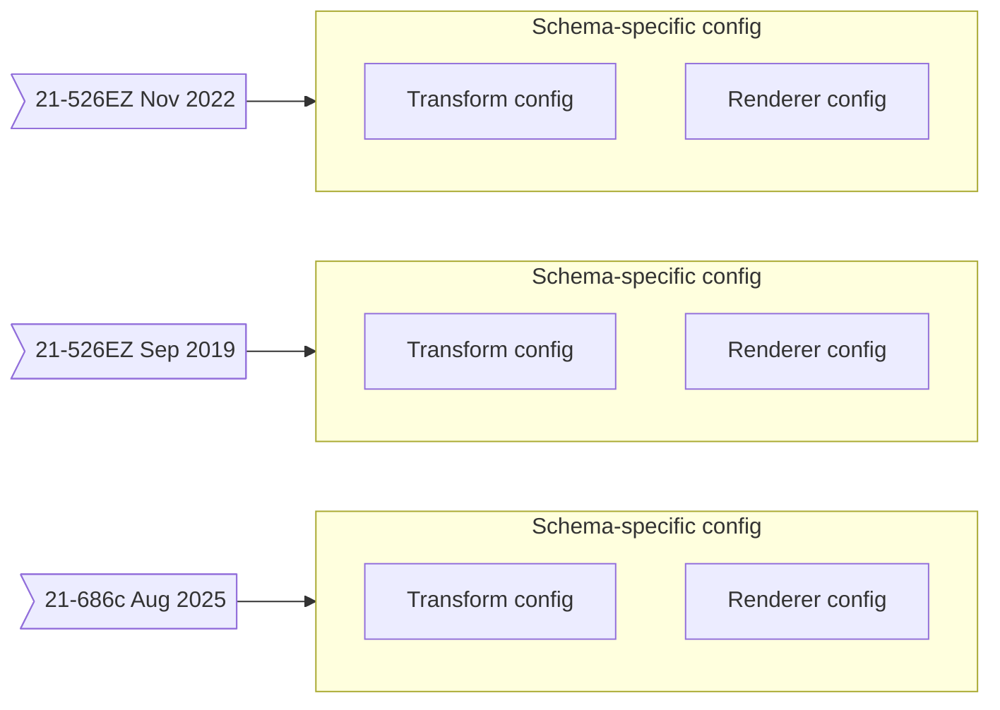
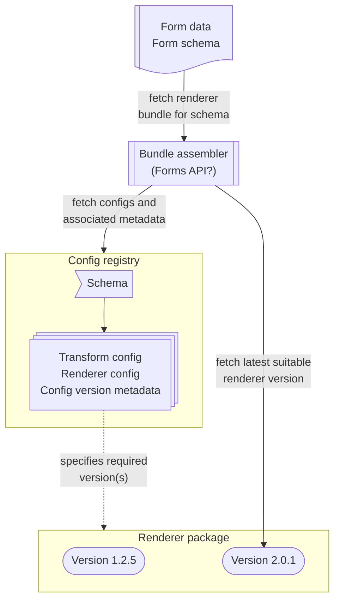

# Renderer Bundle build and deploy

In the initial [renderer bundle proposal](https://github.com/department-of-veterans-affairs/va.gov-team-sensitive/blob/master/teams/employee-experience/Renderer%20Bundle%20proposal.md), the renderer pipeline was outlined as consisting of the following:
- Input: the **form data** that was submitted, represented as JSON
- Config: a **transform config** that specifies how to extract all relevant fields from the form data
- Config: a **renderer config** that specifies the presentational structure of the rendering (including section and question labels, for example)
- Finally, **renderer code** which takes the above data/metadata and results in a frontend for the end user, whether a Veteran or a VSR.

This document fleshes out some technical processes around the building and deployment of these components.

## Renderer code versioning and packaging

The renderer is implemented as a stand-alone React component that can be used within multiple frontend environments, including:
- directly in a frontend UI built on React (e.g. VA.gov)
- as an adapted single-spa application within a microfrontend context (e.g. VBMS)

As a software component subject to new feature development, bugfixes, and other code maintenance efforts, the renderer codebase shares some familiar characteristics with stand-alone open source utilities:
- hosted in its own GitHub repository
- published as a Javascript package on NPM
- released with a versioning system that is explicit about backward-compatibility or incompatibility, e.g. [Semantic Versioning](https://semver.org/)

Taking SemVer as an example, version numbers are in the format X.Y.Z where increments to the Y and Z versions reflect backwards-compatible changes for new functionality and bugfixes, respectively.

## Config authoring and registry

Recall that the transform config and renderer config are tied to a specific VA Form and form version, i.e. a **schema** (for example, *21-526EZ Nov 2022*).

When a VA Form undergoes a revision, or when the Fully Digital Forms initiative adds new support for a VA Form, a new pair of transform and renderer configs must be authored. In the long term, this would be performed by the team responsible for maintaining that form.

The result is a mapping from VA Form schema to the two config files:

This mapping is a **config registry** which may be stored in a GitHub repository, or behind an API (such as the new Forms API) that allows authorized users to PUT and GET config files for a given form schema. The registry can also store metadata for configs, such as version specifiers for the renderer.

## Assembling the renderer bundle

Given a submitted form JSON and form schema, a renderer bundle assembler (say, the Forms API) can collect all the components of the rendering pipeline as follows:

## Practical Remarks

### Likelihood of backward-incompatibility

Realistically, it is possible that the renderer package will only have one version, if there is never any need to support rendering a feature that requires breaking backward compatibility. Nevertheless, using something like Semantic Versioning is best practice for a stand-alone library that multiple end-platforms depend on.

### Ensuring availability of a renderer

This arrangement does not guarantee that there will always be a suitable renderer for any form data. Validation is needed in order to avoid the unacceptable scenario of a submitted form that cannot be rendered. The config registry can easily perform this validation:
- Store a list of supported VA Form schemas and validate that every schema maps to some existing config.
- Store a list of available renderer versions and validate that every config metadata's version specifier can be satisfied.

### Statically importing renderers at build time

In vets-website, the VA.gov frontend, package dependencies are installed as part of the build/deploy process, which occurs before and outside the context of fetching a renderer bundle for a particular form schema.

The best approach here would be for the frontend to import every up-to-date renderer version and select the best version at render time. As mentioned above, the number of renderer versions is small -- perhaps ever only one. Note also that renderer code (without shared libraries like VADS and React) is very compact, on the magnitude of 1 MB or less.

### Renderer bundle as microfrontend

Everything needed to render a submitted form is encapsulated within the renderer bundle. Therefore, the renderer bundle can be treated as a microfrontend (MFE) application that is registered within single-spa. The only input to the MFE is the form data JSON.

Because the MFE application is not known to single-spa in advance, it can be imported at runtime by a dynamic module loader such as [SystemJS](https://github.com/systemjs/systemjs) which is commonly used in conjunction with single-spa.

Further work is required to determine how exactly the bundle assembler combines the renderer package with the config files into an MFE application. Note that the bundle depends only on the form schema; if bundle assembly is a heavyweight process, the finished bundle can be cached (by either the bundle assembler or the MFE framework) with generous expiration times.
