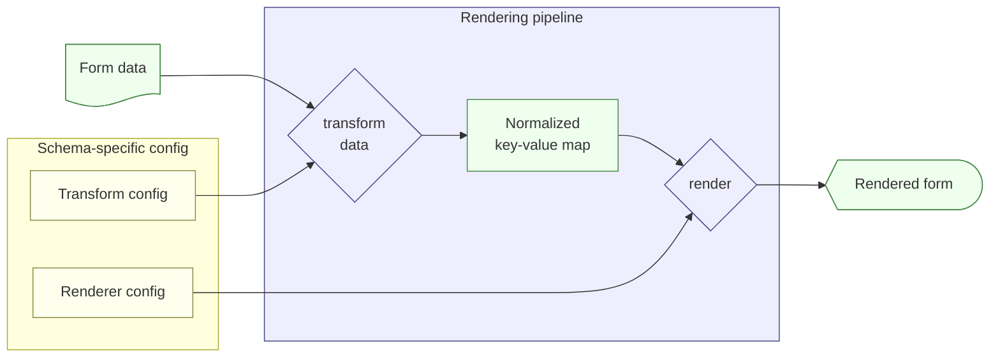

# Renderer Pipeline proposal

## Purpose

This document proposes an approach to represent the capability of rendering a Veteran-submitted form as a data bundle. This representation is motivated by a number of factors related to the Fully Digital Forms initiative, including:
- treating the renderer bundle as a resource that can be returned by a RESTful API
- associating the renderer with a form schema version
- decoupling the format of the form data from the visual styling of the rendering

## Key concepts

- **VA Form** - a form published by VA, both digitally and as a paper form, that a Veteran can fill and submit. (e.g. VA Form 21-526EZ)
- **Form version** - a dated revision of a VA form. VA forms are typically revised every few years, with the paper revision driving a subsequent digital revision. (e.g. 21-526EZ Nov 2022)
- **Form data / form submission** - colloquially, the JSON representation of a single filled-in VA digital form.
- **Form schema** - a detailed specification of all expected fields and data types for a JSON form submission. This is likely manifested using the [JSON Schema](https://json-schema.org/) standard. A form version is nominally associated with one schema, although one version could conceivably span multiple schemas if the digital revision is implemented in multiple stages.
- **Key-value normalization** - a transformation of JSON form data to a key-value hash, ideal for rendering while agnostic to visual styling or optimizations for specific audiences. The transformation process is schema-dependent, but the key-value normalization is intended to be useful for multiple schemas and, where possible, even compatible across form versions.
- **Form renderer** - a frontend component designed to render form data for a particular context and audience (e.g. on VA.gov for Veterans). A renderer is capable of rendering many VA Forms across many form versions, using just a key-value normalization and a renderer config. As a piece of software, a renderer is distributed with [semantic versioning](https://semver.org/), and can be continuously deployed.
- **Renderer config** - a JSON object describing how a particular renderer translates a key-value normalization to the information architecture of a rendering. Config objects generally lay out the form's sections, questions, and labels relevant to the renderer. Each VA Form version corresponds to a separate renderer config.

## Renderer bundle architecture



At form submission time, the system of record (SoR) for submitted forms stores the following:
- form data
- form schema ID, which references a known schema and can be used to perform schema validation on the submitted form data.

At form rendering time, the system of record returns the form data along with the **renderer bundle** which supplies all schema-specific resources that determine how the form should be rendered. The bundle retrieval is possibly done in conjunction with a separate authority that maps schema IDs to the latest version-compatible bundle resources, if the form data SoR is not responsible for storing these.
- key-value normalization transform config
- renderer config

The key-value transform and renderer code is packaged and distributed in a format compatible with the frontend UI platform that embeds it (e.g. a standalone React component on VA.gov, or a single-spa MFE on VBMS UI). Helper utilities such as [single-spa-react](https://single-spa.js.org/docs/ecosystem-react.html) can make it trivial to ensure compatibility across multiple UI platforms.

### Motivation

* **Configurability** - Both the key-value transform and renderer behavior are determined primarily by configuration files in intuitive formats (say, JSON or YAML) that can be authored without deep familiarity with the rendering pipeline, including non-engineers. This makes it very straightforward to support additional VA Forms.
* **Noun-oriented representation** - Considering the configuration files and the standalone renderer component as nouns rather than verbs allows them to be treated as resources in a RESTful API. 
* **Separating data from presentation** - Decoupling the form data specifics from the presentation layer allows for the renderer to be updated separately, or even to plug in entirely new renderers to use the normalized key-value form. Importantly, this means the configuration files can be versioned according to form schema, and the visual rendering code can be semantic-versioned as packaged software.

## Key-value normalization specification

*Full specification to come*

The normalization transform is described by a JSON object whose top-level keys correspond to those of the normalized object itself. These are generally individual questions, or individual fields within a multi-field question.

Each key maps to an object with the following attributes:
- `transform` - a [jq](https://jqlang.org/) script for extracting the desired value from the original form data.
- `type` - loosely, a data type for this value. Can be a structured object (`ssn`, `date`), a primitive (`boolean`), or `array`. Defaults to unrestricted string.
- `each` - for the `array` type, this is a nested object that describes how to transform each element of the array, using the same attributes of a top-level property. The nested `transform` script is applied to each element. (*Note*: jq does support looping over arrays and accessing nested attributes all in one script, but splitting out array transforms is more explicit and readable.)

*Note*: This transform specification relies pretty heavily on [jq](https://jqlang.org/), whose reference implementation only supports command-line usage. Therefore a drop-in replacement for browser runtime, such as [jq-web](https://github.com/fiatjaf/jq-web), should be evaluated for maturity before transform spec is finalized. If no mature replacement is available, it should be straightforward to re-implement a small subset for attribute extraction only.

Sample key-value normalization for VA Form 21-686c (subset of fields):

```json
{
  "firstName": {
    "transform": ".veteranInformation.fullName.first"
  },
  "ssn": {
    "transform": ".veteranInformation.ssn",
    "type": "ssn"
  },
  "dob": {
    "transform": ".veteranInformation.birthDate",
    "type": "date",
    "strptime": "%Y-%m-%d"
  },
  "phoneNumber": {
    "transform": ".veteranContactInformation.phoneNumber"
  },
  "isSpouseVeteran": {
    "transform": ".spouseInformation.isVeteran",
    "type": "boolean"
  },
  "childrenToAdd": {
    "transform": ".childrenToAdd",
    "type": "array",
    "each": {
      "firstName": {
        "transform": ".fullName.first"
      },
      "lastName": {
        "transform": ".fullName.last",
      }
    }
  }
}
```

## Renderer config specification

*Full specification to come*

Sample VA.gov renderer config object for VA Form 21-686c (subset of fields):

```json
{
  "sections": [
    {
      "id": "section1",
      "ordinalLabel": "Section I",
      "label": "Your information"
    },
    {
      "id": "section2",
      "ordinalLabel": "Section II",
      "label": "Add your spouse"
    }
  ],
  "questions": [
    {
      "ordinalLabel": "1",
      "label": "Name",
      "sectionId": "section1",
      "fields": [
        {
          "label": "First name",
          "source": "firstName"
        },
        {
          "label": "Middle name",
          "source": "middleName"
        }
      ]
    },
    {
      "sectionId": "section1",
      "ordinalLabel": "2",
      "label": "Social Security number",
      "source": "ssn",
      "format": "hyphenateSsn"
    },
    {
      "sectionId": "section1",
      "ordinalLabel": "3",
      "label": "Date of birth",
      "source": "dob",
      "strftime": "%Y-%m-%d"
    },
    {
      "sectionId": "section1",
      "ordinalLabel": "5",
      "label": "Phone and email address",
      "fields": [
        {
          "label": "Phone number",
          "source": "phoneNumber"
        },
        {
          "label": "I agree to receive electronic correspondence from VA about about my claim",
          "source": "electronicCorrespondence",
          "trueValue": "Selected",
          "falseValue": "Not selected"
        }
      ]
    },
    {
      "sectionId": "section2",
      "ordinalLabel": "7",
      "label": "Is your spouse a Veteran?",
      "source": "isSpouseVeteran"
    }
  ]
}
```
