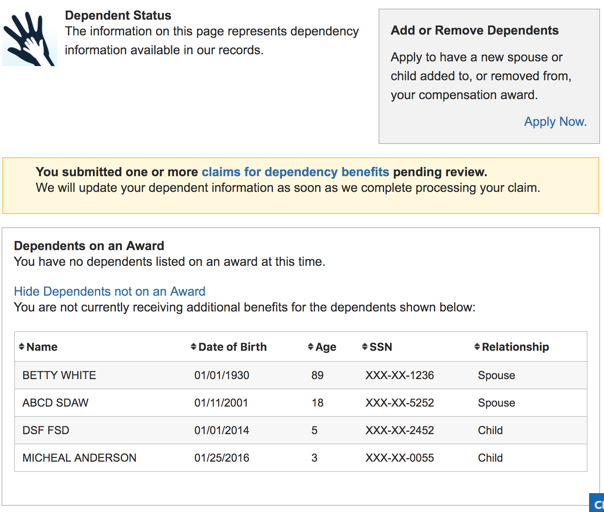

|  | Description |
|---|---|
Feature Name  | Profile - Dependents
Feature Description	| Users are able to view the dependents the VA has on record and see if they are on their Compensation award or not. 
Feature Nickname	| Profile - Dependents
Form Number	| 
Enabling Capability	| Profile - Family Members
VA or DoD Product	| Disability Compensation and Pension
Universal Capabilities / Architectural Components	| Account Activity History
Users Supported	| Veterans, Service members, Family Members, VSOs, Attorneys, Agents
Business Line	| Compensation, Pension
Feature Type	| Custom Built, EVSS-Hosted Capability
Platform	| eBenefits
Minimum Access Level	| LOA 3 (eBenefits Premium)
TYPE OF INTG	| SOAP-Based Web Services
Application Developer	| EVSS
Partner / Service Provider	| BGS
System of Record	| VBA Corp
Document Repository	| N/A
Sensitive Data	| Dependent name, DOB, Gender, SSN (partially masked)
Other Data	| Relationship
Direct Path	| /ebenefits/dependents
References (Service/Operation)| BGS Web Services:CliaimantWebService.findDependents(fileNumber)
EVSS REST Endpoints Supporting Feature | 	
2016 Usage Metrics	| 129,085 avg monthly visits
Frank to EVSS landscape	| User Profile Update
Status	| Profile
Status Notes	| Migrate this feature to VA.gov user profile. This feature has not been migrated and is dependent on another feature (non-Veteran user type). In order for this to be completed, VA profile access needs to be expanded to additional user types. 
Action	| New product, Profile
PRA	| 
Notes	| 
Attachments	| 
Jeff, Chris, and Matt Notes	| My Dependents list, see attachment to a claim
Roadmap | 	NEAR TERM

## Screenshot

