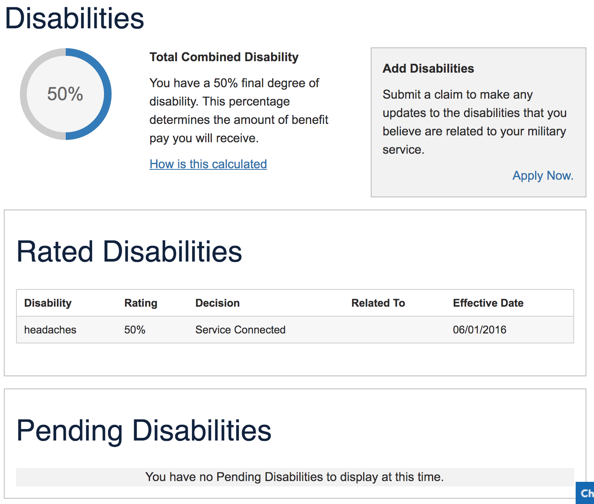

| Field | Description |
|---|---|
Feature Name	| Profile - Rated Disabilities
Feature Description	| Users are able to view their current disability ratings for each contention and the combined disability rating. 
Feature Nickname	| Profile - Rated Disabilities
Form Number	| 
Enabling Capability	| Profile - Disabilities
VA or DoD Product	| Disability Compensation
Universal Capabilities / Architectural Components	| Account Activity History
Users Supported	| Veterans, Service members, Family Members, VSOs, Attorneys, Agents
Business Line	| Compensation
Feature Type	| Custom Built, EVSS-Hosted Capability
Platform	| eBenefits
Minimum Access Level	| LOA 3 (eBenefits Premium)
TYPE OF INTG	| SOAP-Based Web Services
Application Developer	| EVSS
Partner / Service Provider	| BGS
System of Record	| VBA Corp
Document Repository| 	N/A
Sensitive Data	| diagnostic text, diagnostic type code, diagnostic type name
Other Data	| service-connected combined degree, non-service-connected combined degree, exam dates, relevant military service period, decisions, withholding amount
Direct Path	| /ebenefits/disabilities
References (Service/Operation)	| BGS Web Services: RatingService.findRatingData(FileNumber) RatingService.findRatingDataByParticipant(participantId)
EVSS REST Endpoints | Supporting Feature	
2016 Usage Metrics	| 667,625 avg monthly visits
Frank to EVSS | landscape	User Profile Update
Status	| Profile
Status Notes	| Migrate this feature to VA.gov user profile. This feature has not been migrated and is dependent on another feature (non-Veteran user type). In order for this to be *fully* completed, VA profile access needs to be expanded to additional user types. However, letting Veterans view their rated disabilities is not precluded by that requirement.
Action	| New product, Claim/appeal status, Profile
PRA	| 
Notes	| 
Attachments	| 
Jeff, Chris, and Matt Notes	| We should show these ratings in profile
Roadmap	| NEAR TERM

## Screenshot

 
