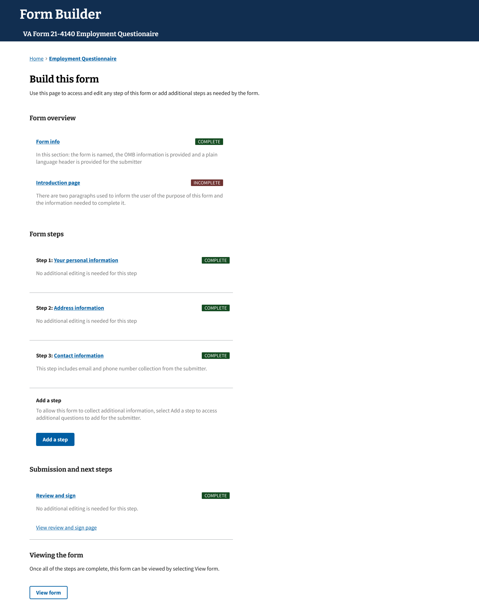

# Collaborator Guide to the Form Builder of Form Engine 

## Welcome to the overview and guide for the Form Builder UI

The process outlined here is specific to the UI that has been created in Drupal to support the quick conversion of existing PDF-based forms into an online, interactive experience for Veterans. There are additional systems and processes in place that support this tool. Explaining all of the related dependencies are beyond the immediate scope of this documentation, but will referenced when needed. 

The UI leverages visual elements of the VA Design System in support of creating a consistent experience for both internal and Veteran-facing tools. We will go into more detail as we talk about how to use Form Builder. 

Keep in mind, this documentation is “living.” and will reflect updates to the tools and processes used by OCTO and the VA Design System.

### In this guide

#### • [The purpose of Form Builder](https://github.com/department-of-veterans-affairs/va.gov-team/blob/master/teams/form-engine/runbook/Collaborator-Guide.md#the-purpose-of-form-builder)

#### • [Before starting with Form Builder](https://github.com/department-of-veterans-affairs/va.gov-team/blob/master/teams/form-engine/runbook/Collaborator-Guide.md#before-starting-with-form-builder)

#### • [Starting a new form](https://github.com/department-of-veterans-affairs/va.gov-team/blob/master/teams/form-engine/runbook/Collaborator-Guide.md#starting-a-new-form)

#### • [Working with steps in Form Builder](https://github.com/department-of-veterans-affairs/va.gov-team/blob/master/teams/form-engine/runbook/Collaborator-Guide.md#working-with-steps-in-form-builder)

#### • [Sharing for review and approval](https://github.com/department-of-veterans-affairs/va.gov-team/blob/master/teams/form-engine/runbook/Collaborator-Guide.md#sharing-for-review-and-approval)

#### • [Editing the content of a form](https://github.com/department-of-veterans-affairs/va.gov-team/blob/master/teams/form-engine/runbook/Collaborator-Guide.md#editing-the-content-of-a-form)

#### • [Handing off the form](https://github.com/department-of-veterans-affairs/va.gov-team/blob/master/teams/form-engine/runbook/Collaborator-Guide.md#handing-off-the-form)

### The purpose of Form Builder

Form Builder was created to simplify the digitization of existing forms available to the Veteran.   
As a starting point, Form Builder can process simple forms that do not require evidence to be uploaded with submission. 

This runbook will serve as your introduction to the process that the Form Builder supports and a quick guide to how to work within the UI of the Form Builder, while following the best practices put in place by the VA Design System (VADS). 

This early version of the Form Builder is an iterative tool which will be improving with your input and collaboration. And as such we look forward to your input on how we might continue to refine, improve, and innovate where it comes to delivering more value for our Veterans and their families. 

### What Form Builder does

Form Builder will provide a “head start” in the digitization of a selected form. 

It automatically generates a draft that contains the expected default steps of most forms on VA.gov.

Form Builder will create the structure needed in order to support adding additional steps as you digitize an existing form. With Form Builder you can add the steps required to collect the necessary information from the user (Today this is the Veteran), in order to help expedite their registration, information update, or task that the previously printed form supported. 

Think of the Form Builder as a shortcut to creating forms on behalf of the VA to more quickly assist the Veteran in providing the necessary information to unlock the benefits that they are entitled to recieve. 

The Form Builder is your assistant in setting up an online experience for the form and it will need your collaboration to help the form get approved for use on the VA.gov platform. 

The output of the Form Builder is what the Collaboration Cycle (insert link) will measure to make sure that the content and flow follows the expected patterns for consistency on the VA.gov platform. 

To make sure that the form you are converting to an online experience is as correct as possible, we have included as many pre-defined and up-to-date components for you to use. 

You will still need to work within the Form Builder to provide the necessary content for labels and areas that the user will need to complete to submit their form. This is handled on an item by item basis for things that are customized by a user of Form Builder.

### What Form Builder will do (but doesn’t yet)

As the Form Builder continues to improve and iterate with enhancements and additional features, it will become an even more valuable tool in the digitization and conversion of existing forms. 

Additionally, the Form Builder will likely exceed this role by becoming a test vehicle for user testing of new flows or more challenging forms to convert. As it will continue to “consume” the components available in the Forms Library, the functionality of Form Builder will expand to be able to tackle more and more forms. 

The Form Builder, in its current state, will not publish directly to the VA.gov platform in a Veteran Facing manner, i.e. it does not circumvent the current governance model. The output of Form Builder (a digital form) is reviewable in a staging environment based on a certain set of dependencies, more on this in the [sharing for review](https://github.com/department-of-veterans-affairs/va.gov-team/blob/master/teams/form-engine/runbook/Collaborator-Guide.md#viewing-the-form-on-staging) section.

Currently, the Form Builder does not support a real-time preview. The adjustments made to the draft of the form will be visible at an interval of the next day or the immediately following day, depending on when the edits to the form were committed to the draft.

## Before Starting with Form Builder

There are a couple of considerations to weigh when thinking about working with Form Builder.  
These include: the suitability of the form you have been assigned to convert, your familiarity with converting existing forms into digital experiences on VA.gov, your comfort with creating additional content, and working with other teams and stakeholders. This section should cover most of these challenges and dependencies.

### Do you have access to Form Builder?

Form Builder is available on the [CMS platform.](https://prod.cms.va.gov)
 

**Note:** If after attempting to log in with your PIV, and you are returned to this screen, you may need to reach out to the CMS team for access. 

Once you are logged in, you will find the Form Builder in the menu

### Is your form a fit for this process?

Form Builder has been designed to work with simple forms. 

There are many types of forms available on VA.gov and not all of them are great candidates for conversion to an online experience without significant engineering and design effort. 

A form is a good fit if the information needed to complete the form is something that the Veteran has access to, such as dates, locations, and contact information. 

A form is NOT a good fit if it requires additional information to be uploaded such as receipts, images or additional documentation. These forms need more advanced engineering efforts and support from other parts of the form library.

### Working with the Collaboration Cycle

The [Collaboration cycle,](https://depo-platform-documentation.scrollhelp.site/collaboration-cycle/overview) administered by the Governance team, helps to foster consistency in experience across all form digitization. 

Every effort has been made to control the output of this process so that the Collaboration Cycle goes smoothly when the digitized form (the output of this process) is reviewed by that team. 

There are areas that will need to be created and then reviewed as part of this digitization effort, and that is where it makes sense to get Content and IA involved at the start so that a form uses the right amount of and style of content to label sections, interactions, and elements that ask for information from the user. 

For more information about touchpoints and this process you can [follow this link](https://depo-platform-documentation.scrollhelp.site/collaboration-cycle/overview)

### Overview of the Form Builder User Interface

Working within the Form Builder, you will use the user interface. 

The above page is representative of what you can expect when you log into the Form Builder tool. 

If you are starting a new form, the “Build a form” button will start the process of inputting the necessary information and creating a draft for you to work with within the tool. 

View your draft is covered later in this guide. 

When you want to return to this screen, select “Home” from the breadcrumbs at top. 

You will also see a list of the most recent forms that have been worked on in this tool, should you need to edit a previously started form. 

### Working with Stakeholders

It is helpful to discuss the form with the form owner in advance of the conversion.

As part of that conversation, you can learn about which elements are most important to collect via the form, and if there are any challenges that the team has with the way that the paper form has been setup. 

Designing a form, or online experience, often includes trade-offs, and so knowing where using the provided elements would be most helpful can improve the experience for both the user and the stakeholder. 

Keep in mind, several patterns are already established to create consistency, so you may want to ask more broad questions about the general purpose of the form, or which areas the users struggle with on the paper form, or any other insights. 

Currently this tool is focused for use with the simplest of forms, but even in those sometimes there are tricky sections or questions that need to be reworded for clarity or understanding. 

### Setting up an App for reviewing the form

A necessary part of this conversion is to have an application setup in advance in order to see the changes to content and steps for a converted form. 

This is an engineering dependent task and will need support from an engineer familiar with… 

[Engineering Runbook for app setup](https://github.com/department-of-veterans-affairs/va.gov-team/tree/master/teams/form-engine/runbook#creating-the-vagov-application)

This can be done in advance of your form creation, and will allow you to view your content in place, after a build picks up your edits. 
More on viewing a form and sharing for review in this [section](https://github.com/department-of-veterans-affairs/va.gov-team/blob/master/teams/form-engine/runbook/Collaborator-Guide.md#sharing-for-review-and-approval)

## Starting a new form

When you are ready to begin providing the content for a new form conversion, there are a few steps to go through in order to begin with a draft of that form. 

### Starting with Form Builder

Form Builder is available on the [CMS platform.](https://prod.cms.va.gov)
 

**Note:** If after attempting to log in with your PIV, and you are returned to this screen, you may need to reach out to the CMS team for access. 

Once you are logged in, you will find the Form Builder in the menu

### First inputs for a new form

After selecting the menu item for Form Builder, you should arrive at the home page for Form Builder

You will need to start a new from by selecting the *Build a form* button and copying over information from your existing form.

This begins with the form name and number. 

Additionally, you will need to add in the OMB information. 

Importantly, you will also need to add the Header for the form to use on each of the pages that faces the user.  
This is referred to as the Plain Language Header. 
It is easy to think of this as the general purpose of the form for the user.

### The structure of a form in Form Builder

The next screen will show all of the default steps in the new form.   
This is also the screen you will go to when selecting an existing form to edit.  

Breadcrumbs at the top should show your location within this form. **Note** that the name of the form is how you will get back to this location. 

Also note that the parts of this form are separated into three general areas.

**Form overview** has the first page you worked on with information about the form and will also contain the Introduction page.
When a new form is started, this section is created along with the other sections. 

**Form steps** are the sections that the user will go through in completing the form. The default steps are added for personal information, Address information, and Contact information.  These are not editable and included automationally.

After the default steps, the opportunity to add a step is listed. 
This is how you can add functionality (and additional questions) as steps into a form. More on this in “Working with steps”

**Submission and next steps** is the final section contains the review and successful submission page of the form. 
This section is also added in a *complete* state, and requires no configuration to work for the user.

### Next steps with your new form

The “Incomplete” label next to the Introduction page indicates it is not configured completely for use in this form. 

One of the first steps you can complete on this form is to fill in the content to explain how a user will complete this form. 

Access the Introduction page by clicking on the page title. You will then be able to add the content a user will want to know in advance of interacting with the form. This might be specific to the information that will be collected, or things to keep in mind while using the form. 

Note that the Content team will want to review or assist with the content in this area, so collaborating with them is very helpful. 

You do not have to complete this section first.

This tool supports “non-linear” editing, so you may proceed with adding steps if you would prefer to continue building the structure of the form before adding in all of the content. 

## Working with steps in Form Builder

Most existing (paper or PDF) forms will have at least three “sections”  which contain several numbered questions. Although these are similar from form to form, there are variances and differences that reflect considerations to physical space or other important choices that were made when the physical form was designed for use. 

The Form Builder will automatically add the default steps (and parts) of a form including an Introduction, Personal information, Review and Confirmation areas. Typically, these are the first section of the paper or PDF form. The remaining questions outside of these will need to be added as steps to the digital form. The final section of each form is where the signature is collected. This is also automatically handled with the Form Engine, and you will not need to configure it within the Form Builder UI. 

This leaves only the unique questions and information to be gathered per the paper or PDF form. 

To collect these inputs from the user, you will need to craft each question as either a single question within a step, or a repeated set of questions within a step. 

If you think a series of questions work best together as a step, and they aren't repeated, they can be kept together. Please keep in mind the design principle of one thought per page and realize that each question and response will be on its own page, even if kept in the same step. 

After step or steps have been added to the form, you may edit, delete, reorder or add additional steps to the form. 

### Adding a step

To begin adding a step, you will need to begin from the layout page of the form, which has the form name in the breadcrumbs at the top. You should be able to see the "Add step" button listed after the default steps provided by the Form Builder.

Once clicked, you will be given the opportunity to name this step. 

We label the step to help the user understand what the subject matter of the questions contained within this step will be about. This is typically a two to five word label that is suitably high-level enough to hold the question or questions underneath. 

Insert the step label and click **Save and Continue**. This will bring you to the first configuration choice of the question and response you would like to ask of the user. 

### Single v. Repeated sets of questions

The first decision you will need to weigh is the choice between creating a single response (one input from the user) or a repeated set of questions (the user can provide several sets of information about a topic). 

Most questions on a form are single response. Examples of single response are choices from lists, singluar things like addresses, or phone numbers, names, etc. 

A repeated set of questions are a group or set of questions that ask a user to input the same information in a series if they have more than one example. Examples of this might include employment histories, or training sessions, etc. This would collect more than one part, but have a repeatable format. 

Once you are sure which type of response you need to collect, select from the buttons at the bottom of this screen and you will proceed to the choice in setting up your step.

### Pre-defined v. Custom

To support consistency through all digital experiences, you will be brought to a choice of using a pre-defined question and response pattern, or the option to create your own. 

If there is an existing question and response that fits what the target form is attempting to collect, we encourage you to use the pre-defined version. This will simplify both the inputs that are needed from you and make sure that you are in compliance with the most up to date guidance. 

If on the otherhand, an existing pre-defined question does not match what you need the user to provide, you can use this page to launch the custom setup for a single response. 

Additionally, if you need to create a custom list and loop, or repeated set of questions... this will be handled at the admin level for the time being. Please seek advice from your form admin for this functionality.

### Question and Response choices 

The Form Builder UI separates the single response questions into three main types. 

**Choice**
This type of question and response will allow the user to select from a list of provided choices. In this type of response, the user can select one (Radio Button style) or several (Checklist style). For both of these styles, you will need to provide the labels for the choices. If you decide to provide more detail, or information, as a description for the choice, the list will be presented in a tile style presentation.

**Date**
Both date and date range responses are grouped together as a kind of response. The opportunity to make this a range is a later choice, once you decide to work with date as a response pattern. If you work with a single date (instead of a range) you can further select to make the response less specific by choosing only to ask the user for the month and year of the occurance. 

**Text input**
For questions that you expect the user to fill in, you will need to choose between a single line, set of single lines (text group) or a longer "paragraph-style" (text area) style response. If a question will require several single line responses, such as *name*, *title* and *division*... use the text group version, labeling each field as the item you want the user to provide.

The first part of your question and response for your added step will be to provide a "Page Title". This page title is the question or item you are trying to gather from the user. 

You may also add more explanation for the Page where the responses will be present to be selected or filled in, this is called the **Body**

After you have completed adding the Page title and optional body, you will then configure the responses available to the user. 

**Note** Configuration for Checkbox list items shown above. 

At saving and continuing past the completed responses, you will brought to a summary screen of that step, including a link back to the newly-created question and repsonse. If you are through with adding questions to this step, you can return to the form layout page or "steps".

### Organizing steps and questions

Available once more than one question is added, you can arrange the order in which questions are presented within a step. You can also add addition questions, delete questions or edit them. You must have at least one question for the step to be presented as *Complete*. If you need to delete the step, reorder the step in relation to other added steps (2 or more) you must do this at the layout level.

## Sharing for review and approval

Reviewing the output of this process is critical to making sure that the content is consistent with the other interactions and communications that a Veteran or their beneficiaries may experience. When you are ready to share your progress on a form conversion, there will likely be a touchpoint within the collaboration cycle that aligns to where you are in the process. You may also want to share early with other collaborating teams such as ADE and Content and IA. Each of these teams may have specific tickets to start to engage their resources. Using this time to set up these appointments will usually mean that your content is available to review when the other collaborative team is ready to engage

### Viewing the form on staging

If the instructions [here for establishing an app](https://github.com/department-of-veterans-affairs/va.gov-team/blob/master/teams/form-engine/runbook/README.md#creating-the-vagov-application) to host the content of the form have been followed, you should be able to share the output from the tool after 24 hours. The normal pickup time for new content is daily. There may be occasions where this is delayed slightly, however planning ahead for at least one day to populate your newest content to a readable form is likely sufficient. 

 

## Editing the content of a form

Editing an existing form's content can be done from within the Form Builder. There are some elements, such as custom list and loop (repeating sets of questions) that will need to be handled by an admin. This part of the guide will assist with locating an existing form, and accessing the content that is available for editing. 

### Accessing a previously started form

Once logged into the home page (shown below), the list of most recent forms that have been started are presented below the opportunity to build a new form. 

In the future, we expect to be able to show which forms are in progress (as drafts), in review, or are published ... which would serve as templates for similar forms. 

Click on the form name (link) to access the layout screen for that form. 
The layout screen may look something like this example (below). This will list all of the steps of the form as links and allow you to go directly to that area by clicking on the link.
**Note** you can not change step types... from single to repeated sets, or from radio to text input response for example. **You can edit any entered text** but the function of the step and/or page will remain the same. 

**To replace a step or to change it's functionality... you must delete and add a new step.** 

### Reviewing the updates

After the content has been updated, you can review the changes within Form Builder. To view the updated content in the context of the form, the content will need to be picked up in a build, which happens daily. It is possible that it may take longer for a day to populate the previously set up app that shows the content. If you are scheduling, a review please allow time for the app to populate with your content. 

If the window of 24-48 hours has passed and your most recent updates are not in place, you may need to reach out to the [CMS platform team](https://dsva.slack.com/archives/CDHBKAL9W) for support. 

## Handing off the form 

Further publishing the form, with all of the collaboration cycle sign-offs complete, will need to be handled by an engineering effort. 

### Items to consider

The Form Engine is specific to simple forms that do not need addition content to be successfully submited. 

The confirmation screen is generated automatically and is not configurable by the Form Engine or Form Builder UI.

### Notifications and Alerts

TBD Added by the engineering team. Referencing what alerts need to be sent and how they will be delivered.

### PDF mapping

PDF mapping is a manual process at this time, handled by an engineering effort. 

Mapping of the output to the previously designed PDF will typically happen later in the development of the form, once all of the necessary steps and content has been approved.
The Form Builder is not equipped to handle PDF mapping at this time.

