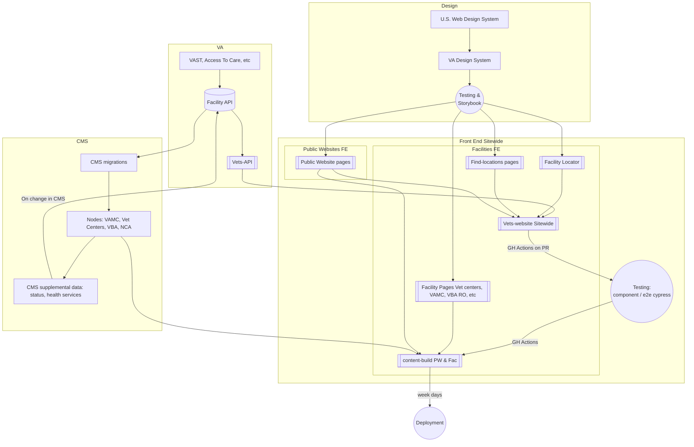

# Facilities and Facility Locator pages dependencies and testing

## Table of Contents

1. [Landscape chart](#landscape-chart)
2. [System Dependencies](#system-dependencies)
3. [Component Dependencies](#component-dependencies)
4. [Unit Testing](#unit-testing)
5. [Integration Testing](#integration-testing)

## Landscape chart

## System Dependencies

### CMS (prod/staging)
#### Content-build
The CMS system is the primary dependency on which content-build relies. All pages are processed from the pages.json file statically at compile time and therefore doesn’t depend on CMS at runtime. This makes it not a likely point of failure. The only type of failure that could happen is if the CMS diverges from the graphql queries in `stages/build/drupal/graphql`. If there is divergence, broken pages will result (verified by modifying data in the graphql queries without corresponding values in the CMS– causing banners to appear when they shouldn’t). The metalsmith build process doesn’t seem to indicate what testing is being done on the pages built from the liquid components. There don’t seem to be any tests to guarantee correctness of data on any page. This is likely due to the fact that the majority of pages are dynamic based on CMS content.

> In case of failure, likely contact Steve Wirt or Christian Burk, but in the case of something like “CMS is not responding” escalate to the platform team. 

#### Vets-website
Vets-website does not directly pull from dynamic CMS. So, changes in CMS will not affect vets-website. It does pull from static CMS data in the form of the `https://www.va.gov/data/cms/vamc-ehr.json`. However, this is a small portion of the data on vets-website. There is an indirect link between CMS and vets-website, in that CMS pushes data to LightHouse and LightHouse is consumed via vets-api by vets-website.

### Vets-api

#### Content-build
No dependencies in content-build

#### Vets-website
Vets-website heavily uses vets-api for all facility related data (locator/find-locations/details about various types of facilities). All calls to vets-api from vets-website should be using vets-api’s v1 endpoints.

| Facility type | endpoint called by vets-website | 
| --- | --- |
Vet Centers, VA Benefits, VAMC facilities, and VA Cemeteries |  `https://api.va.gov/facilities_api/v1/va`|
| Community care providers | `https://api.va.gov/facilities_api/v1/ccp/provider`
| Urgent care | `https://api.va.gov/facilities_api/v1/ccp/urgent_care`| 
| Emergency care | `https://api.va.gov/facilities_api/v1/va?type=health&services[]=EmergencyCare` and `https://api.va.gov/facilities_api/v1/ccp/provider?specialties` with several (4) specialties |
| Pharmacy | `https://api.va.gov/facilities_api/v1/ccp/pharmacy`|

All routes on Vets-api are managed by the Facilities team and monitored in datadog. Facilities team, up to this point, has been managing the routes but ICs on the team had not had access to datadog directly. We recently got access to datadog. 

> Vets-api is a bit ambiguous who the line of defense is for when the system fails. If vets-api services dev, sandbox, staging, or prod are not responding, escalate to the platform team via a support request. These systems are on EKS and therefore unlikely to be completely down. 

### Lighthouse (LH)
While lighthouse is not directly called by vets-website or content-build, vets-api heavily relies on lighthouse for data. CMS feeds data directly to lighthouse and therefore, to some degree vets-website depends indirectly on CMS.

> Questions about LH on the DSVA slack platform channel often end up identifying that the platform team does not control LH or operate on LH in any meaningful way.

### Sandy’s Database
While Sandy’s database is not directly called by vets-website or content-build, vets-api and CMS rely on data from this database for things such as location of facilities, hours of operation, etc. Michelle Middaugh has access to this database. It is unknown if there are any systems tests or monitoring of this data source.

> Questions about this database should be directed to Michelle, or platform team. However, it appears that it is not necessarily the platform team who is responsible for this data source. 

### VAST
Outside OCTO. VAST is consumed by Facility API

## Component Dependencies

### Content-build
Uses the dsva components which in turn use uswds components

### Vets-website
Uses the dsva components which use uswds components

> If components are not functioning correctly, contact design system team

## Unit Testing

For all unit tests, the Facilities team is responsible for successful testing of components. Contact Maxwell Antonucci or Eli Selkin about testing that is not complete.

### Content-build

Most unit tests in content-build are tests to determine whether the liquid processing helper functions are correct. 

> There are some facility specific tests, such as the spec which tests centralized content processing. This is maintained by the Facilities team. Contact Maxwell Antonucci or Eli Selkin or Steve Wirt about this test.

### Vets-website
> Responsible people for failing tests: Maxwell Antonucci or Eli Selkin
These tests seem somewhat sporadic. Components tested are in `src/applications/facility-locator/tests/components`. 

Those include:
- CCProvider link
- Covid19 component for facility locator
- Location directions link
- Location distance
- Location information
- Operational status
- Phone Link
- CCP result
- Covid Result
- Emergency Care result
- Pharmacy
- Urgent care
- VA Facilities

## Integration testing

### Content-build
According to cy:open/cy:run there are only a few specs for e2e testing vets-website:
VA and TRICARE Lovell About page (2) ✅
VA and TRICARE Lovell Main pages (2) ✅
An accessible dialog that does not work ❌
A required test for analytics and homepage test ✅
No other facility static page has testing. It may be that testing these pages is impossible or superficial testing for unchanging objects would yield not useful data. Additionally, when datadog status is in place, the only types of monitoring on these pages would be to determine if the pages are receiving 404s or some other error.

### Vets-website
There are 499 end-to-end tests. The majority are tests related to form completion either by mouse-clicks and typing or keyboard only navigation and not related to facilities. There are a number of end-to-end tests related to facilities that should be maintained by the Facilities team that must pass (are not disabled).

Find-locations via URL with facility ID (nested under facility-locator, is this misleading?) - no separate testing for keyboard accessibility
- detail page uses: http://localhost:3001/find-locations/facility/vc_0304V
- Closed message: tests alert for facility closed ✅
- Limited service: as above but for limited service ✅
- No message: no alert ✅
- Any message ✅

Facility locator - 
- messages in returned data - no separate accessibility for the error message tested✅
- downtime notification - waits for tool to break - looks like a broken test, but is running correctly ✅ AXE NOT INJECTED
- accessibility - tests everything except whether search actually functions. However doesn’t enter text in zipcode text input ❓
-  CCP Disabled - ✅ - disables option in dropdown
- CCP Enabled - ✅- enables option in dropdown 
- detailPage - AXE NOT INJECTED - also this seems like the wrong location for this 
- errorMessages - AXE NOT INJECTED - error messages for facility locator drop downs and text boxes ✅
- facilitySearch all succeed except breadcrumbs. Uncertain why it’s left in an ambiguous state. Possibly because it doesn’t multiple tests missing AXE, but is it necessary in all scenarios?
- gaEvents - ✅
- Geolocation - AXE missing -  ✅
- Map-zoom - flaky❓
- Mobile - missing AXE check ✅
- Provider search - About half are missing AXE check ✅
- serverErrors  Missing AXE check ✅

## Axe tests
Axe testing is done via cypress injection. Axe tests are required to be done in any unit or integration test. However, a majority of tests do not have Axe injected into the testing and there are warnings all over the place that Axe was not included. It is not just facilities tests that do not include Axe. It is possible the Axe injection and the rule to inject it came after those tests were created. 

> If Axe tests fail, consult Maxwell Antonucci, Eli Selkin, or Laura Flannery 
