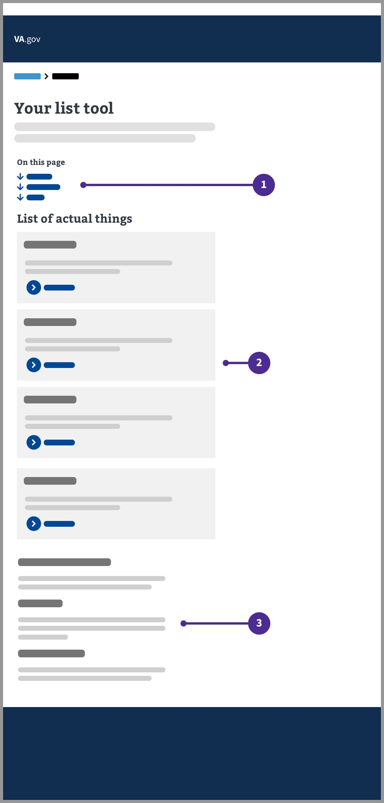
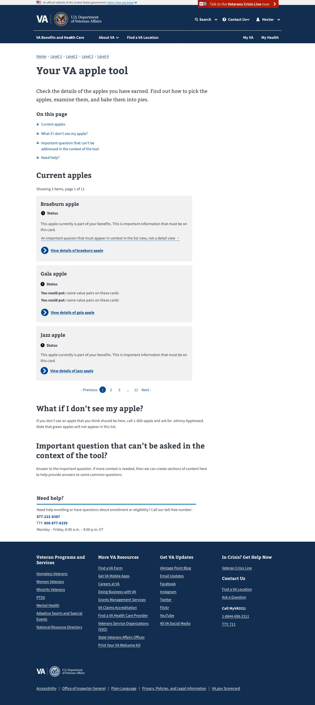

Suggested by: Shawna H, Kevin S.

# Authenticated info list pattern
This pattern helps users quickly see a list of items related to their own personal information, as well as quickly navigate to answers to the questions they might have.

## Purpose
The purpose of this pattern is:

1. To create an easily scannable list / group of a user's related items
2. To consolidate the page layout and remove the sidebar, so as to reduce page scanning
3. To maintain consistency with mobile layout patterns
4. To give the user a quick way to 'jump' to desired content

## Example

1. **'On this page' component.** This section should link to the associated content on the page. It should 'jump' to that section when the user clicks it.
2. **User's list of items.** A group of related (and relevant) content items for the user to review.
3. **Additional information.** Relevant but potentially tertiary information for the user. Not part of the user's list of items. The 'on this page' component will link to these items. 

## Desktop designs

### Typical layout

### Layout with consolidated additional information (FAQs section)

## Mobile designs

### UX behavior

You should use this pattern if you're designing an experience where a Veteran is viewing a list of items relevant to them. For example, a list of the claims they have in process, a list of their disability ratings, or a list of the medical devices they have ordered.

### Additional notes

#### When to consider something else
- If you're designing a list of things embedded in a form, this may not be the best pattern. 
- If you're designing a list with complex filtering and sorting needs, this pattern is probably too simple and you may want to go with patterns more similar to other search tools on our site.

#### The 'on this page' component and headings
The on this page component should start with a link to the list itself, and then list frequently asked questions or other important content topic areas. If there are more than 4 top questions or content topics, you can collapse the questions down to a single H2 "FAQ" in the "on this page component", as seen in the second design mockup with "FAQ about apple trees."

#### Integrating contextual questions in the cards
Overall questions should be in a content area accessed by the "on this page" component, but more contextual questions can be "additional info" components on the cards themselves. Example provided.

#### Optional card elements 
Not all the elements you see in this design are necessary, for example, if you don't have detail pages for your items, you can leave out the action link and still use this pattern.

## Accessibility considerations

Always be sure to include an a11y specialist in any authenticated info list pattern you're developing.

#### Action links
The designs provided above leverage action links as an example for the list cards. Consider whether an action link or a default link is more appropriate for your use case. Please follow the guidance provided on the [action link page](https://design.va.gov/experimental-design/action_links) of the design system. 

Still not sure which is best for your use case? Our accessibility team held a [presentation on Buttons vs. Links](https://docs.google.com/presentation/d/1hv7kENiPuXGcZDwQSM5hItnbyXezu4nY9lFksMQpSK4/edit#slide=id.ge8045de9aa_0_0), which is a great reference to help you decide.

## Research

Research for this layout was conducted via the [Debt Letters MVP Usability Test](https://github.com/department-of-veterans-affairs/va.gov-team/blob/master/products/debt-letters-mvp/research/usability-july20/usability-readout.md) and proved favorable among veterans. 
