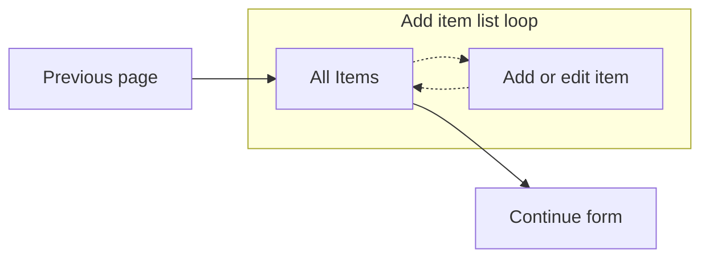

Check out these other pages:
- [list loop](list_loop.md) for the form system list loop
- [contact info list loop](list_loop_v2_contact_info.md) which allows editing contact info in 3 separate pages

---

# Add item list loop overview (v2)

The form system built-in list loop method allows adding and editing items on one page. This makes for a complex UI with lots of accessibility (a11y) problems, e.g. labels and IDs on the edit and remove buttons within each card. It makes for a poor user experience.

This recommended method shows all items on one page along with an "add item" link. The "add item" link directs the Veteran to a new page with the form elements for adding an item. Upon completion, a "add" or "update" button will return the Veteran to the original page with new changes, or a "cancel" button will return the Veteran to the original page without any changes. This greatly simplifies the flow.



So let's get going!

## Setting up the form config

Let's say you've received a design that requires a Veteran to enter each of their medical issues into a list. Let's go through what it would look like to build this.

First, we need to set up the `config/form.js` file with two pages. One for rendering all the issues, along with an "add issue" link, and a second page to add or edit issues.

```js
chapters: {
  // ... other pages
  issues: {
    title: 'Issues',
    pages: {
      listOfIssues: {
        title: 'Issues eligible for review',
        path: 'all-issues',
        // listOfIssues defined in next section
        uiSchema: listOfIssues.uiSchema,
        schema: listOfIssues.schema,
        // needed to bypass bug on review & submit page
        appStateSelector: state => state.form?.data?.listOfIssues || [],
      },
      addIssue: {
        title: 'Add issue',
        path: 'add-issue',
        depends: () => false, // accessed from listOfIssues page
        CustomPage: AddIssue,
        uiSchema: addIssue.uiSchema,
        schema: addIssue.schema,
      },
    },
  },
},
```

The `listOfIssues` page would likely use a widget to render all of the issues. In our decision review forms, we include a checkbox that allows selecting API-loaded readonly issues, and add additional issues all on the same page; but for this doc, we'll simplify it to only use one list. Then a `<Link>` will send the Veteran to the add issue page.

The `addIssue` page is hidden from the flow &ndash; the `depends` function always returns `false`. This page is set up to use the [`CustomPage` method](https://department-of-veterans-affairs.github.io/veteran-facing-services-tools/forms/bypassing-schemaform) which over-rides the form system page rendering.

## Main page (`listOfIssues`)

We'll use a widget to render the main page, so the uiSchema doesn't need to do too much. The `ui:title` is blank to prevent rendering an empty `<legend>` (axe error) on the page.

The `schema` is set up to build an array of items, but shouldn't include any properties since we don't want to render any form elements on this page.

```js
export const listOfIssues = {
  uiSchema: {
    'ui:title': 'All issues',
    listOfIssues: {
      'ui:title': ' ',
      'ui:field': 'StringField', // this is necessary, but shows type errors
      'ui:widget': issuesWidget,
      'ui:validations': [maxIssues],
    },
  },
  schema: {
    type: 'object',
    properties: {
      listOfIssues: {
        type: 'array',
        items: {
          type: 'object',
          properties: {}, // we won't render any form elements here
        },
      },
    },
  },
};
```

## `issuesWidget`

The `issuesWidget` needs a few key necessities:

- As mentioned in the form config definition section, a `<Link>` needs to be included to point to the add issue page. A search parameter of the index is passed, set to the array length, to ensure the added issue is appended to the list. We need this because editing issues will also need to pass an index to the add issue page.

  ```jsx
  <Link
    className="add-new-issue"
    to={{ pathname: '/add-issue', search: `?index=${items.length}` }}
  >
    Add a new issue
  </Link>
  ```
- Upon return to the `listOfIssues` page, check the `sessionStorage` for the last added or modified issue so that the item can be focused and scrolled to for optimal a11y.
- Each card will also include an update `<Link>` with appropriate search parameter index and a "remove" button to remove it from the list.
- Removing an issue would happen within this widget, so we display it as a button and use the appropriate index to remove the entry.
- Using the "Continue" button would still check validations on the page, but would behave as expected and skip the add issue page.

Lastly, pay attention to what's being rendered. Within the form, you'll need to render a `<dl>` wrapper, but on the review & submit page, you'll render the content inside the `<dl>` (`<div>`s wrapping the `<dt>` and `<dd>` elements).

## Add issue page

Because the add issue page is being rendered by the [`CustomPage` component](https://department-of-veterans-affairs.github.io/veteran-facing-services-tools/forms/bypassing-schemaform), the `uiSchema` isn't necessary, and the `schema` is needed because we didn't set up a `CustomPageReview` component. The schema does set up the form data, and is used in the final validation check before submission.

```js
export default {
  // this uiSchema is completely ignored
  uiSchema: {},
  // this schema is needed if a CustomPageReview isn't included, and is used
  // for form validation
  schema: {
    type: 'object',
    properties: {
      addIssue: {
        type: 'array',
        minItems: 1,
        items: {
          type: 'object',
          required: ['name'], // no empty issue names
          properties: {
            // this property aren't really necessary, but here for completeness
            name: {
              type: 'string',
              maxLength: 140,
            },
          },
        },
      },
    },
  },
};
```

The form config contains the setting and will render the `AddIssue` component. We're only showing the basic structure in this example. For a complete example see the [`AddIssue` page for Form 10182](https://github.com/department-of-veterans-affairs/vets-website/blob/main/src/applications/appeals/10182/components/AddIssue.jsx)

```jsx
const AddIssue = ({
  data,         // Obj - complete form data
  goToPath,     // Func - Continue button destination (additional pages, if needed)
  onReviewPage, // Bool - Page rendered on the review & submit page?
  setFormData,  // Func - Set form data
  testingIndex, // Number - for unit testing
}) => {
  const { listOfIssues } = data;

  // get index from url '/add-issue?index={index}' or testingIndex
  const searchIndex = new URLSearchParams(window.location.search);
  // testing index needed for unit tests
  let index = parseInt(searchIndex.get('index') || testingIndex, 10);
  // We shouldn't have an undefined or index less than 0
  if (Number.isNaN(index) || index < listOfIssues.length) {
    index = listOfIssues.length;
  }

  const currentData = listOfIssues[index] || {};
  const isEditing =  !!currentData.name;

  // TextInput field
  const [fieldObj, setFieldObj] = useState({
    value: currentData.name || '',
    dirty: false,
  });
  // Update/edit button clicked
  const [submitted, setSubmitted] = useState(false);

  // path of the all issues page
  const returnPath = 'all-issues';

  // Set session storage of edited item. This enables focusing on the item
  // upon return to the listOfIssues page (a11y)
  window.sessionStorage.setItem('last_added_item', index);

  // Only show an error message if the input has blurred or the update (submit)
  // was used
  const errorMessage = () => !fieldObj.value
    ? 'Please add the name of an issue'
    : null;

  // Added this handlers object because eslint is set to warn about arrow
  // functions within the JSX
  const handlers = {
    onSubmit: event => event.preventDefault(),
    onNameChange: updatedField => {
      setFieldObj(updatedField)
    },
    onCancel: event => {
      event.preventDefault();
      goToPath(returnPath);
    },
    onUpdate: event => {
      event.preventDefault();
      setSubmitted(true);
      if (!errorMessage) {
        const issues = [...listOfIssues];
        issues[index] = {
          name: fieldObj.value,
        };
        setFormData({ ...data, listOfIssues: issues });
        goToPath(returnPath);
      }
    },
  };

  return (
    <form onSubmit={handlers.onSubmit}>
      <fieldset>
        <legend>{`${isEditing ? 'Edit your' : 'Add a new'} issue`}</legend>
        <TextInput
          id="add-issue"
          name="add-issue"
          type="text"
          label="Name of issue"
          required
          field={fieldObj}
          onValueChange={handlers.onNameChange}
          errorMessage={(submitted || fieldObj.dirty) && errorMessage}
        />
        <p>
          <button
            type="button"
            id="cancel"
            className="usa-button-secondary vads-u-width--auto"
            onClick={handlers.onCancel}
          >
            Cancel
          </button>
          <button
            type="button"
            id="submit"
            className="vads-u-width--auto"
            onClick={handlers.onUpdate}
          >
            {`${isEditing ? 'Update' : 'Add'} issue`}
          </button>
        </p>
      </fieldset>
    </form>
  );
}
```

Notes:

- Using session storage as the primary method of determining the issue index isn't possible, because the edit `<Link>` cannot pass any data to the add issue page. Eventhough the `<Link>` component has this ability, the data itself gets lost in the complexity of the form system and the pages that renders it.
- The `Formix` state management library was not used in this example because we wanted to cancel and drop any changes. Formix would directly update the form data when used.
- Using the React-binding version of the web-components at the time of this writing wasn't possible because the `label` property would not render JSX. The component library may have to switch it to use a "slot".
- The actual implementation includes both `TextInput` and `SimpleDate` components.
- We're rendering our own cancel and submit button and using the `goToPath` function. The `CustomPage` props include `goBack` wasn't used. I can't remember exactly, but I think there was a problem with the `goBack` going to the last page that had the "continue" button pressed, which may not always be the main `listOfIssues` page.
