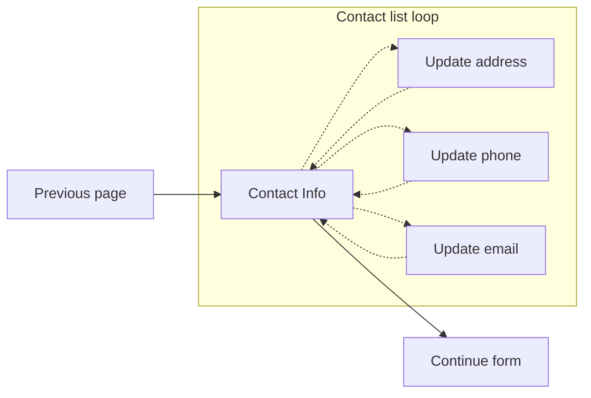

Check out these other related docs:
- [list loop](list_loop.md) for the form system list loop
- [add item list loop](list_loop_v2_add_item.md) with a separate add item page

---

# Contact info list loop overview (v2)

If you want to add a contact info page that shows the Veteran's contact info and allows updating the changes to their profile directly, then follow this example.

Our team had previously tried numerous methods:
- Adding prefilled contact info as inline form elements; but once the form was submitted, the intake personnel would see the address discrepancy and update the Veteran's profile. The time between submission and update could be months.
- We then tried adding a link to the va.gov profile page, but this took the Veteran out of the form flow. And if the profile page was opened in a new tab, we'd have to ask the Veteran to reload the form in the original tab before the profile changes could be seen &ndash; this took multiple steps:
  - Click on "finish this application later"
  - Reload the form saved page (returns them to the Introduction page)
  - Click on "Continue your application"
- We then used profile's original code to allow editing of contact info inside modal windows. This still wasn't the best user experience.
- Next we switched to profile's inline editing of contact info; but if you attempted to edit multiple entries at once, a modal would open stating that an edit was already in progress
- Once the [custom page method](https://department-of-veterans-affairs.github.io/veteran-facing-services-tools/forms/bypassing-schemaform) was added to the form system, we knew this was the right method! Clicking edit of any contact info item would take the Veteran to a new page, then return them to the contact info page once complete. We're still using the profile inline editing components, but only on the edit page.



## Setting up the form config

The flow of this method sets the contact info page as the main page, and each edit page as a new path for each entry. Set up the form config by adding the contact info page and 3 hidden edit pages:

```js
chapters: {
  infoPages: {
    title: 'Veteran details',
    reviewDescription: ReviewDescription,
    pages: {
      // ... other pages
      confirmContactInformation: {
        title: 'Contact information',
        path: 'contact-information',
        uiSchema: contactInfo.uiSchema,
        schema: contactInfo.schema,
      },
      editMobilePhone: {
        title: 'Edit mobile phone',
        path: 'edit-mobile-phone',
        CustomPage: EditPhone,
        depends: () => false, // accessed from contact info page
        uiSchema: {},
        schema: { type: 'object', properties: {} },
      },
      editEmailAddress: {
        title: 'Edit email address',
        path: 'edit-email-address',
        CustomPage: EditEmail,
        depends: () => false, // accessed from contact info page
        uiSchema: {},
        schema: { type: 'object', properties: {} },
      },
      editMailingAddress: {
        title: 'Edit mailing address',
        path: 'edit-mailing-address',
        CustomPage: EditAddress,
        depends: () => false, // accessed from contact info page
        uiSchema: {},
        schema: { type: 'object', properties: {} },
      },
    },
  },
}
```

Notes:

- `ReviewDescription` will render all the info on the review & submit page, so we don't need to include the `CustomPageReview` entry in the form.
- `contactInfo` details described below
- The three edit pages all have their:
  - `CustomPage` renders the component without depending on the form system
  - `depends` function set to return `false`.
  - The `uiSchema` is an empty object since the `CustomPage` doesn't use it, but the entry is still needed
  - The `schema` isn't used, but still needs to be defined

## ReviewDescription

Renders the contact info on the review & submit page based on the form data structure, or use the `profile.vapContactInfo` data from Redux.

To simplify this component, we opted to add a link to the profile page within the review & submit accordion since the chance the Veteran will want to edit their contact info on this page is much more rare (no reseach on this, just a gut feeling).

```html
 <a
  href="/profile"
  target="_blank"
  rel="noopener noreferrer"
  className="vads-u-margin-right--1"
  aria-label="Edit contact information in your profile"
>
  Edit Profile
</a>
```

## Contact info page

### uiSchema & schema

The uiSchema & schema are relatively straight-forward

```js
export default {
  uiSchema: {
    'ui:title': ' ',
    'ui:description': ContactInfoDescription,
    'ui:required': () => true, // don't allow progressing without all contact info
    'ui:validations': [contactInfoValidation], // needed to block form progression
    'ui:options': {
      hideOnReview: true, // We're using the `ReveiwDescription`, so don't show this page
      forceDivWrapper: true, // It's all info and links, so we don't need a fieldset or legend
    },
  },
  schema: {
    type: 'object',
    properties: {}, // no form elements on this page
  },
};
```

### `ContactInfoDescription` component

The `ContactInfoDescription` we set up is a bit complex in that it displays alerts for missing info and a success alert once everything has been updated, but we'll just cover the basics here ([full contact info component code](https://github.com/department-of-veterans-affairs/vets-website/blob/main/src/applications/appeals/10182/components/ContactInformation.jsx)). We need to render the contact info and links to their edit page:

```jsx
(
  <>
    <h4 className="vads-u-font-size--h3">Mobile phone number</h4>
    <va-telephone contact={phoneNumber} extension={phoneExt} not-clickable />
    <p>
      <Link to="/edit-mobile-phone" aria-label="Edit mobile phone number">
        Edit
      </Link>
    </p>
    <h4 className="vads-u-font-size--h3">Email address</h4>
    <span>{email?.emailAddress || ''}</span>
    <p>
      <Link to="/edit-email-address" aria-label="Edit email address">
        Edit
      </Link>
    </p>
    <h4 className="vads-u-font-size--h3">Mailing address</h4>
    <AddressView data={mailingAddress} />
    <p>
      <Link to="/edit-mailing-address" aria-label="Edit mailing address">
        Edit
      </Link>
    </p>
  </>
)
```

## CustomPage component

Since all profile entries use the same profile component, we only need to render the wrapper and change the field name.

```jsx
import React from 'react';

import InitializeVAPServiceID from '@@vap-svc/containers/InitializeVAPServiceID';
import ProfileInformationFieldController from '@@vap-svc/components/ProfileInformationFieldController';
import { FIELD_NAMES } from '@@vap-svc/constants';

const buildPage = ({ title, field, goToPath }) => {
  const handlers = {
    onSubmit: event => {
      // This prevents this nested form submit event from passing to the
      // outer form and causing a page advance
      event.stopPropagation();
    },
    cancel: () => {
      goToPath('/contact-information');
    },
    success: () => {
      goToPath('/contact-information');
    },
  };

  return (
    <div className="va-profile-wrapper" onSubmit={handlers.onSubmit}>
      <InitializeVAPServiceID>
        <h3>{title}</h3>
        <ProfileInformationFieldController
          forceEditView
          fieldName={FIELD_NAMES[field]}
          isDeleteDisabled
          cancelCallback={handlers.cancel}
          successCallback={handlers.success}
        />
      </InitializeVAPServiceID>
    </div>
  );
};

export const EditPhone = ({ title, goToPath }) =>
  buildPage({ title, goToPath, field: 'MOBILE_PHONE' });

export const EditEmail = ({ title, goToPath }) =>
  buildPage({ title, goToPath, field: 'EMAIL' });

export const EditAddress = ({ title, goToPath }) =>
  buildPage({ title, goToPath, field: 'MAILING_ADDRESS' });
```

And that's pretty much it.
