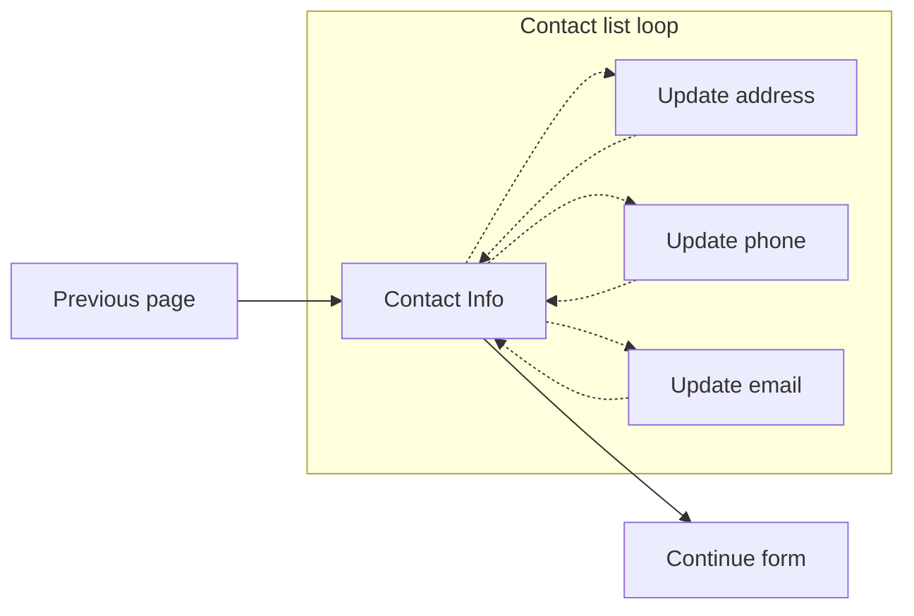

# VA Forms Library - How to create the contact info Array Data (aka List Loop)

Before you get started, it’s helpful to know how to work with Array Data. For more information, see:
[VA Forms Library - How to work with Array Data (aka List Loops)](https://depo-platform-documentation.scrollhelp.site/developer-docs/VA-Forms-Library---How-to-work-with-Array-Data-(aka-List-Loops).2101805082.html)

<hr>

If you want to add a contact info page that shows the Veteran's contact info and allows updating the changes to their profile directly, then follow this example. Clicking edit for any contact info item takes the Veteran to a new page, then returns them to the contact info page once complete.

For more information on why the Forms Library Team recommends this configuration, please see the last section of the document, [Previous implementations of contact info Array field (aka list loop)](https://depo-platform-documentation.scrollhelp.site/developer-docs/va-forms-library-how-to-create-the-contact-info-ar#previousImplementations).



## Page details

### Headers

On the main contact info page, header levels are set up in sequential order. Initial focus is set on the contact info header and each edit link includes an `aria-label` for screen readers.


After using an edit link, a separate edit page becomes visible. Initial focus is set on the unique header. These fields will be prefilled (not shown in the screenshot)


After using save or cancel, the Veteran returns to the main contact info page. If changes were saved successfully, a green background alert becomes visible and is focused. If the Veteran canceled the changes, the original edit link will be focused.


On the review & submit page, all required and non-empty fields are rendered showing the typical format of data. Using the edit button will display the contact info page, and using edit links will redirect the Veteran to the separate edit page and return them back to the review & submit page.


### Errors

If a required field is missing, or is invalid, a warning alert is shown to the Veteran when they arrive at this page. Initial focus is still on the contact information H3. If they try to continue, a second error alert will become visible and receive focus.


On the review & submit page, each required field is checked and will prevent submission & display an inline error message. Email and zipcodes have an additional validation check which will show an invalid value message.


## Set up

### Form config

The flow of this method sets the contact info page as the main page, and each edit page as a new path for each entry.

Using the `profileContactInfo` definition provides a lot of customization options, but it may still not provide enough. If your data structure doesn't match the following pattern, you can either use the submit transformer to manipulate the values prior to submission, or copy code from the `profileContactInfo` page definition to build a custom data structure:

```js
// form data structure
[wrapperKey]: {
  [addressKey]: {
    isMilitary: false,
    country: '',
    street: '',
    street2: '',
    street3: '',
    city: '',
    state: '',
    postalCode: '',
  },
  [homePhoneKey]: {
    countryCode: '',
    areaCode: '',
    phoneNumber: '',
    phoneNumberExt: '',
  },
  [mobilePhoneKey]: {
    countryCode: '',
    areaCode: '',
    phoneNumber: '',
    phoneNumberExt: '',
  },
  [emailKey]: '',
}
```

In the future, we may include a custom callback that allows the developer to collect, transform and return the desired form data.

### Default setup

With no customization, default paths and data structure is created:

- Show email, mailing address, home phone and mobile phone
- Email and mailing address are required (on the contact info page)
- Home phone and mobile phone is required (on the contact info page)
- Edit pages are automatically generated based on the `included` setting (array value in `profileContactInfo` function)
- Email, mailing address and phone validations are checked on the review & submit page using the default contact info schemas, **but**
- Email, mailing address and phone validations **are not** checked on the contact info page; you'll need to add a `ui:required` and `ui:validations` within the `contactInfoUiSchema` to prevent Veterans from getting past the contact info page with invalid information.

Additional notes:

- Because both the home and mobile phone are required (by default), you will likely need to either:
  - Only require a single phone number
  - Add a page to ask the Veteran what their preferred, or primary, phone number is within the form flow. Then, submit that phone number.
- The schema for the phone, email, and address are used in the main contact info page for form validation on the review & submit page prior to submission. They **do not alter** the edit page form fields!

#### Using default options (no options)

```js
import profileContactInfo, { profileReviewErrorOverride } from 'platform/forms-system/src/js/definitions/profileContactInfo';

const formConfig = {
  reviewErrors: {
    // discussed in another section
    _override: profileReviewErrorOverride(),
  },
  // ...

  chapters: {
    infoPages: {
      title: 'Veteran details',
      pages: {
        // Verify Veteran details: name, SSN, VA file number, etc
        veteranDetails: { /* */ },

        // Verify contact information using profile data
        ...profileContactInfo(),
      },
    },
  },
};
```

#### Showing default options

```js
import profileContactInfo from 'platform/forms-system/src/js/definitions/profileContactInfo';

// Adding these imports for reference
import {
  getContent,
  standardPhoneSchema,
  standardEmailSchema,
  profileAddressSchema,
} from 'platform/forms-system/src/js/utilities/data/profile';

const formConfig = {
  // ...

  chapters: {
    infoPages: {
      title: 'Veteran details',
      pages: {
        // Verify Veteran details: name, SSN, VA file number, etc
        veteranDetails: { /* */ },

        // Verify contact information using profile data
        ...profileContactInfo({
          // contact path for main page, and base for edit pages
          contactPath: 'contact-information',

          // form data schemas; checked on form submission
          phoneSchema: standardPhoneSchema,
          emailSchema: standardEmailSchema,
          addressSchema: profileAddressSchema,

          // Object key wrapping contact info, e.g.
          // { veteran: { mailingAddress: {}, homePhone: {}, ... } }
          wrapperKey: 'veteran',
          addressKey: 'mailingAddress',
          homePhoneKey: 'homePhone',
          mobilePhoneKey: 'mobilePhone',
          emailKey: 'email',

          // Page key used within the form config chapter
          contactInfoPageKey = 'confirmContactInfo',

          // Set required fields; Always use the same keys as defined above
          // mobilePhoneKey, homePhoneKey, addressKey, & emailKey
          contactInfoRequiredKeys: [
            'mailingAddress',
            'email',
            // include either, or both, homePhone or mobilePhone
            'homePhone',
            'mobilePhone',
          ],

          // ** Always use the same keys as defined above **
          // mobilePhoneKey, homePhoneKey, addressKey, & emailKey
          included: ['mobilePhone', 'homePhone', 'mailingAddress', 'email'],

          // All text used within the contact info pages
          content: getContent('application'),

          // Contact info depends callback; see applications/_mock-form/config
          depends: null,

          // Contact info custom ui schema; see section below on adding
          // validation checks to ensure you're submitting valid contact info
          contactInfoUiSchema: {},
        }),
      },
    },
  },
};
```

### Custom setup

In this example set up, the form has a `homeless` question. We will only require a mobile phone, email and mailing address; but, if the Veteran reports themselves as being homeless, the mailing address is still shown, but is not required:

#### validations/contact-info.js

```js
// Check for both missing & invalid values
export const contactInfoValidation = (errors = {}, _fieldData, formData) => {
  const { veteran = {}, homeless } = formData || {};
  const { email = '', phone = {}, address = {} } = veteran;

  if (!email) {
    errors.addError?.('missing email');
  } else if (!isValidEmail(email)) {
    errors.addError?.('invalid email');
  }

  if (!phone.phoneNumber) {
    errors.addError?.('missing mobile phone');
  } else if (!isValidPhone(phone.phoneNumber)) {
    errors.addError?.('invalid mobile phone');
  }

  if (
    !homeless &&
    (!address.city ||
      (address.countryCodeIso2 === 'US' &&
        (!address.stateCode || address.zipCode?.length !== 5)))
  ) {
    errors.addError?.('invalid mailing address');
  }
};
```

#### config/form.js

```js
import profileContactInfo from 'platform/forms-system/src/js/definitions/profileContactInfo';
import set from 'platform/utilities/data/set';

// code for this file is in the previous section
import { contactInfoValidation } from '../validations/contact-info';

const formConfig = {
  // ...

  chapters: {
    infoPages: {
      title: 'Veteran details',
      pages: {
        // Verify Veteran details: name, SSN, VA file number, etc
        veteranDetails: { /* */ },

        // Verify contact information using profile data
        ...profileContactInfo({
          addressKey: 'address', // change form data address key
          mobilePhoneKey: 'phone', // change form data mobile phone key

          // using new address & phone keys (only mobile phone is used here)
          included: ['email', 'phone', 'address'],
          contactInfoRequiredKeys = ['email', 'address', 'phone'],
          contactInfoUiSchema: {
            'ui:options': {
              // return updated schema; address is not required when the
              // Veteran reports as being homeless
              updateSchema: (formData, schema) =>
                set(
                  'properties.veteran.required',
                  formData.homeless
                    ? ['email', 'phone']
                    : ['email', 'phone', 'address'],
                  schema,
                ),
            },
            'ui:required': () => true,
            'ui:validations': [contactInfoValidation],
          },
        }),
      },
    },
  },

  // ...
};

export default formConfig;
```

### App reducer

Make sure to include the `vapService` reducer in the `reducer/index.js`

```js
import { createSaveInProgressFormReducer } from 'platform/forms/save-in-progress/reducers';
import vapService from 'platform/user/profile/vap-svc/reducers';

import formConfig from '../config/form';

export default {
  form: createSaveInProgressFormReducer(formConfig),
  vapService,
};

```

### Review error override

Because the form library doesn't have a `uiSchema` that matches the data within the defined `wrapperKey`, it doesn't correctly associate the form errors on the review & submit page. To fix this, we need to add a `reviewErrors` override.

You can use the function provided in the platform definition:

```js
// config/form.js
import profileContactInfo, { profileReviewErrorOverride } from 'platform/forms-system/src/js/definitions/profileContactInfo';

const formConfig = {
  // ...
  reviewErrors: {
    // using default chapter & page keys from config/form
    _override: profileReviewErrorOverride({
      // matches chapter key
      contactInfoChapterKey: 'infoPages',
      // matches contactInfoPageKey in profileContactInfo()
      contactInfoPageKey: 'confirmContactInfo',
     }),
  },

  chapters: {
    infoPages: {
      title: 'Veteran details',
      pages: {
        // Verify Veteran details: name, SSN, VA file number, etc
        veteranDetails: { /* */ },

        // Verify contact information using profile data
        ...profileContactInfo({
          // ...
          contactInfoPageKey = 'confirmContactInfo',
          // ...
        }),
      },
    },
  },
  // ...
};
```

Or, you can add it manually, like this:

```js
const formConfig = {
  // ...
  reviewErrors: {
    _override: errorMessage => {
      if (
        typeof errorMessage === 'string' &&
        errorMessage.startsWith('veteran')
      ) {
        // these keys must match the chapter & page keys
        return { chapterKey: 'infoPages', pageKey: 'confirmContactInfo' };
      }
      return null;
    },
  },
  // ...
};
```

### Custom content

Within the `profileContactInfo` function is a `content` parameter.

You can customize it by using the `getContent` result and altering some or all of the values.

```js
import { getContent } from 'platform/forms-system/src/js/utilities/data/profile';

// ...
profileContactInfo({
  content: getContent('application'),
  // ...
})
```

These are the default values returned by the `getContent` function:

```js
// appName is passed into the `getContent` function with a default of
// 'application'
{
  title: 'Contact information',
  description: (
    <>
      <p>
        This is the contact information we have on file for you. We’ll send any
        updates or information about your {appName} to this address.
      </p>
      <p>
        <strong>Note:</strong> Any updates you make here will be reflected in
        your VA.gov profile.
      </p>
    </>
  ),

  // page titles & link aria-labels
  editHomePhone: 'Edit home phone number',
  editMobilePhone: 'Edit mobile phone number',
  editEmail: 'Edit email address',
  editMailingAddress: 'Edit mailing address',

  // Review & submit page stuff
  edit: 'Edit', // link text
  editLabel: 'Edit contact information', // link aria-label
  update: 'Update page', // update button on review & submit page
  updated: 'updated', // alert updated text

  // Missing info alert messaging
  missingHomeOrMobile: 'home or mobile phone',
  missingHomePhone: 'home phone',
  missingMobilePhone: 'mobile phone',
  missingAddress: 'mailing address',
  missingEmail: 'email address',
  alertContent: `The missing information has been added to your ${appName}. You may continue.`,

  // Review & submit & section titles
  mailingAddress: 'Mailing address',
  mobilePhone: 'Mobile phone number',
  homePhone: 'Home phone number',
  email: 'Email address',
  country: 'Country',
  address1: 'Street address',
  address2: 'Street address line 2',
  address3: 'Street address line 3',
  city: 'City',
  state: 'State',
  province: 'Province',
  postal: 'Postal code',
  zipCode: 'Zip code',

  // Error on review & submit
  missingEmailError: 'Missing email address',
  missingPhoneError: 'Missing phone number',
  missingCountryError: 'Missing country',
  missingStreetAddressError: 'Missing street address',
  missingCityError: 'Missing city',
  missingStateError: 'Missing state',
  // international postal code is optional
  missingZipError: isUS => (isUS ? 'Missing zip code' : ''),

  invalidEmail: 'Invalid email address',
  invalidPhone: 'Invalid phone number',
  invalidZip: isUS => (isUS ? 'Invalid zip code' : ''),
}
```

