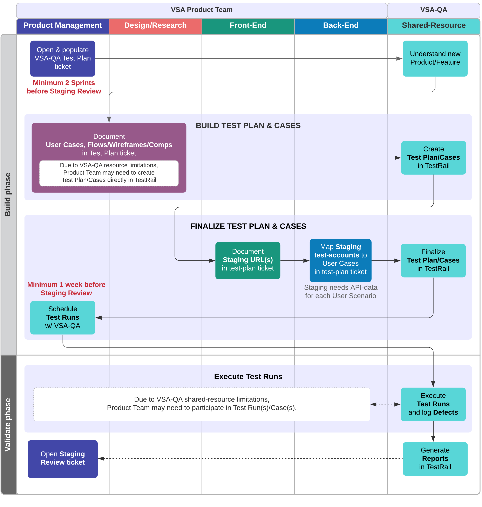

# VSA-QA Process - Manual-UI testing for VSP Staging Reviews

VSA-QA's **current capacity** can only accommodate **manual-UI testing on Staging environment** to satisfy [VSP Staging Review](https://github.com/department-of-veterans-affairs/va.gov-team/blob/master/platform/working-with-vsp/vsp-collaboration-cycle/vsp-collaboration-cycle.md#staging-review) requirements.

## Manual-UI testing on Staging \[for VSP Staging Review]

Both Product Team & QA will collaborate & coordinate test planning and test-case development.

Ideally, once Test Plan/Cases are mature and Product/Feature is stable/testable on Staging,  VSA-QA will handle actual Test Runs.  Occasionally, Product-Team members may need to conduct Test Runs themselves when VSA-QA capacity is overloaded due to multiple already-scheduled Staging Reviews in the same week.

### Important timings

- **At least 2 Sprints before opening VSP Staging Review request-ticket**: Product Manager (PM) opens [VSA-QA Test Plan ticket](https://github.com/department-of-veterans-affairs/va.gov-team/issues/new?assignees=tlei123&labels=vsa-qa&template=vsa-qa-test-plan.md&title=%5BProduct%2FFeature%5D+VSA-QA+Test+Plan).
- **At least 1 Sprint before scheduling VSP Staging Review meeting**: PM notifies VSA-QA to schedule QA test-runs -- VSP requires all artifacts to be ready for review at least 4 days before the meeting.

### Important Product-Team artifacts

- **Use Cases**: Product Team should document Use Cases and share with QA, so that Test Cases can be properly developed.
- **Form-flow diagrams**: For form-based products/features, Product Team should supplement above Use Cases with flow-diagrams.
- **Design/Copy references**: Product Team should document designs and/or copy and share with QA, so that visual-testing steps can be included in Test Cases.
- **Staging test-accounts**: For authenticated Use Cases, Staging test-usernames must be provided.  NOTE: Accompanying API-mockdata should be in-place on Staging to support each Use Case.

### Process Flow

The required steps of the VSA-QA Process are as follows:

1. At beginning of Build phase, **minimum 2 sprints before requesting [VSP Staging Review][vsp-stg-rvw]**, **VSA Product-Team PM opens a [VSA-QA Test Plan ticket](https://github.com/department-of-veterans-affairs/va.gov-team/issues/new?assignees=tlei123&labels=vsa-qa&template=vsa-qa-test-plan.md&title=%5BProduct%2FFeature%5D+VSA-QA+Test+Plan)** to signal/start of test-planning:
    - Add self (PM) to Assignees
    - Add links to relevant Product/feature tickets/docs:
        - Outline
        - Epic(s)
        - Pre-Launch Checklist and/or Release Plan
        - UX Design prototypes
        - Copy decks \[unless above prototypes also serve as copy documentation]

1. **QA acquires Product/feature knowledge** based on above info provided in Test Plan ticket:
    - Product Team should be available for questions/clarifications on provided info.

1. **Product Team documents Use Cases** to ensure coverage of the targeted changes.
    - **PM & Designer(s)** document all relevant Use Cases.  Link Test Plan ticket to a Use-Cases doc in va.gov-team repository's Product/Feature/Project folder \[[use this template](https://github.com/department-of-veterans-affairs/va.gov-team/blob/master/teams/vsa/design/product-use-cases-template.md)].
    - **Engineers** finalize Use Cases by mapping them to Staging test-accounts.  Each account-/data-specific Use Case should be supported on Staging with appropriate API (mock-)data to ensure testability.
    
1. **QA creates Test Plan & Cases**, based on Use Cases developed above in Test Plan ticket.
    - Test Cases may outnumber Use Cases. A given account-specific Use Case may branch off into different "flows" -- e.g., a form may behave differently based on selection of a form-option.
    
1. At beginning of Validate phase, **minimum 1 week before Staging Review meeting**, **PM notifies QA** to schedule Test Runs.  Test Runs must be completed, and relevant QA artifacts generated, at least 2 workdays before Staging Review meeting.
    
1. **QA creates & executes QA Test Runs**\*:
NOTE: Depending on Staging Review urgency and VSA-QA staffing/capacity, Product-Team members may occasionally need to participate in running QA tests.
    1. QA creates Test Runs in [TestRail](https://dsvavsp.testrail.io/) for the finalized Test Cases.  
    2. QA executes Test Runs, and logs any defects discovered, and generates QA artifacts for VSP QA reviewer.
    
1. **PM requests Staging Review**:
    - Open a Staging Review ticket, requesting meeting to be scheduled **2 workdays after** completion of QA Test Runs above.  VSP-QA requires VSA-QA artifacts to be ready at least 2 workdays before the meeting, in order to have proper QA-feedback prepared.

1. **QA reports test-results**:
    - Once test runs are completed, QA generates [TestRail reports](https://github.com/department-of-veterans-affairs/va.gov-team/blob/master/platform/working-with-vsp/vsp-collaboration-cycle/vsp-collaboration-cycle.md#artifact-inputs-7)
    - QA adds report links to Test Plan and Staging Review tickets.

[vsp-stg-rvw]: git@github.com:department-of-veterans-affairs/va.gov-team.git
