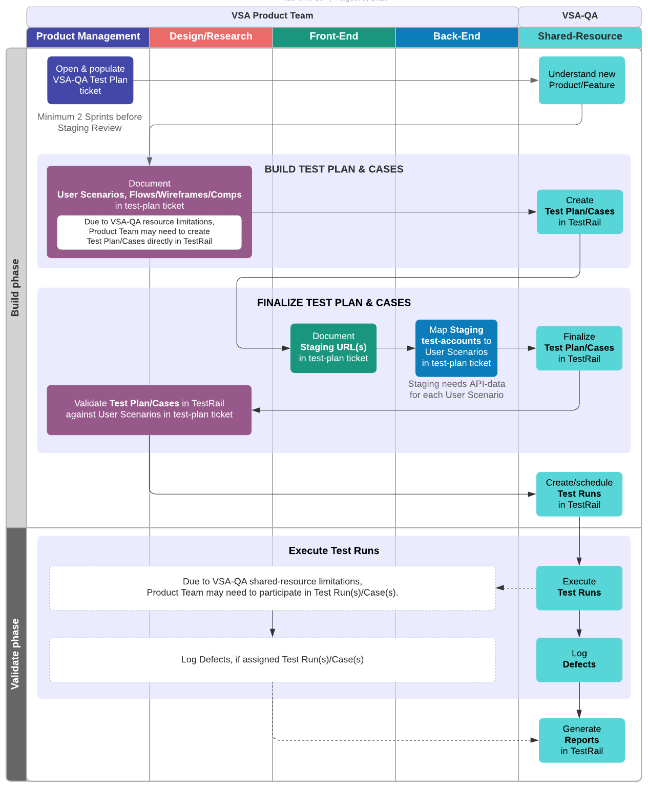

# VSA-QA Process

VSA QA Engineer: Tze-chiu Lei \[call me "Zay"] (GitHub @tlei123)(Slack @Tze-chiu Lei)

This VSA-QA Process is currently a **subset** of [Platform's template process](https://github.com/department-of-veterans-affairs/va.gov-team/blob/master/platform/quality-assurance/process.md), and should expand as QA staffing increases.

VSA-QA's **current capacity** can only accommodate **manual-UI testing on Staging environment** to satisfy Platform's [Staging Review](https://github.com/department-of-veterans-affairs/va.gov-team/blob/master/platform/working-with-vsp/vsp-collaboration-cycle/vsp-collaboration-cycle.md#staging-review) requirements.

## Regression testing

\[TBD] Once VSA-QA capacity increases, process documentation will be developed here.

For now, we're relying on the Product/Feature's **existing, automated unit- and e2e-tests** developed & maintained by Product-Team Engineers.

## Manual-UI testing on Staging \[for VSP Staging Review]

Both Product Team & QA will collaborate & coordinate test planning and test-case development.

Ideally, once Test Plan and Test Cases are mature, VSA-QA will handle actual Test Runs.  In the event that QA capacity/scheduling cannot acoommodate Test Runs in time for any Product/Feature's Staging Review, Product-Team members may need to conduct Test Runs themselves.

### Process Flow

The required steps of the VSA-QA Process are as follows:

1. At least 2 sprints\* before a product/feature's expected [Platform Staging Review](https://github.com/department-of-veterans-affairs/va.gov-team/blob/master/platform/working-with-vsp/vsp-collaboration-cycle/vsp-collaboration-cycle.md#staging-review), **VSA Product-Team PM opens a [VSA-QA Test Plan ticket](https://github.com/department-of-veterans-affairs/va.gov-team/issues/new?assignees=tlei123&labels=vsa-qa&template=vsa-qa-test-plan.md&title=%5BProduct%2FFeature%5D+VSA-QA+Test+Plan)** to signal/start of test-planning:
    - Add self (PM) to Assignees
    - Add links to relevant Product/feature tickets/docs:
        - Outline
        - Epic(s)
        - Pre-Launch Checklist and/or Release Plan
        - UX Design prototypes
        - Copy decks \[unless above prototypes also serve as copy documentation]

1. **QA acquires Product/feature knowledge** based on above info provided in Test Plan ticket:
    - Product Team should be available for questions/clarifications on provided info.

1. **Product Team & QA build Test Plan and Use Cases** to ensure coverage of the targeted changes.
    - PM & Designer(s) collaborate with QA to develop all elevant User Scenarios.  Either:
            - Create list directly in the Test Plan ticket; or
            - Link Test Plan ticket to separate Use-Cases doc \[[use this template](https://github.com/department-of-veterans-affairs/va.gov-team/blob/master/teams/vsa/design/product-use-cases-template.md)].
    - Engineers finalize Use Cases by mapping them to Staging test-accounts.  Each account-specific Use Case should be supported on Staging with appropriate API (mock-)data to ensure testability.
    
1. **QA creates Test Cases**, based on Use Cases developed above in Test Plan ticket.
    - Test Cases may outnumber Use Cases. A given account-specific Use Case may branch off into different "flows" -- e.g., a form may behave differently based on selection of a form-option.
    
1. **Product Team reviews & approves Test Plan & Test Cases**\*.
    - Review plan & cases in [TestRail](https://dsvavsp.testrail.io/) test case management system (TCMS) -- each Product Team should have TestRail login-credentials provided by Platform QA.
    - Request changes to Test Cases in Test Plan ticket, or just make edits directly in TestRail as desired.
    - After requested changes are made and accepted, signify approval in Test Plan ticket -- check off appropriate items under ticket's **Definition of Done**.

1. **QA create(s) & execute(s) QA Test Runs**\*:
NOTE: Depending on Staging Review urgency and VSA-QA staffing/capacity, Product-Team members may occasionally need to participate in running QA tests.
    1. QA creates Test Runs in [TestRail](https://dsvavsp.testrail.io/) for the approved Test Cases.  
    2. QA executes Test Runs, and logs any defects discovered.

1. **QA reports test-results**:
    - Once test runs are completed, QA generates [TestRail reports](https://github.com/department-of-veterans-affairs/va.gov-team/blob/master/platform/working-with-vsp/vsp-collaboration-cycle/vsp-collaboration-cycle.md#artifact-inputs-7)
    - QA adds report links to VSA-QA Test Plan ticket.
    - Product Team PM copies report links into any Platform Staging Review request ticket that may already be Opened.
    
    
\* It's important to plan/schedule VSA-QA Test Runs to be completed BEFORE Platform Staging Review.  When opening a Staging Review ticket, be sure to add VSA-QA Shared Resource to Assignees and add vsa-qa label.
