```mermaid
flowchart TD
  Start["You need a11y assistance!"]

  %% Bug Flow
  Start --> BugQ{"Are you creating a bug?"}
  BugQ --> B1["Make a bug ticket with the **A11y Bug Template** 1️⃣"]
  B1 --> B2["The a11y team will create a sub issue using the **Spike: A11y Assessment** 2️⃣"]
  B2 --> B3["We'll then make the initial **A11y Bug Ticket** 1️⃣ blocked by the sub issue **Spike** 2️⃣"]
  B3 --> B4["Once the assessment is done, providing Reproducibility, Root Cause Analysis and A11y Severity, the original issue will be unblocked and ready to be worked on by someone else on the team"]

  %% Feature Flow
  Start --> FeatureQ{"Are you creating feature work?"}
  FeatureQ --> F1["Initial team work generated on the board"]
  F1 --> F2["When Design work is assigned, create a new ticket with the **A11y Review Request** 3️⃣"]
  F2 --> F3["Once completed, and Design work is wrapped up Engineering work proceeds."]
  F3 --> F4["Before deploying, Engineering should create another **A11y Review Request** 3️⃣ ticket"]
  F4 --> F5["Once completed, Engineering is free to deploy"]
```

# How to Utilize A11y Resources on Disability Benefits

**This flow diagram applies to the Disability Benefits 1, Disability Benefits 2, Disability Conditions, and Employee Experience teams only.**

---

---

## 📌 Template Links

1️⃣ [Disability Benefits Team A11y Bug Template](https://github.com/department-of-veterans-affairs/va.gov-team/issues/new?template=Disability-BaseTeam-A11y-Bug-Template.md)  
2️⃣ [Disability Benefits Team Spike: A11y Assessment](https://github.com/department-of-veterans-affairs/va.gov-team/issues/new?template=Disability-BaseTeam-A11y-Spike-Template.md)  
3️⃣ [Disability Benefits Team: A11y Review Request](https://github.com/department-of-veterans-affairs/va.gov-team/issues/new?template=Disability-BaseTeam-A11y-Review-Template.md)
