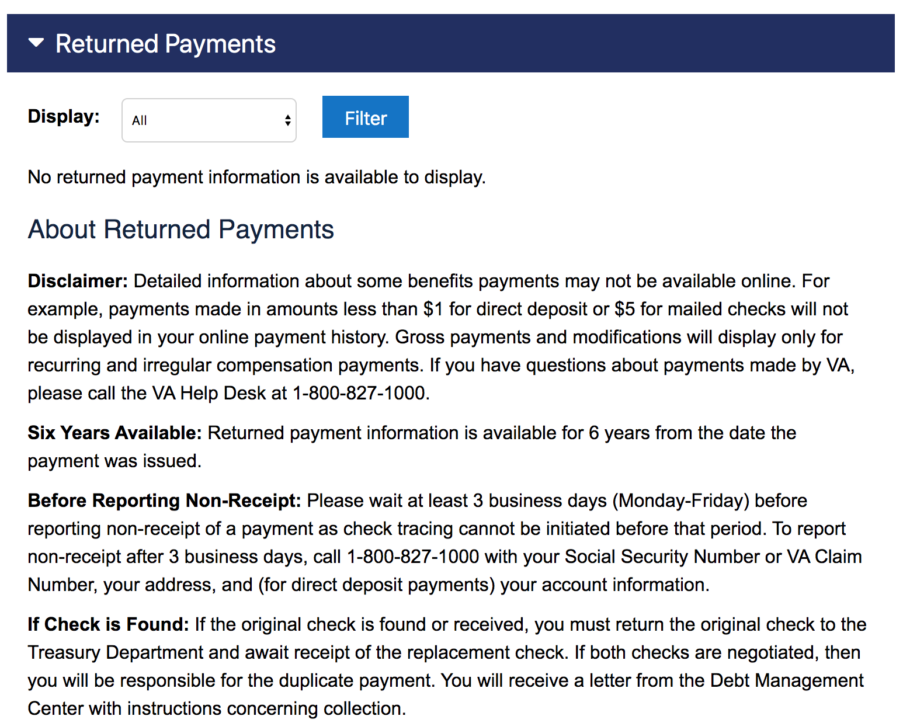
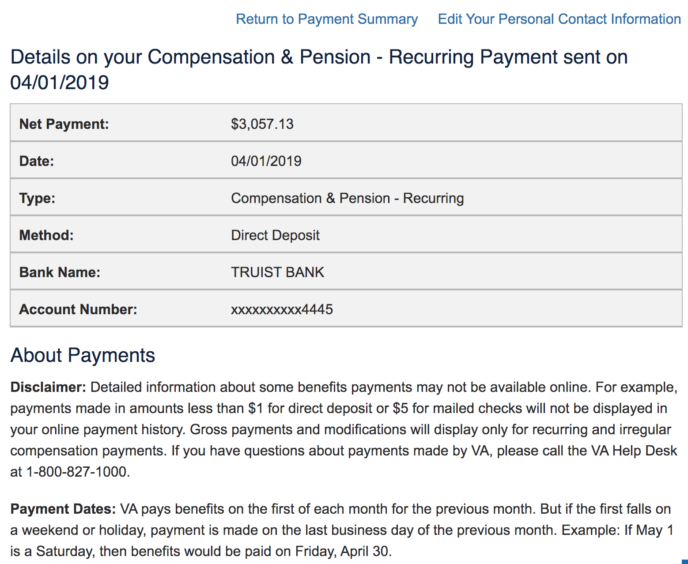

# View Payment History

## User stories

- I can find a page to view my Payment History
- I can see a list of my payments
- I can see a list of my returned payments
- I can read information about what payments are displayed in these lists, and what payments are not, and what to do if I think something is wrong
- I can sort the list of payments by date and type
- I can click on a payment to see details about that payment

## Considerations
- Veterans can have hundreds of payments, so some way to paginate/ filter will be necessry
- Assuming "returned payments" arrive from the same service as regular payments

## eBenefits Screenshots

