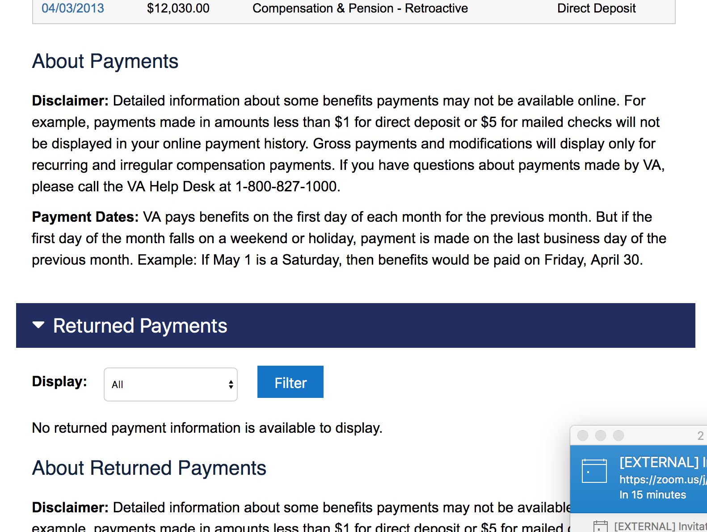

| Field | Description |
| --- | --- | 
Feature Name	| Profile - Payment History
Feature Description	| Users are able to check the status of their Compensation Service payments.
Feature Nickname	| Payment History
Form Number	| 
Enabling Capability	| Profile - Payment History
VA or DoD Product	| Disability Compensation
Universal Capabilities / Architectural Components	| Account Activity History
Service Orchestration| 
Users Supported	| Veterans, Service members, VSOs, Attorneys, Agents
Business Line	| Compensation
Feature Type	| Custom Built, EVSS-Hosted Capability
Platform	| eBenefits, SEP
Minimum Access Level	| LOA 3 (eBenefits Premium)
TYPE OF INTG	| SOAP-Based Web Services
Application Developer	| EVSS
Partner / Service Provider	| BGS
System of Record	| VBA Corp,BDN
Document Repository	| N/A
Sensitive Data	| Net Payment Amount, Payment Date, Payment Method, Bank Name, Account Number (partially masked)
Other Data	| None
Direct Path	| /ebenefits/payments
References (Service/Operation)	| BGS Web Services: PaymentInformationService.retrievePaymentSummaryWithBDN VetRecordWebService.findVeteranByFileNumber BenefitClaimWebService.findGeneralInformationByFileNumber (ClaimantWevService?) DdeftWebService.findComericaRoutingTrnsitNbr
EBenefitsAdd
EVSS REST Endpoints | Supporting Feature	
2016 Usage Metrics	| 696,824 avg monthly visits
Frank to EVSS landscape	| "VA Payment History - Monitor VA Compensation and Pension, Education, and Vocational Rehabilitation benefits payments.", User Profile Update
Status	| Profile
Status Notes	| Migrate this feature to VA.gov user profile. This feature has not been migrated and is dependent on another feature (non-Veteran user type). In order for this to be completed, VA profile access needs to be expanded to additional user types. 
Action	| New product, Claim/appeal status, Profile
PRA	| 
Notes	| 
Attachments	| 
Jeff, Chris, and Matt Notes	| This is linked on the HP twice, this is a big feature for profile.
Roadmap	| NEAR TERM

## Screenshots

