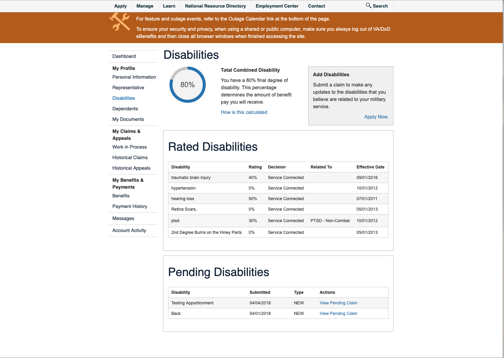

# Product Outline: eBenefits  
- GitHub Label: vsa-ebenefits
- Slack channel: vsa-ebenefits
- VA.gov link: n/a
- Demo video link: n/a
- Product POCs: Steve Kovacs & Jason Wolf

---

### Table of Contents

# Executive Summary 
- [User Problem Statement](#user-problem-statement)
- [Solution Goals](#solution-goals)
- [Assumptions](#assumptions)
- [Requirements and Constraints](#requirements-and-constraints)
- [Discovery Takeaways](#discovery-takeaways)
- [Solution Approach](#solution-approach)
- [Value Propositions](#value-propositions)
- [KPIs](#kpis)

# Implementation Information
- [Status](#status)
- [Solution Narrative](#solution-narrative)
- [How to Access and Test](#how-to-access-and-test)
- [Error Handling](#error-handling)
- [Service Level Objective](#service-level-objective)
- [API Calls and Dependent Systems](#api-calls-and-dependent-systems)
- [Resources and Documentation](#resources-and-documentation)
- [Keywords](#Keywords)
- [Team](#team)
- [Screenshots](#screenshots)

---

# Executive Summary

## User Problem Statement
As a Veteran, I want to find, and apply for, as many benefits available to me so that I can leverage more of the VA's resources.

## Solution Goals
Help Veterans, their dependents and caregivers get the benefits they've earned by transforming, migrating and optimizing critical features and functions from eBenefits to the VA.gov central location.

### User Goals
With resources better presented to the user, they should be able to find and apply to more benefits with better efficacy.

### Business Goals
Ensure that as many resources produced by the VA are being leveraged to as many Veterans possible.

## Assumptions
There are several different stacks, departments and procedures around migration of features from eBenefits to VA.gov.

## Requirements and Constraints
Onboarding, access and domain knowledge has some upfront challenges.

## Discovery Takeaways
The key to implementing what has been learned is at least two-fold: stay organized and communicate as much as possible.  Notes are useless if they cannot be easily access and talking things through with your team allows for shared understanding, team cohesion and improved culture. 

## Solution Approach
Begin migration process with documentation of simpler **view** tasks to learn the stacks and process and perfect the process with repeatability in mind and continue with **view** tasks as priorities permit.  Next might be more complicated "**submit** tasks and having the **view** task foundation will be tremendously helpful.

## Value Propositions
Probably the largest is the placement of resources closer to the user and their anticiapted increased usage.

#### User Value
Not having to dig and deal with any confusion as to where a benefit can be found.

#### Business Value
Money spent on programs at the VA will be better utilized.

## KPIs
Once a feature is moved, comparing its exposure and usage will be insightful from its old location to its new location.

---

# Implementation Info

## Status
In progress

## Solution Narrative
- **Date**: summary of any big changes and why
- **Date**: summary of any big changes and why

## How to Access and Test
- Link:
- Password protection info:
- User authentication info:

## Error Handling
...

## Service Level Objective
...

## API Calls and Dependent Systems
...

## Resources and Documentation

- Discovery and Research
- Technical Documentation
- Product specs
- Design
- Roadmap
- ATO documentation

## Keywords
eBenefits, ...

## Team
- DSVA Product Manager: Steve Kovacs
- Team Product Manager: Jason Wolf
- VA Call Center Partner(s): TBD
- UX Designer: Aricka Lewis
- Designer/Reseearcher: James Adams
- Front-end Engineer: Micah Chiang
- Back-end Engineer: Kathleen Crawford

### Screenshots
#### Before

#### After
