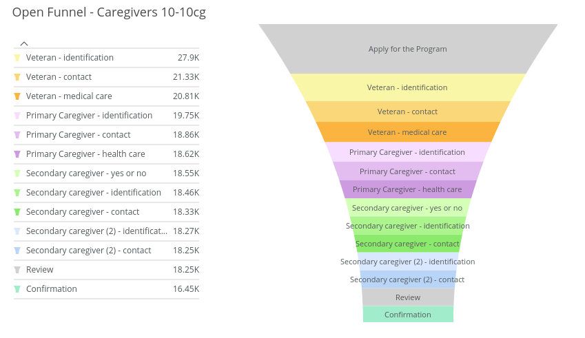
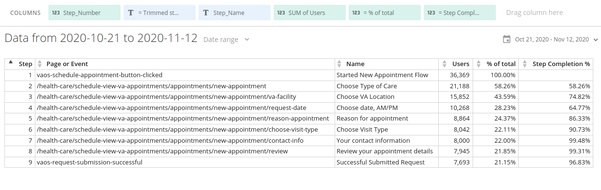

# Funnels

## What is a funnel?

A **conversion** is when a user on your site or app does something that you want them to do.  This can include completing a form, downloading an app, or some other action.  A **funnel** is a way of visualizing the multiple steps a user takes towards this conversion.

Funnels are useful because they can show you the steps where users tend to exit - or _abandon_ - your form or application.  Applying segments based on user types or actions further improves the diagnostic usefulness of funnels.
 
Funnels are a sequence of steps or stages.  These are user actions that you define, most commonly pageviews or other analytics events.

A funnel is said to be **open** if users can enter at any step or **closed** if they are required to start with the first step you define.  Some funnels automatically fill in steps a user skips in a process called **backfilling**.

Funnels have a **scope**. Most of our funnels measure completions by the day (though not a requirement), but we must decide if a funnel must be completed in a single session (**session scope**), in a direct sequence of hits (**hit scope**), or merely by the same user at some point during the day (**user scope**).  One of the driving factors in creating funnels in DOMO (as opposed to just in Google Analytics) is the ability to fine-tune the scope and rules of your funnel.


## Funnels in Google Analytics

Google Analytics provides a few ways to create funnels:

### Custom Reports

Standard GA Custom Reports allow you to create what are called [Custom Funnels](https://support.google.com/analytics/answer/6180923).  There are a few limitations:

*   Custom Funnels can only have five steps ("stages")
*   These steps can each only have 5 rules
*   Funnels can be open or closed, but only for session-based funnels.  User-based funnels must be closed.

<p style="text-align: right">
source: <a href="https://support.google.com/analytics/answer/6180923">https://support.google.com/analytics/answer/6180923</a></p>

### Funnel Analysis

Similar to Custom Funnels are the [Funnel Analysis](https://support.google.com/analytics/answer/9327974) in the Analysis feature of Google Analytics 360.  This is much more robust compared to Custom Funnels in many ways:


*   _You can define up to 10 steps in the funnel._
*   _You can use a segment as a step._
*   _Funnel steps can follow the previous step directly or indirectly._
*   _You can set a time constraint between steps._
*   _You can define optional steps._
*   _You can apply up to 4 segments to the analysis._
*   _You can apply a breakdown dimension._
*   _You can see trends for each funnel step (trended funnels)._
*   _The visualization includes a data table, providing greater context and detail_.

<p style="text-align: right">
source:  <a href="https://support.google.com/analytics/answer/9327974">https://support.google.com/analytics/answer/9327974</a></p>


One downside is that you can only report on user completion rates, not session.  Also, while your Funnel Visualization can be shared with other users, it is read-only (even the date range!).


### Goal Funnel Visualization

If you have goals configured as [Destination Goals](https://support.google.com/analytics/answer/1116091), where steps are defined as user visits to certain pages or screens, you can view these as a [Funnel Visualization](https://support.google.com/analytics/answer/2976313) in Google Analytics.  These funnels are based on your goal configuration.  They are **open** if all steps are optional and **closed** if you make the first step required.  The metric displayed is **users** though it also includes a session completion rate at the top of the report.

It helpfully shows the pages that users exit to, but - watch out - this can be inaccurate if you're using a Google Analytics view that filters sessions based on page URL.

<p style="text-align: right">
source: <a href="https://support.google.com/analytics/answer/2976313">https://support.google.com/analytics/answer/2976313</a></p>

## Recreating (and Creating) Funnels in BigQuery

Our goal is to create BigQuery queries that can return calculated funnel user or session counts.  In its most basic form, you need a step number, some sort of step description (like a name), and a metric for users or sessions.


<table width="100%">
  <tr>
   <td><strong>Date</strong></td>
   <td><strong>Step_Number</strong></td>
   <td><strong>Step_Name</strong></td>
   <td><strong>Users</strong>

   </td>
  </tr>
  <tr>
   <td>1/1/2020
   </td>
   <td><p style="text-align: right">
1</p>

   </td>
   <td>Introduction
   </td>
   <td><p style="text-align: right">
10,000</p>

   </td>
  </tr>
  <tr>
   <td>1/1/2020
   </td>
   <td><p style="text-align: right">
2</p>

   </td>
   <td>Applicant Information
   </td>
   <td><p style="text-align: right">
9,750</p>

   </td>
  </tr>
</table>


Usually you will want to include more information, including the standard date fields and the step's URL or event information:


<table width="100%">
  <tr>
   <td><strong>Date</strong>
   </td>
   <td><strong>Month</strong>

   </td>
   <td><strong>Day</strong>

   </td>
   <td><strong>Year</strong>

   </td>
   <td><strong>Step_Number</strong>

   </td>
   <td><strong>Step_Name</strong>
   </td>
   <td><strong>Step_URL_or_Event_Label</strong>
   </td>
   <td><strong>Users</strong>

   </td>
  </tr>
  <tr>
   <td>1/1/2020
   </td>
   <td><p style="text-align: right">
1</p>

   </td>
   <td><p style="text-align: right">
1</p>

   </td>
   <td><p style="text-align: right">
2020</p>

   </td>
   <td><p style="text-align: right">
1</p>

   </td>
   <td>Started New Appointment Flow
   </td>
   <td>vaos-schedule-appointment-button-clicked
   </td>
   <td><p style="text-align: right">
10,000</p>

   </td>
  </tr>
  <tr>
   <td>1/1/2020
   </td>
   <td><p style="text-align: right">
1</p>

   </td>
   <td><p style="text-align: right">
1</p>

   </td>
   <td><p style="text-align: right">
2020</p>

   </td>
   <td><p style="text-align: right">
2</p>

   </td>
   <td>Choose Type of Care
   </td>
   <td>www.va.gov/health-care/schedule-view-va-appointments/appointments/new-appointment
   </td>
   <td><p style="text-align: right">
9,750</p>

   </td>
  </tr>
</table>


### Closed Funnels with User Scope

Example: <br />
[BQ - Closed Funnel - VAOS Request v1 - Oct 23 - Oct 30](https://va-gov.domo.com/datasources/c687647a-d9d9-4553-a33d-00fcadc61793/details/overview)


1. Create a dataset of GA hits (using WITH) that contains all the hits that could possibly be in your funnel.  
2. Need to segment?  Exclude some people with certain hits or custom dimensions?  Do it here using a [subquery](https://cloud.google.com/bigquery/docs/reference/standard-sql/subqueries).
3. This dataset needs the date, user ID or a concatenated session id, the hit's page path or event label (or whatever), and the hit's calculated timestamp (visitStartTime + hits.time).
4. Starting with your first step, SELECT the GA hits dataset and filter on the event or page for Step 1.
5. LEFT JOIN in each subsequent step by joining on an **exact match** for user ID and a **less than** match for the timestamp.  You want to make sure the next step's hit timestamp is after the previous. 
6. When you're done, SELECT COUNT DISTINCT user ID to get user counts for each step.
7. SELECT UNION ALL all of these user counts to get them into a Users column and return your values.

Hit timestamp:
```sql
(visitStartTime + hits.time) AS transaction_time
```


### Closed Funnels with Session Scope

Same thing as the User Scope funnel but join on the concatenated session ID.

Concatenated session ID:
```sql
CONCAT(fullVisitorId, CAST(visitStartTime AS STRING)) AS session_id
```


### Closed Funnels with Hit Scope

Similar to the other closed funnels, you want a GA hit dataset with all of your data.  However, instead of using JOIN, you can use [LEAD](https://cloud.google.com/bigquery/docs/reference/standard-sql/functions-and-operators#lead) to build a single row that contains all the steps.


```sql
-- Goal Completion Location (dimension)
hits.page.pagePath AS Goal_Step_1,
-- Goal Next Step 2 (dimension)
LEAD(hits.page.pagePath, 1) OVER (
    PARTITION BY fullvisitorId,
    visitStartTime
    ORDER BY
        hits.hitNumber ASC
) AS Goal_Step_2,
-- Goal Next Step 3 (dimension)
LEAD(hits.page.pagePath, 2) OVER (
    PARTITION BY fullvisitorId,
    visitStartTime
    ORDER BY
        hits.hitNumber ASC
) AS Goal_Step_3,
...etc...
```


You can then create separate datasets for each step's conversion numbers: 

```sql
Goal_Starts AS (

    SELECT
        *
    FROM
        sessions
),
Goal_Step_1_Completions AS (
    SELECT
        *
    FROM
        Goal_Starts
    WHERE
        REGEXP_CONTAINS(
            Goal_Step_2,
            r'/health-care/apply/application/veteran-information/personal-information'
        )
),
...etc…
```


You can then do the normal SELECT DISTINCT COUNT of user or session IDs to get your user or session counts:


```sql
(
    SELECT
        COUNT(DISTINCT fullvisitorid)
    FROM
        Goal_Step_10_Completions
) AS Goal_Step_10_Users
```


### Open Funnel with Session Scope

Example: <br />
[BQ - Open Funnel - 1010EZ HCA Step Completion by Session](https://va-gov.domo.com/datasources/ea5a09b4-93b9-4136-a3b5-25b9033f2f29/details/overview) 

This are a little less complicated than the closed funnels because of this:


> The Funnel Visualization report backfills any skipped steps between the step at which the user entered the funnel and the step at which the user exited the funnel.

Since we just need to know if a user hit a step **or any step after**, we can check if a user or user's session's MAX step >= a specific step.


```sql
SELECT
    goal.Step_Number AS Step_Number,
    goal.Step_Page AS Step_Page,
    goal.Step_Name AS Step_Name,
    COUNT(DISTINCT sessions.SessionID) AS Sessions,
FROM
    goal
    CROSS JOIN sessions
WHERE
    sessions.Step_Number >= goal.Step_Number
GROUP BY
```

### Open Funnels with User Scope

Same as above but use the fullVisitorId.


## Visualizing Funnels in DOMO

Usually we create two separate cards / visualizations in DOMO for each funnel.


### Funnel


<table>
  <tr>
   <td>

   </td>
   <td><strong>Chart type:</strong>
<p>
Funnel
<p>
<strong>Funnel section name:</strong> <br />
Step_Name
<p>
<strong>Funnel section value:</strong> <br />
SUM of Users or Sessions
<p>
<strong>Sorting:</strong> <br />
Step_Number ASC (no aggregation)
<p>
<strong>Display in Legend</strong>:
<p>
Value Only
   </td>
   <td><strong>Legend Percentage: <br />
</strong>Percent of Total
<p>
<strong>Series Height</strong>:
<p>
Value
<p>
<strong>Text:</strong> <br />
%_NAME
   </td>
  </tr>
</table>


### Data Table


<table>
  <tr>
   <td>


   </td>
   <td colspan="2" ><strong>Chart type:</strong>
<p>
Table
<p>
<strong>Columns:</strong> <br />
Step_Number, Step_Name, SUM of Users or Sessions, Step % of Total, Step Completion %, Step Abandonment %
<p>
<strong>Sorting:</strong> <br />
Step_Number ASC (no aggregation)
   </td>
  </tr>
</table>

### Creating Dynamic Date Range Titles

For charts like funnels and data tables, which don't display a date range, it is helpful to add a dynamic title to the card summary.  To do this, create a Beast Mode calculation that returns the text you want to display and the MIN and MAX of your date column:

```js
CONCAT('Data from ', MIN(`date`), ' to ', MAX(`date`))
```

You can then add this Beast Mode calculation to your card as a summary.

### Calculating **Step % of Total** in a Beast Mode


```sql
SUM(`Users`) / MAX(SUM(`Users`)) OVER ()
```


This seems to work best without any sort of partitioning in the function.


### Calculating **Step Completion %** in a Beast Mode


```sql
SUM(`Users`) / LAG(SUM(`Users`), 1) OVER (PARTITION BY `date` ORDER BY `date` ASC)
```


This seems to work best when it's partitioned by date.  For funnels without a date, I've used BATCH_LAST_RUN.


### Calculating **Step Abandonment %** in a Beast Mode


```sql
1 - (SUM(`Users`) / LAG(SUM(`Users`), 1) OVER (PARTITION BY `date` ORDER BY `date` ASC))
