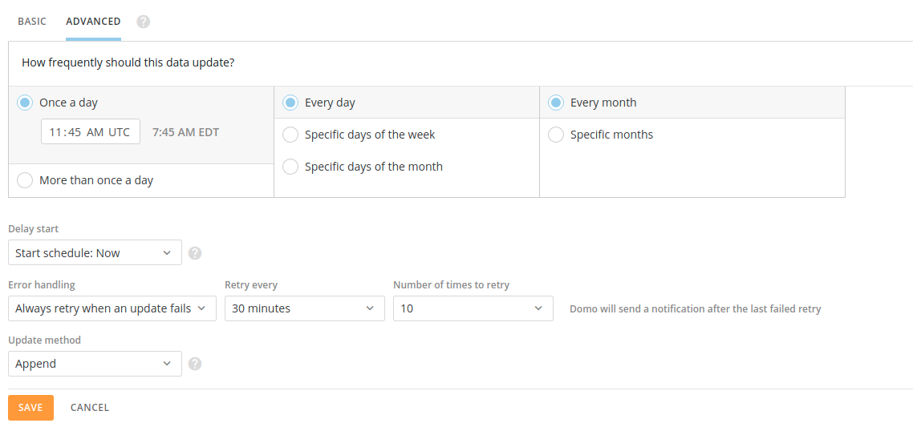

### How to structure and schedule BigQuery queries in DOMO

The majority of our DOMO datasets are populated via a daily scheduled standard SQL query to BigQuery. The most commonly queried data table is the standard Google Analytics session table from the prior day. 

Unfortunately, due to the inconsistent completion time of these daily tables and limitations in DOMO, we must structure our queries to `RETURN` an exception if the daily session table is not yet present in BigQuery. This allows us to use the built-in DOMO advanced scheduling and retry functionality.
 
In order to return an exception, you must use some BigQuery scripting techniques.
 
First, the overall structure of your query must be as a `BEGIN...EXCEPTION`.

```sql
BEGIN
   sql_statement_list
EXCEPTION WHEN ERROR THEN
   sql_statement_list
END;
```

We use a stored procedure (vsp-analytics-and-insights.stored_procedures.hasGoogleAnalyticsDataLoaded) to check if the daily session tables are loaded.  If not, an error is thrown using `RAISE`.  In the `EXCEPTION` handler, we `RETURN` to stop query execution.
 
The overall query structure should be:

```sql
BEGIN
   CALL `vsp-analytics-and-insights.stored_procedures.hasGoogleAnalyticsDataLoaded`();
   SELECT
       ...
   WHERE
       ...
   ORDER BY
       1;
EXCEPTION WHEN ERROR THEN
 RETURN;
END;
```

Note the semicolon at the end of the `SELECT`.  This is necessary when we are using BigQuery scripting statements:

> A SQL statement list is a list of any valid BigQuery statements that are separated by semicolons.

If you see this error message, you are probably missing a semicolon:

`Syntax error: Expected ";" but got keyword EXCEPTION at [xx:xx]`
 
In DOMO, make sure you are scheduling the query to retry if it fails:




