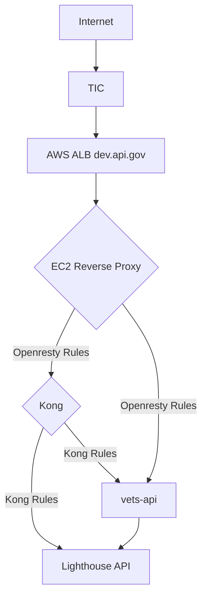
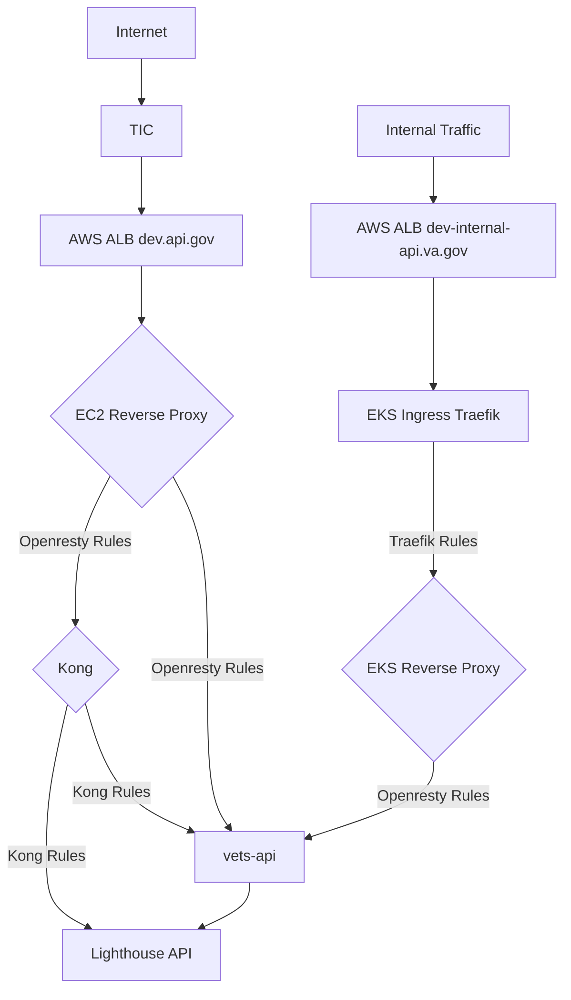
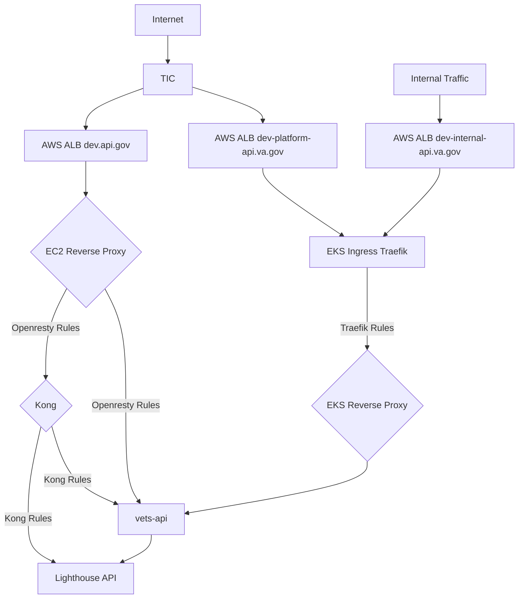
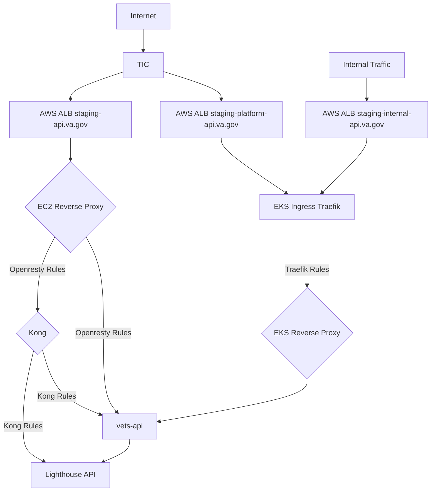
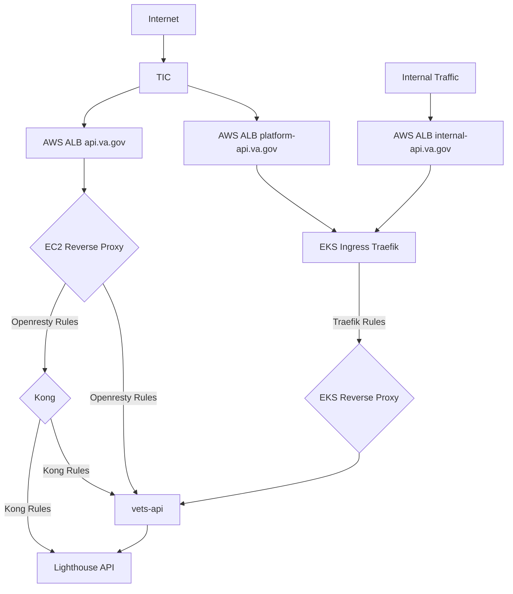
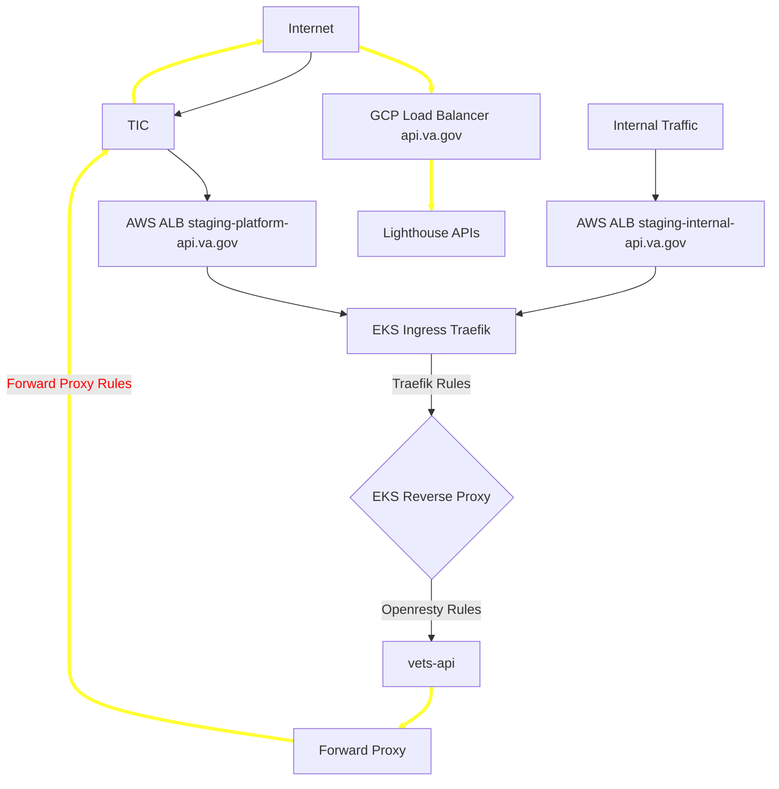
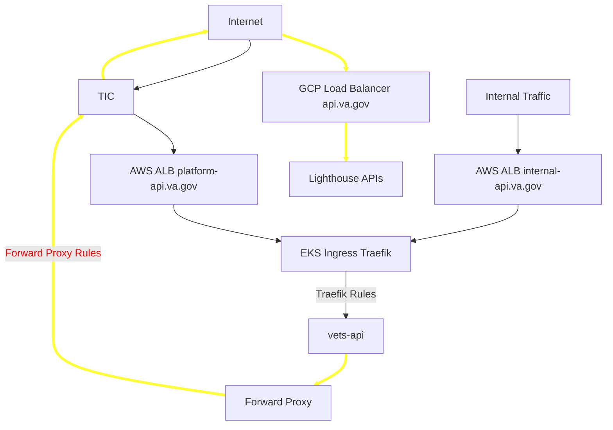
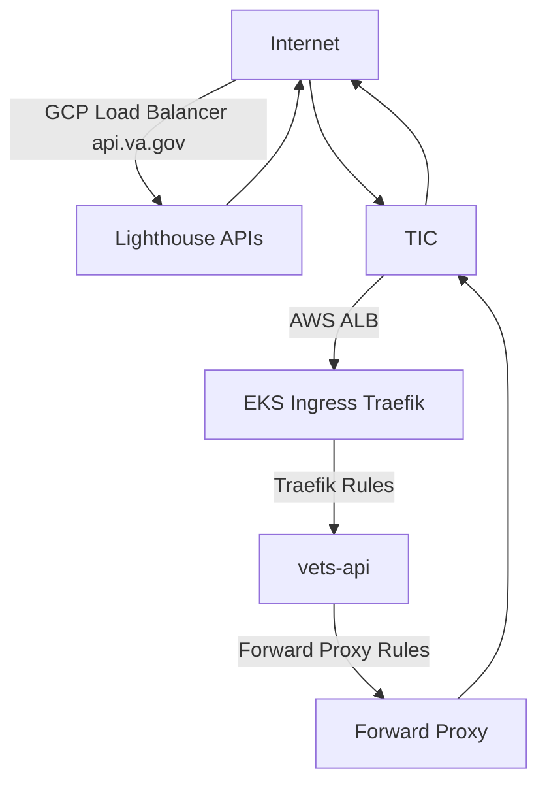

### Discussed in https://github.com/department-of-veterans-affairs/va.gov-team/discussions/39439

Originally posted by **dginther** March 31, 2022
- Start Date: 2022-03-31

# Summary

The Lighthouse program has announced their intention to use a phased approach to remove their reliance on the Kong Gateway which lives inside the dsvagovcloud AWS account. The steps of their approach are described here: https://vfs.atlassian.net/wiki/spaces/PST4/pages/2138996933/Lighthouse+Migration+Plan

Because of this, the routes to the vets-api APIs that are utilized by applications in vets-website and by VA Mobile will have to change, so that the Lighthouse API can eventually utilize and control the api.va.gov (and associated dev-api, staging-api, sandbox-api) URL. There is an associated RFC for the decision of what URL the vets-api APIs will eventually use here: https://github.com/department-of-veterans-affairs/va.gov-team/discussions/39068

The CIT team has analyzed the existing routes and has divided those routes into categories: https://vfs.atlassian.net/wiki/spaces/PST4/pages/2143977624/Set+of+routes+to+be+served+by+platform-api.va.gov

This RFC describes the approach the CIT team will take to develop and test the new routing, and the future plans for how the architecture will evolve to support vets-api APIs and any other APIs that are developed in the dvsagovcloud AWS account in the future.

# Motivation

The Lighthouse team intends to follow their planned approach to moving to the Apigee gateway hosted in the GCP cloud. This will mean that they will no longer need (or want!) to maintain infrastructure pieces like the Kong API Gateway inside the dsvagovcloud AWS account.

The CIT team's objective is to facilitate the removal of the Lighthouse infrastructure and the separation of the api.va.gov URLs so that the Lighthouse team can control that URL and eventually point it at the GCP cloud Apigee gateway.

A helpful explainer document is here: https://vfs.atlassian.net/wiki/spaces/ECP/pages/1907523684/Explainer+-+VA.gov-Lighthouse+Overlap

**Use-cases:**
- Lighthouse eventually can use api.va.gov (and associated dev-api, staging-api, sandbox-api) URLs for their APIs
- The Platform crew has it's own API URL for vets-api endpoints, as well as the ability to integrate future endpoints (whether they are part of vets-api or not)

**Expected outcome:**
- Unintentional points of coupling between LH and vets-api APIs no longer exist
- Clear responsibilities are defined for URL control, infrastructure control and support, and DVP/Lighthouse presence in the dsvagovcloud AWS account is no longer necessary

# Detailed design
**Current state:**
All traffic to api.va.gov (and associated dev-api, staging-api, sandbox-api) URLs enters the infrastructure via an ALB, and then is routed to the revproxy instances in the respective VPC corresponding to the environment.

**Phase 1:**
The CIT team will bring up a copy of the EC2 Openresty revproxy instance in the EKS Cluster as a Kubernetes Pod. Internal traffic will enter through the existing AWS ALB or a new AWS ALB, be routed to the EKS Ingress controller (Traefik) and a rule in Traefik will send all traffic from there to the Openresty reverse proxy running in EKS. Openresty rules/processing will be used to send appropriate traffic to vets-api APIs. vets-api calls to the Lighthouse APIs will be routed through the forward proxy.

This phase should be entirely transparent and allow the CIT team (and other teams) to test the functionality of the new routing.

**Phase 2:**
The CIT team will request a new external URL from the ESECC team, dev-platform-api.va.gov, which will be routed to the EKS reverse proxy (via Traefik), to allow testing of the new routes in the dev environment

This phase will allow the React applications in vets-website to be reconfigure to use the new external URL for API access, in preparation for eventual discontinuation of using the old URL. Lighthouse API calls can possibly at this point be done using the new external URL provided by the Lighthouse team (see Stage 2: https://vfs.atlassian.net/wiki/spaces/PST4/pages/2138996933/Lighthouse+Migration+Plan)

Testing of the dev environment and the vets-website React applications, as well as the VA Mobile app, would be performed to ensure that everything is working as expected.

**Phase 3:**
CIT team will replicate the above configuration in the staging environment

Testing of dev and staging environments would be done at this point to ensure that everything is working as expected.

**Phase 4:**
CIT team will replicate the above configuration in the production environment

Production vets-website applications as well as the VA Mobile app would be configured to use the new API URL

**Phase 5:**
Once metrics from the Kong API gateway showed that it was no longer being utilized for API routing to vets-api, it could be removed from the infrastructure, and the external api.va.gov (and associated dev-api, staging-api, sandbox-api) URL could be given to the Lighthouse team. In this phase, when requests are made to the Lighthouse APIs (colored arrows) they will exit the VA network and re-enter the GCP cloud, traversing the TIC.

**Phase 6:**
If we discover in this research: https://github.com/department-of-veterans-affairs/va.gov-team/issues/39404 that Traefik _can_ replace the fucntionality we currently use in Openresty
- Openresty is phased out in favor of Traefik rules. All routes in Openresty are converted to Traefik rules, utilizing any necessary Traefik middlewares. This would first be performed in the dev environment, and then replicated to the staging and production environments.

If Traefik is not sufficiently featured to replace the functionality, then the CIT team will Investigate and decide on a different piece of software to replace the Openresty functionality.

# Alternatives

If we do not split the API into multiple URLs, and give control of the api.va.gov (and associated dev-api, staging-api, sandbox-api) URLs to Lighthouse, and allow them to route requests from their API gateway to vets-api, the resulting path for requests looks like this:

Any requests that would be made to vets-api would be first sent through the GCP cloud, routed back to the internet, then routed (by an external domain name, which we would have to get anyway) to AWS via the internet/TIC. Any requests that vets-api needs to make to Lighthouse APIs would then have to be routed back out the TIC and the internet, to the GCP cloud.

