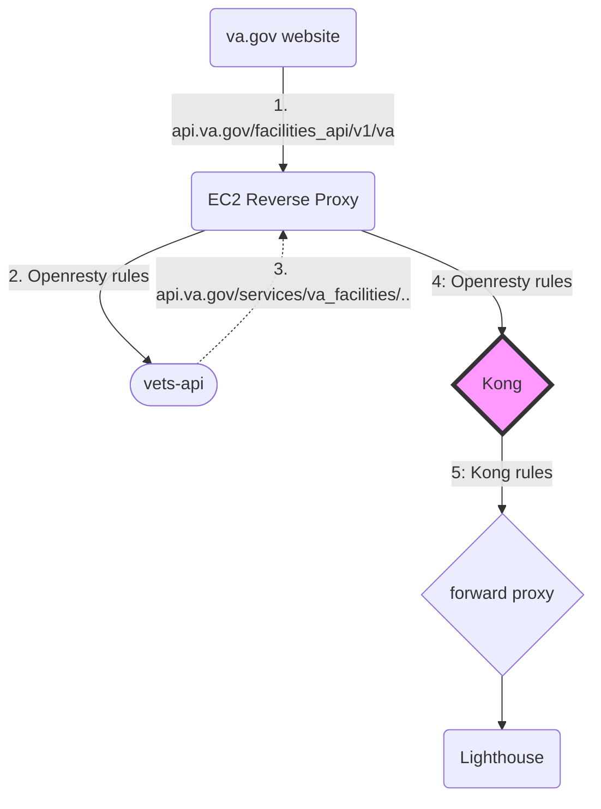
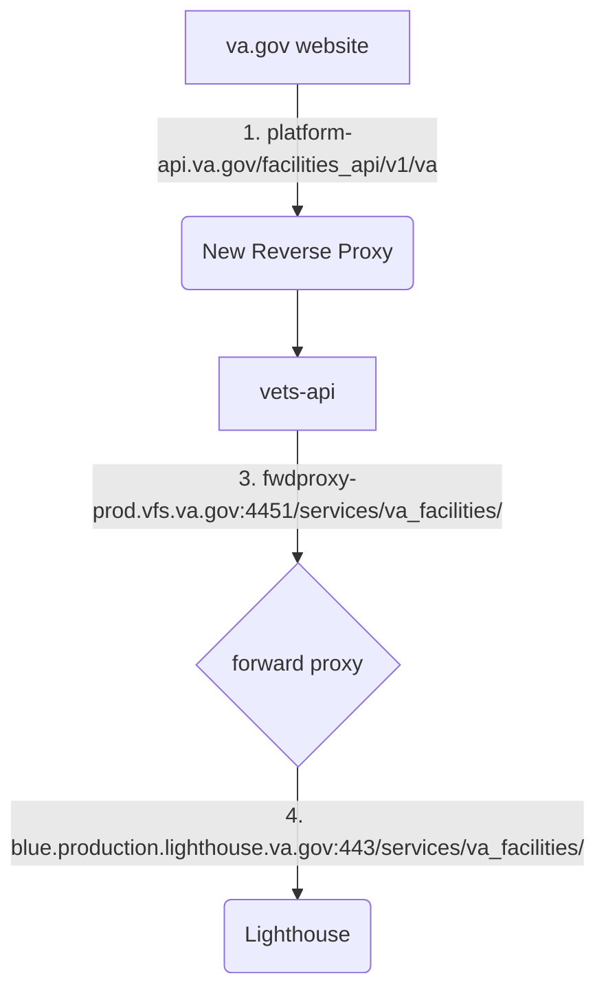

### Discussed in https://github.com/department-of-veterans-affairs/va.gov-team/discussions/39753

<div type='discussions-op-text'>

<sup>Originally posted by **madebydna** April  7, 2022</sup>
- Start Date: 2022-04-06

# Summary

The Kong API gateway is currently an integral part of the overall `dsvagovcloud` AWS architecture. The Lighthouse team is [planning to retire Kong](https://vfs.atlassian.net/wiki/spaces/PST4/pages/2138996933/Lighthouse+Migration+Plan) by migrating to a new Apigee gateway hosted on GCP. The idea is that the domain `api.va.gov` will be routed to Apigee, and a new domain `platform-api.va.gov` will expose the API endpoints of the `vets-api`. The major users of this new domain are the va.gov website and the mobile app and they will need to adjust their API calls accordingly.

Our thinking is that in the first phase of the new `dsvagovcloud` architecture we will no longer need an API gateway, since Kong's main role was to funnel traffic to the vets-api and Lighthouse, respectively. Most requests to the **new** domain will need to go directly to `vets-api`. It is our opinion, therefore, that a reverse proxy would be sufficient to handle incoming traffic at this stage. (Further down the road, we may need to introduce an API gateway component to better support the migration of the `vets-api` from a monolithic Rails app to a more microservices-based system.)

This RFC is about one of Kong's current functions of handling cases in which Lighthouse APIs are used as an upstream dependency of `vets-api`. These types of requests first go (either via Kong or via the current revproxy) to `vets-api`, and then back through Kong and a forward proxy to Lighthouse. Once Kong is removed, `vets-api` would need to make those requests _directly_ to Lighthouse via the forward proxy.

This RFC outlines the hurdles and intricacies of removing Kong as an intermediary between the `vets-api` and Lighthouse and kicks off the discussion on our approach.

# Motivation

We're inviting comments on our initial investigation into what needs to be taken into account in removing Kong. The overall benefit of removing Kong is to achieve a simpler architecture with a more straightforward request flow. By investigating and exposing potential pitfalls in the removal of Kong, we can make the path to the new architecture smoother. Our initial research and your input will save our team development time and prevent us going down avenues that would have to be abandoned.

**Use-cases:**
- Website and mobile API calls to `vets-api` that make secondary API calls to Lighthouse under the hood

**Expected outcome:**
- Kong can safely be removed from the `dsvagovcloud` account and API calls to `vets-api` that use Lighthouse as an upstream dependency will continue to work as they do

# Detailed design
**Example**
To better illustrate the problem domain, consider how a web request from the [Find VA locations](https://www.va.gov/find-locations/) page currently travels.

Once the website determines the lat and long of a location entered by a user, it composes a API request to `https://api.va.gov/facilities_api/v1/va` sending lat and long as parameters. The current reverse proxy solution, Openresty, parses the path and forwards this type of request directly to the `vets-api` backend.

To actually obtain a list of nearby locations, `vets-api` makes a request to Lighthouse, using a different url `https://api.va.gov/services/va_facilities/v0/facilities`. According to redirect rules set up in Openresty, this second request will be directed to Kong, that is configured to handle all requests that have `/services` or `/internal` as a prefix. 

Kong recognizes this request as one destined for Lighthouse and sends it to HAProxy, our forward proxy, which finally transmits it on to LH.



In the new architecture, this scenario is greatly simplified. Notice the new domain names involved.



Preliminary experiments with `curl`-ing the fwd proxy address directly verifies that this plan is in theory viable:

```
curl -G -s -k --socks5-hostname localhost:2001 "https://fwdproxy-dev.vfs.va.gov:4451/services/va_facilities/v0/facilities?lat=36.1663&long=-115.1492&radius=75"
```
Here is an excerpt from the response:
```
{"data":[{"id":"vba_354b","type":"va_facilities","attributes":{"name":"VetSuccess On Campus at University of Nevada, Las Vegas (UNLV)","facility_type":"va_benefits_facility","classification":"VetSuccess On Campus", ...}, ...]}
```

### How do we get there?
In order to remove Kong as intermediary between `vets-api` and the forward proxy, we need to address the following:

**Identify the instances in which vets-api uses Lighthouse API as an upstream dependency**

Currently, LH upstream dependencies in the `vets-api` are not exhaustively documented. It is, however, important to have a comprehensive list of these occurrences in order to ensure those requests are routed to the forward proxy rather than to `api.va.gov`.

Preliminary research based on examining the `config/settings.yml` file in `vets-api`, some instances have been identified, but there are likely more:

| LH API | Path | Settings |
| --- | --- | --------- |
| Facilities APIs | `/services/va_facilities/` | `Settings.lighthouse.facilities` |
| Health APIs | `/services/fhir/` | `Settings.lighthouse.veterans_health.url` and `Settings.lighthouse_health_immunization.api_url` |
| Appeals APIs | `/services/appeals/` | `Settings.virtual_agent.lighthouse_api_uri` and `Settings.decision_review.url` and `Settings.virtual_agent.lighthouse_api_uri`|
| PGD (Patient Generated Data?) | `services/pgd/` | `Settings.hqva_mobile.lighthouse.pgd_path` | 
| Forms APIs | `/services/va_forms/` | `Settings.forms.url` |


Please comment with any ideas on how best to amass a complete list. One idea that came up was to parse the forward proxy logs for calls to the Lighthouse API. [This Google sheet](https://docs.google.com/spreadsheets/d/1MyHGNqBjhrFUAx8uXqm5YGhiBW9wcJ03K2lT6i6xARk/edit#gid=196772961) is the result of obtaining a day's worth of API requests logs that go to LH through the forward proxy. Overall, there were 15k+ unique urls. To remove the noise, the ones where the uniqueness is based on an ID are represented with an example, e.g. `/clinical-fhir/v0/r4/Patient/1015864945V516423` 

**Identify Kong's role in forwarding LH requests from the vets-api to the forward proxy**

Besides sending select traffic to the forward proxy, Kong uses several plugins to perform additional request manipulation common to API gateways:

- [ACL anonymous plugin](https://docs.konghq.com/hub/kong-inc/acl/)
- [Key Auth function plugin](https://docs.konghq.com/hub/kong-inc/key-auth/)
- [Rate limiting plugin](https://docs.konghq.com/hub/kong-inc/rate-limiting/)
    - 400 requests a minute for most cases but overriden to 60 rpm for `/services/pgd/v0`
- [Request transformer plugin](https://docs.konghq.com/hub/kong-inc/request-transformer/)
    - only used for the Address validation API which has not (yet) been identified as an upstream dependency of `vets-api`

The Lighthouse team confirmed that this functionality will be replicated in Apigee, so it stands to reason that there will be no intervention needed in the travel between `vets-api` and the forward proxy:

**Before**: `vets-api --> Kong -->  fwd proxy --> LH` with Kong doing things like rate limiting
**After**: `vets-api --> fwd proxy --> Apigee --> LH` with Apigee replacing all Kong functionality

**Changes required to the forward proxy congfiguration**

Currently, the forward proxy is configured to listen for Lighthouse traffic on port 4451 and send that traffic to `blue.production.lighthouse.va.gov`. 

```
backend lighthouse_apis_back
  http-request set-header Host blue.production.lighthouse.va.gov
  http-request del-header Cookie
  http-response del-header Set-Cookie
  option httpchk GET /healthz HTTP/1.1\r\nHost:\ blue.production.lighthouse.va.gov
  server lighthouse_apis_primary blue.production.lighthouse.va.gov:443 init-addr last,none resolvers dns resolve-prefer ipv4 sni str(blue.production.lighthouse.va.gov) ssl verify none check check-sni blue.production.lighthouse.va.gov inter 30s

frontend lighthouse_apis_front
  bind *:4451 ssl crt /etc/pki/tls/private/server.pem
  default_backend lighthouse_apis_back
```

The backend configuration will clearly need to change, but other than that, we think that the forward proxy can be used without too much modification. Let us know if you can think of any issues we might have missed.

**Coordinating the removal of Kong with the Lighthouse team**

The traffic from `vets-api` that is intended for LH will need to have been routed reliably and exhaustively to the forward proxy before Kong can be taken out of the picture. This will require some careful planning to come up with a phased, environment-based approach.

# Alternatives
An alternative would be to leave Kong in place and continue to rely on its capabilities to route traffic. This would still require some work to change the current configuration but would leave Kong as an architectural unit intact. While this might sound like less work, and also lessen risk, we believe that greater benefit would be realized in simplifying the overall architecture.

</div>
